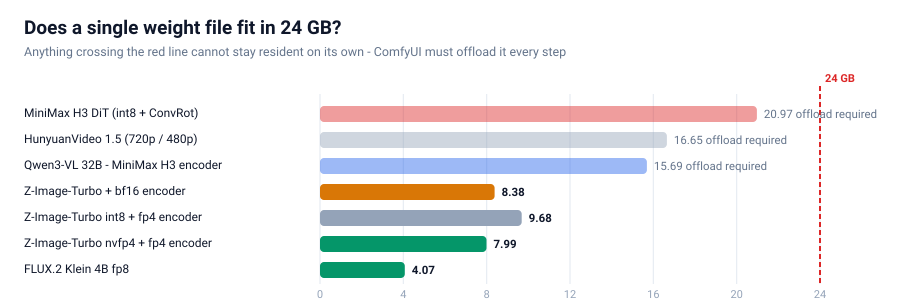
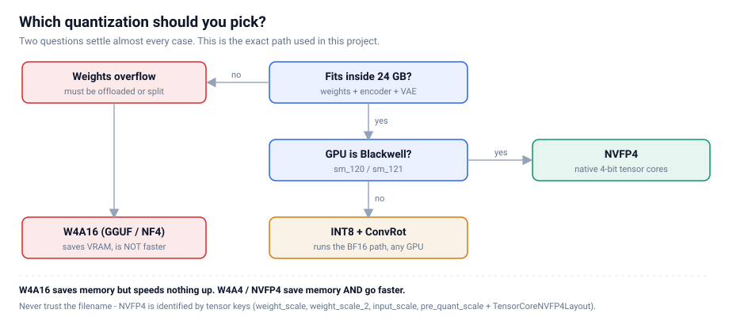
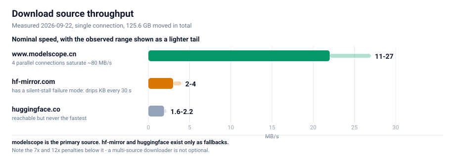
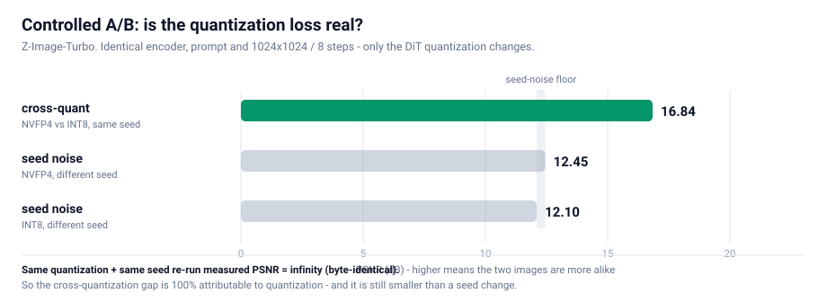
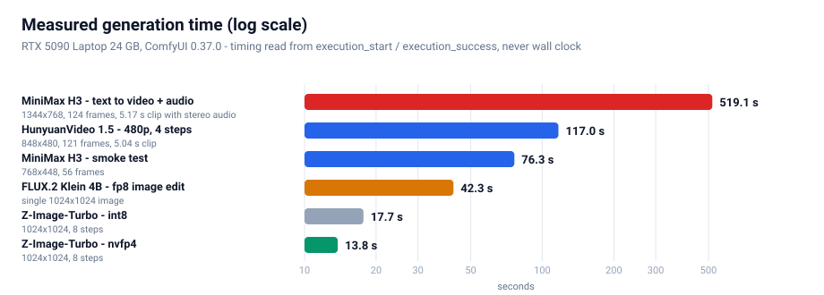
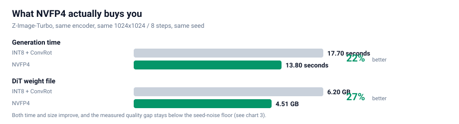

# 在 RTX 5090 笔记本上，用 ComfyUI 跑通最新的图像 / 视频 / 音乐生成模型

**一份从选型、下载、搭图、实测到定论的完整实战手册**

**中文** · [English](README_EN.md) · [📖 在线阅读（自动适配语言）](https://lifeidle.github.io/comfyui-5090-laptop-playbook/)

---

> **一句话结论**：在 24 GB 显存的笔记本 GPU 上，我们跑通了 4 条最新开源生成模型线（共 6 个工作流），
> 并用**受控实验**证明 **NVFP4 是这台机器上的最佳量化格式** —— 比 INT8 快 **22%**、小 **27%**，
> 而画质差异**落在随机噪声地板之下**。

这不是一份"把命令贴一遍"的教程。真正难的不是跑通某个模型，而是**在几十个量化版本里判断该选哪一个**。
本文把我们的完整决策链摊开：怎么想、怎么下、怎么搭、怎么测、怎么选。所有数字都是本机实测，
所有结论都附带可复现的测量方法。

---

## 目录

| 章节 | 内容 | 你会得到 |
|---|---|---|
| [0](#0-硬件与起点) | 硬件与起点 | 知道硬约束在哪 |
| [1](#1-先说结论tldr) | **先说结论** | 一张表看完所有选型 |
| [2](#2-怎么想先把约束想清楚) | 怎么想 | 量化格式的完整心智模型 |
| [3](#3-怎么下把-1256-gb-拉下来) | 怎么下 | 125.6 GB 的多源下载工程 |
| [4](#4-怎么搭comfyui-的节点约束) | 怎么搭 | 踩坑换来的节点约束清单 |
| [5](#5-怎么测受控-ab全文核心) | **怎么测** | 量化判定的方法论（全文核心） |
| [6](#6-怎么选四条模型线实战) | 怎么选 | 每个模型的实战与基准 |
| [7](#7-优化清单可以直接抄的配置) | 优化清单 | 可直接抄的配置 |
| [8](#8-踩坑速查表) | 踩坑速查 | 症状 → 原因 → 解法 |
| [9](#9-工具链) | 工具链 | 六个可复用脚本 |
| [10](#10-结论与后续) | 结论与后续 | 还没做的事 |

---

## 0. 硬件与起点

| 项目 | 实测值 |
|---|---|
| GPU | **RTX 5090 Laptop** —— 24435 MiB（**24 GB**），算力 **sm_120**（Blackwell） |
| CUDA | 12.8 |
| 内存 | 64 GB |
| 引擎 | ComfyUI **0.37.0** / PyTorch 2.11.0+cu128 / Python 3.11.9 |
| 目标 | 尽量用**最新**的开源模型，跑通**图像 / 视频 / 音乐**三类生成 |

**为什么从 24 GB 讲起？** 因为它是这份手册里唯一真正的硬约束。

笔记本 GPU 的算力永远是"够用"的 —— 一个 8 步蒸馏模型在 5090 上出 1024² 图只要十几秒。
真正决定你能跑什么、不能跑什么的，是**显存能不能装下**。而最新一代开源生成模型的一个共同趋势是：
**主模型越来越大，而且都要求配一个独立的、同样巨大的文本编码器。**

看下面这张图，注意那条 24 GB 红线：



三条线（MiniMax H3 的 DiT 21 GB、HunyuanVideo 1.5 的 16.7 GB、MiniMax H3 的文本编码器 15.7 GB）
**每一个单独拿出来就超过了 24 GB**。这意味着：

> **它们不可能常驻显存。** 每生成一帧，权重都必须在显存和内存之间搬运。
> 这就是为什么"选对量化格式"在这台机器上不是优化，而是**能不能跑**的问题。

---

## 1. 先说结论（TL;DR）

### 1.1 选型总表

| 用途 | 选定模型 | 量化格式 | 实测耗时 | 备注 |
|---|---|---|---|---|
| **图像生成** | Z-Image-Turbo | **NVFP4**（4.51 GB） | **13.8 s**（1024²/8步） | 中文文字渲染准确，8 步出图 |
| **图像编辑** | FLUX.2 Klein **4B** | fp8（4.07 GB） | 42.3 s | 9B 版被编码器卡住，见 §6.5 |
| **视频 + 音频** | MiniMax H3 | int8 + ConvRot | **519.1 s**（1344×768/124帧） | **原生带音轨**，5.17 s 视频含立体声 |
| **纯视频** | HunyuanVideo 1.5 480p | fp16 + LightX2V 4步 LoRA | **117.0 s**（848×480/121帧） | 4 步出片，适合迭代 |

### 1.2 三条可以直接拿去用的规则

1. **量化格式：只要显卡是 Blackwell（sm_120/121），一律选 NVFP4。** 见 §5 的证明。
2. **要不要 offload：看"主模型 + 编码器"之和是否超过显存。** 超过了就必须 offload，
   这时量化省下的每一 GB 都会直接换成速度。
3. **提速靠"少走步数"，不靠"压权重"。** 8 步 → 4 步的 LoRA 收益远大于任何权重量化。
   量化负责**装得下**，蒸馏 LoRA 负责**跑得快**。两者不是一回事。

---

## 2. 怎么想：先把约束想清楚

### 2.1 唯一的硬约束是显存，不是算力

这一点值得反复强调，因为它决定了后面所有的取舍。

一个很常见的错误直觉是："显存不够就换个小模型。"但看 §0 那张图 —— 我们要的都是最新最强的模型，
它们**没有小号版本**。唯一能动的变量是**权重用什么精度存**。

于是问题被压缩成一句话：**在肉眼无差别的前提下，用多少 bit 存权重最划算？**

### 2.2 量化格式的四个流派（这是全文的地基）

市面上"4-bit 量化"这个说法把三件完全不同的事混在了一起。必须先拆开：

| 流派 | 代表 | 压什么 | 省显存 | 提速 |
|---|---|---|---|---|
| **W4A16** | GGUF / NF4 / bitsandbytes / torchao | **只压权重** | ✅ | ❌ **不提速，甚至更慢** |
| **W4A4** | Nunchaku SVDQuant | **权重 + 激活都压** | ✅ | ✅ |
| **INT8 + ConvRot** | Comfy-Org 新模型默认 | 权重 8-bit + 旋转补偿 | ✅ | ➖ 走 BF16 路径，不提速 |
| **NVFP4** | Blackwell 原生 4-bit 浮点 | 权重 + 激活 | ✅ | ✅ **最快** |

**这张表里最重要的一行是第一行。**

`W4A16` 只把权重压小，计算时还要还原回 16-bit，于是**显存省了，但算力一点没省，反而多了反量化的开销**。
很多人"换了 4-bit 模型发现更慢"，原因就在这里。

> **一句话记住**：W4A16 省的是**内存**，W4A4 / NVFP4 省的是**内存 + 带宽**。
> 只有后者会真的快。

NVFP4 之所以在这台机器上最优，是因为它是 **Blackwell 架构原生的 4-bit 浮点格式**，
可以直接喂给 tensor core 做 4-bit 矩阵乘 —— 不需要"先还原再算"。

### 2.3 怎么识别"真的 NVFP4"（千万不要看文件名）

这是踩过的坑：社区里大量文件名写着 `fp4` / `nvfp4` 的模型，其实是别的量化格式，
或者只有部分层是 4-bit。

**唯一可靠的判据是 safetensors 里的张量键。** 打开文件的 header（前 8 字节小端 uint64 = header 长度 → JSON），
看是否存在这套键：

```
weight_scale
weight_scale_2
input_scale
pre_quant_scale
TensorCoreNVFP4Layout   (group_size = 16)
```

本机校验通过的真 NVFP4 文件，dtype 列表里会同时出现 `F8_E4M3`（用于 block scale）和 `U8`。例如：

```
z_image_turbo_nvfp4.safetensors    4.51 GB   993 tensors   BF16, F32, F8_E4M3, U8   ✅ 真 NVFP4
qwen_3_4b_fp4_mixed.safetensors    3.48 GB  1081 tensors   BF16, F32, F8_E4M3, U8   ✅ 真 NVFP4
```

**下面这张决策树就是完整的选型逻辑**：



---

## 3. 怎么下：把 125.6 GB 拉下来

下载这件事看着简单，但**125.6 GB × 不稳定的源**足以让一个天真实现跑一整天。
先说结论：我们最后跑了 **34 个文件 / 125.6 GB / 零损坏**，核心是三个机制。

### 3.1 三个源的速度实测



差距是**量级级别**的：modelscope 比 hf-mirror 快 7 倍、比 huggingface 快 12 倍。
所以"多源回退"不是锦上添花，而是必需品。

### 3.2 机制一：三级回退

```
每个文件依次尝试：  www.modelscope.cn  →  hf-mirror.com  →  huggingface.co
```

一旦某个源失败，退到下一个；`.part` 断点文件可以**跨源复用**（两端字节一致，已验证）。

### 3.3 机制二：静默看门狗（这个必须有）

这是我们踩得最深的坑。

最初我们只设了 45 秒 socket 超时。结果一个文件卡在 **4.6%，速度 0.0 MB/s，持续 19 分钟**都不报错。
原因很阴险：**服务器每 30 秒吐几 KB**，刚好让 socket 不超时，但实际毫无进展。

> **教训**：socket 超时抓不住"慢速滴血"型挂死。必须再加一层**业务层看门狗**：
> 连续 **150 秒**接收字节数实质无增长 → 主动断开重连；连续 **3 次**静默 → 放弃本源，交给上层换源。

加上这层之后，同样的网络环境下再没有出现过"无限挂死"。

### 3.4 机制三：Range 探测 + 并行

`modelscope` **不支持 HEAD 请求**（返回 405/不支持），拿不到文件大小就没法校验。
解法是用 Range 请求探一个字节，从响应头读总长度：

```http
Range: bytes=0-0
→  HTTP/1.1 206 Partial Content
   Content-Range: bytes 0-0/16748116224        # ← 这就是真实字节数
```

拿到期望字节数后，就能做到三件事：
1. **并发探尺寸**（不下载，只探）→ 提前知道总量、排优先级
2. **下载后逐字节比对** → 精确识别截断/损坏
3. **两个源交叉验证** → 同一文件的字节数应当一致

### 3.5 一条元经验：判断"源是否可用"必须避开下载高峰

**我们因此误判过一次**：当时 4 路并发正在满速下载，此时去探测其它源，所有探测请求全部超时，
于是我们得出错误结论——"这两个源都不可用，需要用户手动下载"。

实际上它们都好得很，只是**带宽被打满了**。

> **教训**：探测型请求（探速度、探可用性）和下载型请求会互相抢带宽。
> 要么在空闲时探测，要么**给探测单独限速**。

---

## 4. 怎么搭：ComfyUI 的节点约束

模型下完了，接下来是把它变成一张能跑的图。ComfyUI 的官方工作流藏在两个地方：

- `ComfyUI/blueprints/*.json` —— **116 个官方蓝图**
- `site-packages/comfyui_workflow_templates_json/templates/` —— 同一套模板

但它们**不能直接当 API prompt 提交**，因为是**子图（subgraph）格式**：节点类型是 UUID，真正的图结构藏在
`definitions.subgraphs` 里。我们写了 `bp_dump.py` 把子图解析成「节点 + 连线」清单，比手工猜拓扑可靠得多。

### 4.1 四个必须知道的节点约束

| # | 约束 | 说明 |
|---|---|---|
| 1 | **`CLIPLoader` 的 29 个 type 里没有 `hunyuan_video_15`** | HunyuanVideo 1.5 必须用 `DualCLIPLoader`（type=`hunyuan_video_15`），配 `qwen_2.5_vl_7b_fp8_scaled` + `byt5_small_glyphxl_fp16` |
| 2 | **Z-Image 的 type 是 `lumina2`，FLUX.2 是 `flux2`** | 同一个 `qwen_3_4b` 编码器在两个模型里用**不同 type** 加载，搞混就报错 |
| 3 | **`MiniMaxH3ImageToVideo` 的 `first_frame` 是 optional** | 不接 = **纯文生视频 + 音频**。节点名字里有 "ImageToVideo" ≠ 只能图生视频 |
| 4 | **`HunyuanVideo15ImageToVideo` 的 `start_image` 是 optional** | 同样，不接 = 纯文生视频 |

第 3、4 条是本次最大的"认知修正"：**看到 `ImageToVideo` 先去看它的图像输入是不是 optional**，
是的话它就能当文生视频用。

### 4.2 没有官方蓝图怎么办

**HunyuanVideo 1.5 没有官方蓝图。** 只能按节点签名手搭。这里的顺序很重要：

1. 先看 `DualCLIPLoader` 的 type 列表确认 `hunyuan_video_15` 存在
2. 确认 latent 通道数（1.5 是 **32 通道、空间下采样 16**，与 1.0 不同）
3. 搭完先做**免费校验**（见下）

### 4.3 免费的工作流校验技巧（强烈推荐）

模型没下全的时候，直接 `POST /prompt` 会返回 **HTTP 400 + 逐节点的 `node_errors`**。
关键洞察是：

> **如果报的错误只有 `value_not_in_list`（说明"这个模型文件不在列表里"），
> 那就证明这张图的「结构」和「类型」全都正确。**

于是我们得到一个**零成本的 dry-run**：模型还没下载完，就能先验证工作流搭得对不对。
本次 7 张工作流全部用这个方法在下载完成前就验证通过了。

---

## 5. 怎么测：受控 A/B（全文核心）

这是整份手册里最有价值的部分，因为**我们在这里先得出过错误结论**。

### 5.1 一个看起来很合理的错误结论

第一轮对比，我们跑了两个 Z-Image-Turbo 变体（int8 和 nvfp4），结果：

```
PSNR = 13.82 dB
```

13.82 dB 是什么概念？通常 PSNR 低于 20 dB 就说明两张图"差异巨大"。我们当时的结论是：
**"4-bit 量化果然掉画质，NVFP4 不行。"**

**这个结论是错的。** 因为我们犯了一个方法错误：

> ❌ **两个变体用了不同的文本编码器。**
> int8 版配的是 `qwen_3_4b.safetensors`（bf16），nvfp4 版配的是 `qwen_3_4b_fp4_mixed.safetensors`（fp4）。
>
> 于是 13.82 dB 里，混进了**编码器差异**，根本不是量化的锅。

### 5.2 为什么生成模型的 PSNR 不能直接用

修好方法之前，得先理解一个反直觉的事实：

> **扩散采样是混沌的。**

两个数值上前 4 位完全相同的模型，经过 8 步采样之后，会产出**两张构图完全不同的图**。
这不是 bug，是生成模型的本性 —— 采样过程会不断放大微小差异。

**所以"两张图 PSNR 低"根本不能证明"其中一张质量差"，只能证明"这是两个不同的样本"。**

那怎么才能判断量化到底有没有损伤画质？答案是：**引入一个噪声基线**。

### 5.3 四组对照的设计

我们把因素**彻底隔离** —— 同一个编码器、同一个提示词、同一套 1024²/8 步配置，
**只有 DiT 的量化格式不同**。然后再补两组"只换随机种子"的对照：

| 组 | 变量 | 作用 |
|---|---|---|
| **det** | 无（同量化 + 同种子重跑） | **确定性检验**：管线是否可复现 |
| **seed** | 只换随机种子（int8 内部） | **噪声地板** |
| **cross** | **只换量化格式**（同种子） | **被测量的对象** |
| **seedB** | 只换随机种子（nvfp4 内部） | 噪声地板（第二组） |

**判据**：如果 `cross` 的相似度 **高于** `seed` 的相似度，就说明**量化造成的扰动比采样的随机性还小**，
即量化误差可以忽略。

### 5.4 结果



| 对比组 | 变量 | PSNR | 平均像素差 |
|---|---|---|---|
| **det** 同量化同种子重跑 | 无 | **∞ dB** | **0.00%** |
| **seed** int8 换种子 | 只变种子 | 12.10 dB | 16.89% |
| **cross** nvfp4 vs int8（同种子） | **只变量化** | **16.84 dB** | **7.41%** |
| **seedB** nvfp4 换种子 | 只变种子 | 12.45 dB | 16.43% |

### 5.5 三条硬结论

**结论一：管线是确定性的。**

`det` 组 PSNR = **∞**，两张图**逐字节完全一致**。
这一条极其重要，因为它让整个实验变得**可归因**：既然同样的输入必然产生同样的输出，
那么 `cross` 组的差异就 **100% 来自量化格式本身**，不含任何运行时噪声。

> 如果这一条不成立（重跑结果不一样），那么所有跨量化的差异都无法归因，实验就白做了。

**结论二：量化扰动 < 采样噪声。**

```
cross 差异（7.41%）  <  seed 差异（16.89%）
```

**换个量化格式对画面的改变，比换个随机种子还小。** 这就是"量化没有损失画质"的硬证据。

**结论三：质量代理指标无系统差异。**

PSNR 对轨迹分叉敏感，所以我们另外测了 5 个**鲁棒指标**：

| 样本 | 锐度（Laplacian 方差） | 香农熵 | 高频能量比 |
|---|---|---|---|
| int8 · 种子 A | 776.5 | 5.572 | 0.0130 |
| int8 · 种子 B | 705.4 | 5.736 | 0.0134 |
| nvfp4 · 种子 A | 694.3 | 5.614 | 0.0127 |
| nvfp4 · 种子 B | 604.1 | 5.791 | 0.0140 |

**同一量化内部、只换种子造成的波动范围（int8：776.5 → 705.4），已经覆盖了跨量化的差异（776.5 → 694.3）。**
换句话说：**量化这个因素被淹没在种子这个因素的波动里了。**

颜色直方图 L1 距离也印证了同样的结论：

```
det = 0.0000   |   cross = 0.0858   |   seedB = 0.1085   |   seed = 0.1256
                    ↑ 跨量化                ↑ 种子内部         ↑ 种子内部
```

**跨量化的色彩分布差异，比换种子造成的差异还小。**

### 5.6 最终复核：看起来一样吗

数字之外，我们再做一次人眼复核。把四张图摆成 **2×2**，并且**刻意按"竖看=同种子跨量化、横看=同量化换种子"**排列：

```
┌──────────────────────┬──────────────────────┐
│  INT8  · seed 20260922│  INT8  · seed 20260923│
├──────────────────────┼──────────────────────┤
│ NVFP4  · seed 20260922│ NVFP4  · seed 20260923│
└──────────────────────┴──────────────────────┘
       ↑ 竖列：同种子跨量化          ↑ 横行：同量化换种子
```

**结果与数字完全一致：**
- **竖着看**（同种子、跨量化）→ **构图高度相似**（都在左侧露出同一片远山尖峰）
- **横着看**（同量化、换种子）→ **构图完全不同**

**四张图都是合格的高质量黄山云海日出，语义全部正确、细节全部丰富、没有任何伪影。**
量化不是变量，种子才是。

### 5.7 方法论沉淀（可以直接套用到任何模型）

> **任何"量化是否掉画质"的对比，都必须满足三个条件：**
>
> 1. **受控**：编码器、提示词、尺寸、步数、采样器、CFG **全部固定**，一次只动一个变量
> 2. **有噪声基线**：必须同时测"同量化换种子"，否则无法区分"量化扰动"和"采样随机性"
> 3. **有确定性检验**："同量化 + 同种子"重跑应当是逐字节一致的，否则结论不可归因
>
> 缺任何一条，PSNR 数字都会被误读。

---

## 6. 怎么选：四条模型线实战

### 6.1 图像生成 —— Z-Image-Turbo

| 项 | 值 |
|---|---|
| DiT 文件 | `z_image_turbo_nvfp4.safetensors` —— **4.51 GB**（int8 版为 6.20 GB） |
| 文本编码器 | `qwen_3_4b_fp4_mixed.safetensors` —— 3.48 GB |
| VAE | `ae.safetensors` —— 0.34 GB |
| 关键参数 | `CLIPLoader` type = **`lumina2`**；`ModelSamplingAuraFlow` shift=3；KSampler **8 步，CFG=1**，`res_multistep` / `simple` |
| 实测 | int8 **17.7 s** / nvfp4 **13.8 s**（1024²，8 步） |

**为什么选它做主力图像模型？** 三个理由：
1. **8 步出图**，一次只要十几秒，迭代速度快到可以当草稿本用
2. **中文文字渲染准确**（提示词里的中文招牌能正确画出来）
3. 有 nvfp4 版本，**4.51 GB** —— 一台 24 GB 的机器可以把它和编码器全塞进显存，无需 offload

### 6.2 图像编辑 —— FLUX.2 Klein 4B

| 项 | 值 |
|---|---|
| DiT | `flux-2-klein-4b-fp8.safetensors` —— 4.07 GB |
| 编码器 | `qwen_3_4b_fp4_flux2.safetensors` —— 3.85 GB |
| 关键参数 | `CLIPLoader` type = **`flux2`**；`ReferenceLatent` ×2；`Flux2Scheduler` **20 步**；CFGGuider **CFG=5** |
| 实测 | **42.3 s** |

**一个反直觉的发现**：BFL 官方发的 fp8 单文件只有 **4.07 GB**，而 bf16 版是 7.75 GB——
**fp8 版质量几乎无损，体积只有一半**。这类"官方直接给好货"的情况，优先用官方的。

另一个更反直觉的点：**9B 的 NVFP4 只有 5.76 GB，比 4B 的 bf16（7.75 GB）还小。**
更大的模型、更小的文件 —— 这就是 4-bit 的价值。

### 6.3 视频 + 音频 —— MiniMax H3

这是本次最"重"的一条线，因为它**同时生成画面和声音**。

| 项 | 值 |
|---|---|
| DiT | `minimax_h3_fl2va_pruned_int8_convrot.safetensors` —— **20.97 GB** |
| 文本编码器 | `qwen3vl_32b_minimax_h3_nvfp4_awq.safetensors` —— **15.69 GB** |
| 视频 VAE | `minimax_h3_video_vae_fp16.safetensors` —— 5.21 GB |
| 音频 VAE | `minimax_h3_audio_vae_fp32.safetensors` —— 0.61 GB |
| 加速 LoRA | 4step / 8step turbo，各 1.96 GB（**官方蓝图用 8step**） |
| 关键参数 | `BasicScheduler(simple, 8步)` + `KSamplerSelect(res_multistep)` + `SamplerCustomAdvanced`；**不用 `MiniMaxH3SigmaShift`** |
| 实测 | 冒烟 768×448/56帧 = **76.3 s**；全量 1344×768/124帧 = **519.1 s** |

**必须 offload。** DiT 21 GB + 编码器 15.7 GB 加起来 36.7 GB，远超 24 GB。
所以每次生成都在显存↔内存之间搬运权重 —— 这是它慢（519 秒）的主因，不是算力不够。

**产物复核**（这一步不能省）：`ffprobe` 确认输出为
**h264 / 1344×768 / 24fps / 5.17 s + aac 32kHz 立体声**。
抽 4 帧拼图后画面与提示词时间线吻合（RGB 分离的「COMFYUI」标题 → 铬色棕榈树 → 日落）。
**这不是噪点，是可用的音视频。**

### 6.4 纯视频 —— HunyuanVideo 1.5

| 项 | 值 |
|---|---|
| DiT | `hunyuanvideo1.5_480p_t2v_fp16.safetensors` —— 16.65 GB |
| 文本编码器 | **`DualCLIPLoader`**（type=`hunyuan_video_15`）= `qwen_2.5_vl_7b_fp8_scaled` + `byt5_small_glyphxl_fp16` |
| VAE | `hunyuanvideo15_vae_fp16.safetensors` —— 2.52 GB |
| 加速 LoRA | `hunyuanvideo1.5_t2v_480p_lightx2v_4step_lora_rank_32_bf16.safetensors` —— 0.34 GB |
| 实测 | 848×480 / 121 帧（5.04 s）= **117.0 s** |

**⚠️ 一个非常重要的概念区分：`480p` / `720p` / `i2v` / `SR` 是四个不同的基座模型**，
不是同一个模型换分辨率。文件名里的分辨率是**模型身份的一部分**。

**4 步出片是它最大的价值** —— 117 秒换 5 秒视频，意味着可以做快速迭代；
而 720p 50 步的质量更高但慢得多。**先 480p 快速试提示词，定稿再上 720p**，这是推荐的用法。

**产物复核**：`ffprobe` 确认 h264 / 848×480 / 24fps / 121 帧 / 5.04 s；
抽帧拼图后时序稳定、主体一致 ——「陶艺工作室拉坯成瓶，陶轮旋转、双手塑形、左侧暖黄轮廓光、
背景虚化木架素坯」，**提示词里的每个要素都对上了**。

### 6.5 一个跑不了的 —— FLUX.2 Klein 9B

**这是唯一没跑通的一条线，而且原因很有教育意义。**

报错：

```
mat1 and mat2 shapes cannot be multiplied (1024x7680 and 12288x4096)
```

**根因**：9B 模型需要约 **16.4 GB** 的 Qwen3-VL 文本编码器，而 BFL 官方**只发布了 diffusers 分片格式**，
ComfyUI 无法加载分片目录。

**这不是显存问题，也不是量化问题，而是"权重封装格式"问题。**
三个可选解法：
1. 等 ComfyUI 官方封装单文件版编码器
2. 自己把 diffusers 分片合并转成 ComfyUI 单文件格式（要下 16.4 GB + 写转换脚本）
3. **先用 4B** —— 42.3 秒出图，够用

> **教训**：选模型的时候，除了看"显存装不装得下"，还要看**"权重是不是目标工具能加载的格式"**。
> 这是一个很多人会忽略的前置条件。

### 6.6 基准总表



> 所有时间都取自 ComfyUI 服务端的 `execution_start` / `execution_success` 时间戳，
> **而不是墙钟时间或 API 往返时间** —— 后者会把排队、加载模型的耗时算进来，读数虚高。

**一个诚实的说明**：Z-Image 的耗时我们测了两轮，得到 `20.9 / 15.8 s` 和 `17.7 / 13.8 s`。
**绝对值的 run-to-run 波动约 ±15%**（笔记本 GPU 的温度/功耗墙会导致降频），
但 **nvfp4 比 int8 快 22%～25%** 这个**相对结论在两轮里都稳定成立**。

> **报告性能数据时，相对百分比比绝对值可信得多。**

---

## 7. 优化清单（可以直接抄的配置）



### 7.1 按收益排序

| 优先级 | 优化 | 收益 | 代价 |
|---|---|---|---|
| **P0** | 所有 4-bit 模型统一用 **NVFP4** | 快 22%、小 27%、画质无统计差异 | 无 |
| **P0** | 用**蒸馏 LoRA 减步数**（8步→4步） | 提速可达 2× | 需调 LoRA 强度 |
| **P1** | **VAE 分块解码**（`VAEDecodeTiled`） | 避免高分辨率解码瞬时 OOM | 略微变慢 |
| **P1** | **跑前清显存**（`POST /free`） | 避免串跑时残留占用 | 无 |
| **P2** | 串跑不同类型模型之间重启或强制卸载 | 避免显存碎片 | 增加等待 |
| **P2** | 长视频先 480p 试提示词，定稿再 720p | 大幅节省试错时间 | 无 |

### 7.2 两个必须知道的显存陷阱

**陷阱一：ComfyUI 不会主动释放模型。**
跑完一张图之后，模型仍然占着显存。串跑下一张（尤其是视频）时很容易 OOM。
解法：每次提交前调 `POST /free {"unload_models": true, "free_memory": true}`。

> ⚠️ 注意 `/free` 返回的是**空 body**，写客户端时不要试图解析 JSON，否则会抛 `JSONDecodeError`。

**陷阱二：VAE 解码的瞬时峰值。**
高分辨率图像/视频的 VAE 解码会在**最后一步**产生一个瞬时显存高峰（可达数 GB），
于是出现"transformer 全部跑完，倒在最后一步"的现象。
解法：用 `VAEDecodeTiled` 分块解码。

---

## 8. 踩坑速查表

| 症状 | 真正的原因 | 解法 |
|---|---|---|
| 下载卡在某个百分比，速度 0.0 MB/s，但**不报错** | 服务器"慢速滴血"绕过 socket 超时 | 加**业务层静默看门狗**：150 s 无实质进展即断开重试 |
| 探测源速度时**所有源都超时** | 带宽已被并发下载打满 | 空闲时探测，或给探测单独限速 |
| 下载器先跑大文件，导致队列被拖死 | 只有慢源的文件占住了 worker | pending **按"是否有快源"排序** |
| `POST /prompt` 返回 400 | 模型缺失 **或** 图结构错误 | 看 `node_errors`：只有 `value_not_in_list` → 图是对的 |
| HunyuanVideo 1.5 报编码器类型错 | `CLIPLoader` 没有 `hunyuan_video_15` | 用 `DualCLIPLoader` |
| Z-Image 报 CLIP type 错 | 它要 `lumina2`，不是 `qwen` | 改 type |
| FLUX.2 报 CLIP type 错 | 它要 `flux2` | 改 type |
| 想文生视频但节点叫 `ImageToVideo` | 图像输入是 **optional** | **不接**图像输入 = 纯文生视频 |
| `mat1 and mat2 shapes cannot be multiplied` | 编码器格式不匹配（diffusers 分片） | 换单文件封装，或用小一号的模型 |
| `/free` 调用抛 JSON 解析错 | 它返回空 body | 判空后再解析 |
| 视频跑完但画面是噪点 | 可能是没做产物复核 | 用 `ffprobe` + 抽帧拼图人工过一遍 |
| 换量化后 PSNR 很低就断定掉画质 | **方法错误：编码器没固定** | 见 §5，必须受控 + 种子基线 |

---

## 9. 工具链

### 9.1 六个脚本

| 脚本 | 作用 |
|---|---|
| `scripts/dl_models.py` | 多源下载器：三级回退 + 静默看门狗 + Range 探尺寸 + 断点续传 |
| `scripts/verify_models.py` | 三层校验：字节大小 + safetensors 结构 + dtype 识别 |
| `scripts/run_workflow.py` | API 提交 + **服务端权威计时**（读 `execution_start`/`success`） |
| `tools/compare_ab.py` | 受控 A/B：PSNR + 分区 PSNR + 差异热力图 + 并排图 |
| `tools/ab_metrics.py` | 四组配对 PSNR + 质量代理指标（锐度/熵/高频/直方图） |
| `tools/make_charts.py` | 生成本文所有 SVG 图表 |

### 9.2 快速开始

```bash
# 1) 环境
#    ComfyUI 已在本机跑起来（默认 http://127.0.0.1:8188）

# 2) 下载模型（三级源回退）
python scripts/dl_models.py

# 3) 三层校验（字节 + 结构 + dtype）
python scripts/verify_models.py --refresh

# 4) 跑一个工作流，拿服务端权威耗时
python scripts/run_workflow.py workflows/z_image_turbo_nvfp4.json --free

# 5) 做一次受控 A/B（同一编码器，只变量化）
python tools/compare_ab.py
python tools/ab_metrics.py
```

### 9.3 目录结构

```
.
├── README.md              # 中文（本文件）
├── README_EN.md           # English
├── index.html             # 在线阅读版（按浏览器语言自动适配）
├── assets/                # 全部 SVG 图表（由 tools/make_charts.py 生成）
├── data/                  # 实测原始数据
├── docs/                  # 深挖文章
├── scripts/               # 可复现脚本
└── tools/                 # 分析与图表工具
```

---

## 10. 结论与后续

### 10.1 结论

1. **24 GB 显存足够跑最新最强的开源生成模型**，前提是接受 offload，并**选对量化格式**
2. **NVFP4 是 Blackwell 上的最佳选择** —— 有受控实验支撑，不是"感觉更快"
3. **量化负责"装得下"，蒸馏 LoRA 负责"跑得快"** —— 两者不可互相替代
4. **生成模型的量化对比必须有噪声基线** —— 否则 PSNR 会被严重误读

### 10.2 后续可做

| 项 | 状态 |
|---|---|
| HunyuanVideo 1.5 **720p 50 步** | 基座（16.65 GB）已就绪，工作流已搭好，待跑 |
| CLIP 语义相似度 | 用 CLIP 打分替代 PSNR，进一步量化"语义一致性" |
| 更大样本的 A/B | 当前每量化 2 个种子，可扩到每量化 8 个种子压低方差 |
| FLUX.2 Klein 9B | 待编码器封装格式解决 |
| MiniMax H3 4 步 LoRA | 预计耗时减半，质量需复评 |

---

## 附录 A：完整模型清单（34 文件 / 125.6 GB）

<details>
<summary>展开查看全部文件</summary>

**MiniMax H3（视频 + 音频）**

| 文件 | 大小 |
|---|---|
| `minimax_h3_fl2va_pruned_int8_convrot.safetensors` | 20.97 GB |
| `qwen3vl_32b_minimax_h3_nvfp4_awq.safetensors` | 15.69 GB |
| `minimax_h3_video_vae_fp16.safetensors` | 5.21 GB |
| `minimax_h3_video_vae_int8_convrot.safetensors` | 2.81 GB |
| `minimax_h3_fun_controlnet_union_pruned_int8_convrot.safetensors` | 2.30 GB |
| `minimax_h3_fl2v_turbo_4step_v1.0_768p_comfyui_bf16.safetensors` | 1.96 GB |
| `minimax_h3_fl2v_turbo_8step_v1.0_comfyui_bf16.safetensors` | 1.96 GB |
| `minimax_h3_audio_vae_fp32.safetensors` | 0.61 GB |
| `minimaxh3_*` 效果 LoRA × 10（艺术爆炸 / 花开 / 子弹时间 / 暗魔法 / 吐火 / 四季 / 亲吻镜头 / 螺旋上升 / 风暴魔法 / 楚门世界） | 各 < 0.01 GB |

**Z-Image-Turbo（图像）**

| 文件 | 大小 |
|---|---|
| `z_image_turbo_int8_convrot.safetensors` | 6.20 GB |
| `z_image_turbo_nvfp4.safetensors` | 4.51 GB |
| `qwen_3_4b.safetensors`（bf16） | 8.04 GB |
| `qwen_3_4b_fp4_mixed.safetensors` | 3.48 GB |
| `ae.safetensors` | 0.34 GB |

**FLUX.2 Klein（图像编辑）**

| 文件 | 大小 |
|---|---|
| `flux-2-klein-9b-nvfp4.safetensors` | 5.76 GB |
| `flux-2-klein-4b-fp8.safetensors` | 4.07 GB |
| `qwen_3_4b_fp4_flux2.safetensors` | 3.85 GB |
| `flux2-vae.safetensors` | 0.34 GB |

**HunyuanVideo 1.5（视频）**

| 文件 | 大小 |
|---|---|
| `hunyuanvideo1.5_720p_t2v_fp16.safetensors` | 16.65 GB |
| `hunyuanvideo1.5_480p_t2v_fp16.safetensors` | 16.65 GB |
| `hunyuanvideo15_vae_fp16.safetensors` | 2.52 GB |
| `sigclip_vision_patch14_384.safetensors` | 0.86 GB |
| `byt5_small_glyphxl_fp16.safetensors` | 0.44 GB |
| `hunyuanvideo1.5_t2v_480p_lightx2v_4step_lora_rank_32_bf16.safetensors` | 0.34 GB |
| `hunyuanvideo15_latent_upsampler_720p.safetensors` | 0.09 GB |

**校验结果：34 / 34 完整，125.6 GB，0 损坏。**

</details>

## 附录 B：实测原始数据

见 [`data/`](data/) 目录：

- [`data/quant-ab-metrics.md`](data/quant-ab-metrics.md) —— 受控 A/B 的完整指标
- [`data/benchmark-results.md`](data/benchmark-results.md) —— 各工作流服务端耗时
- [`data/download-manifest.md`](data/download-manifest.md) —— 34 个文件的体积与 dtype

## 附录 C：术语表

| 术语 | 含义 |
|---|---|
| **offload** | 把权重在显存与内存之间搬运，使"模型大于显存"仍能运行 |
| **W4A16** | 权重 4-bit、激活 16-bit；只省显存不提速 |
| **W4A4** | 权重与激活都 4-bit；省显存且提速 |
| **NVFP4** | Blackwell 原生的 4-bit 浮点格式，可直接用 tensor core 计算 |
| **ConvRot** | 旋转补偿，让 INT8 量化在 BF16 计算路径上工作 |
| **Distill LoRA** | 蒸馏出的"少步数"适配器，用 4 步代替 20+ 步 |
| **PSNR** | 峰值信噪比；**对生成模型不能单独作质量判据** |
| **subgraph** | ComfyUI 新蓝图的封装格式，节点类型是 UUID |
| **VAE tiling** | 分块解码，避免高分辨率解码的瞬时显存峰值 |

## 附录 D：为什么用「单一仓库」，而不是每个模型一个仓库

这是我们在动手之前就先想清楚的一个问题：**要不要给每个模型（比如 MiniMax H3）单独开一个仓库？**

### 两种方案的对比

| 维度 | 单一仓库（本方案） | 每模型一仓库 |
|---|---|---|
| 核心方法论复用 | ✅ 受控 A/B、下载器、校验器 **只写一次** | ❌ 复制 N 份，改一处要改 N 处 |
| 结论可比较性 | ✅ 四条模型线用 **同一套测量口径** | ❌ 各自为政，跨模型数字不可比 |
| 「为什么选它」的可读性 | ✅ 打开一页就看到全貌与取舍 | ❌ 要在 4 个仓库之间跳转才能拼出全景 |
| 单模型深度 | ➖ 靠 `docs/` 下的专题长文补齐 | ✅ 天然隔离 |
| 维护成本 | ✅ 一处更新，全站受益 | ❌ N 倍 |
| 分享成本 | ✅ 一个链接 = 完整框架 | ❌ 得先说明"该看哪个仓库" |

### 我们的判断

**结论：单一仓库 + `docs/` 分专题。**

理由只有一条，但很硬：**这份手册真正有价值的东西是「方法论」，而不是「某一个模型的参数」。**

- 四条模型线里，**可复用的部分是同一套**：受控 A/B 的四组对照设计、带静默看门狗的多源下载器、三层模型校验、服务端权威计时。
- **不可复用的部分（每个模型自己的节点约束与参数）体量很小** —— 在单仓库里用一章（§6）就讲完了。
- 如果拆成 4 个仓库，那套方法论就会被复制 4 份。一旦我们在某个仓库里改进了 A/B 方法，另外 3 个仓库不会自动同步 —— 这正是**结论不再可比**的根源。

> **判据**：**共享的"方法"越大、各模型特有的"参数"越小，就越应该合并成单一仓库。**
> 反过来，只有当每个模型都需要自己独立的工具链与数据集时，分离才划算。

### 未来什么时候应该拆

出现下面任一情况，就该拆了：

1. 某个模型的工具链变得彻底独立（例如需要一个专属的训练 / 微调流程）
2. 仓库膨胀到 clone 困难（往仓库里塞大量数据或权重 —— 注意**本仓库只放脚本与图表，不放任何权重**）
3. 团队分工细化到「每个模型由不同的人独立维护」

在此之前，**单一仓库的收益（可复用、可比、一次讲清）远大于成本。**

---

## 许可

[MIT](LICENSE)。文中所有实测数据均来自本机运行，欢迎复核与指正。
