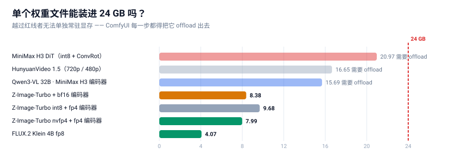
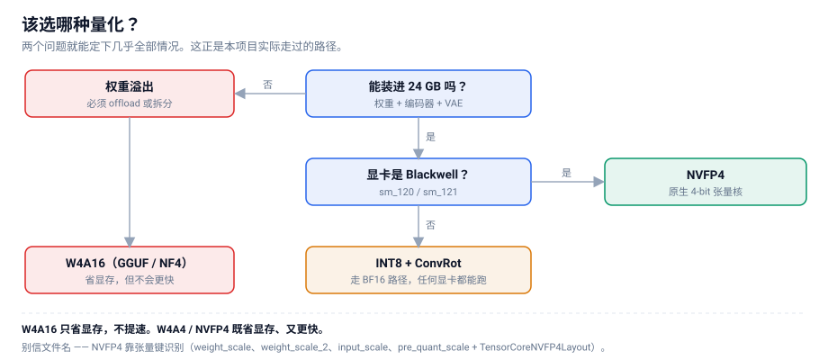
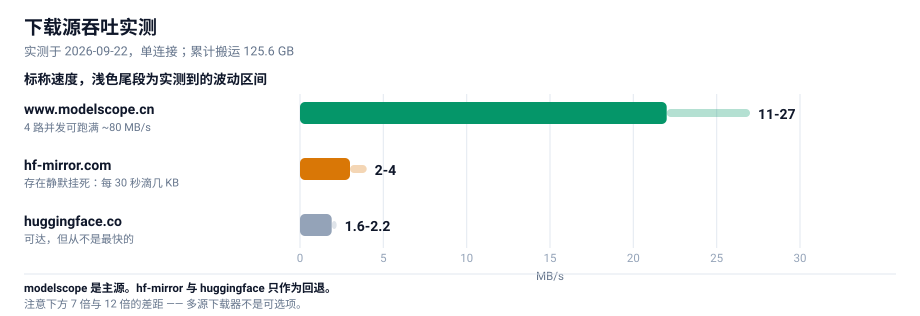
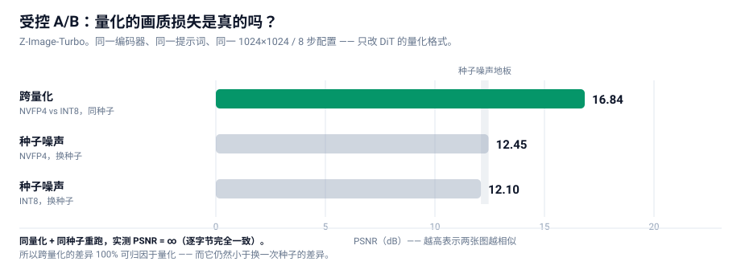
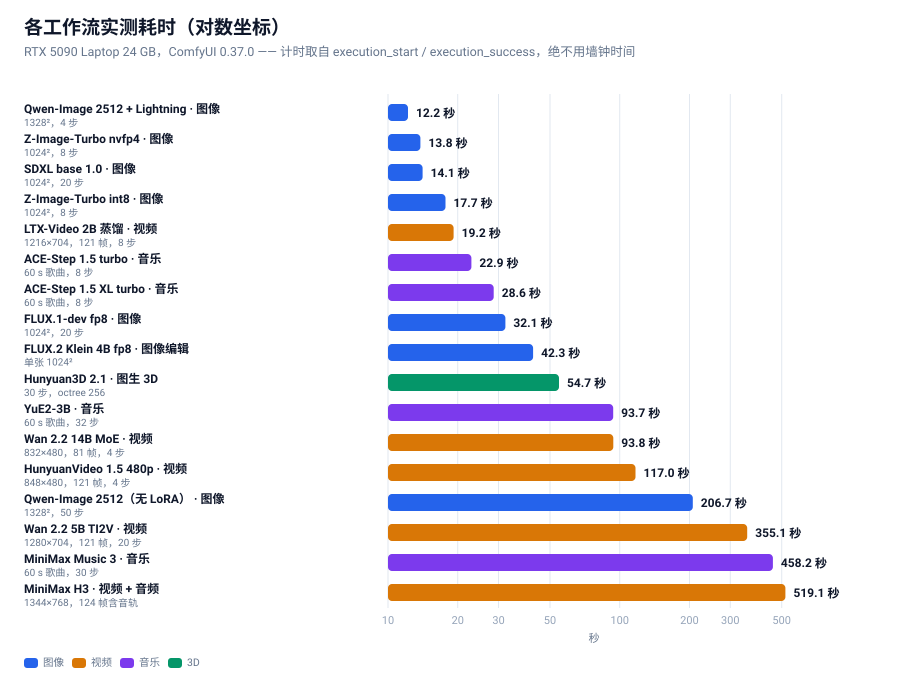
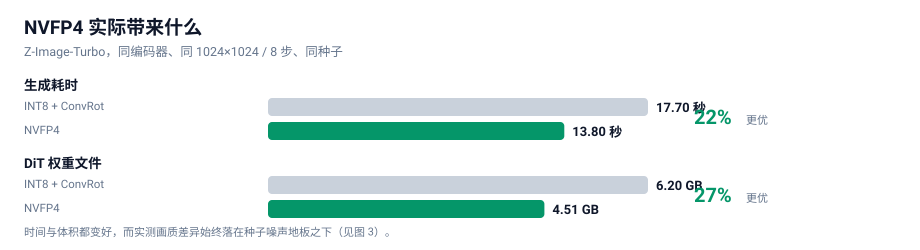

# 在 RTX 5090 笔记本上，用 ComfyUI 跑通最新的图像 / 视频 / 音乐生成模型

**一份从选型、下载、搭图、实测到定论的完整实战手册**

**中文** · [English](README_EN.md) · [📖 在线阅读（自动适配语言）](https://lifeidle.github.io/comfyui-5090-laptop-playbook/)

---

> **一句话结论**：在 24 GB 显存的笔记本 GPU 上，我们跑通了 4 条最新开源生成模型线（共 6 个工作流），
> 并用**受控实验**证明 **NVFP4 是这台机器上的最佳量化格式** —— 比 INT8 快 **22%**、小 **27%**，
> 而画质差异**落在随机噪声地板之下**。

这不是一份"把命令贴一遍"的教程。真正难的不是跑通某个模型，而是**在几十个量化版本里判断该选哪一个**。
本文把我们的完整决策链摊开：怎么想、怎么下、怎么搭、怎么测、怎么选。所有数字都是本机实测，
所有结论都附带可复现的测量方法。

---

## 目录

| 章节 | 内容 | 你会得到 |
|---|---|---|
| [0](#0-硬件与起点) | 硬件与起点 | 知道硬约束在哪 |
| [1](#1-先说结论tldr) | **先说结论** | 一张表看完所有选型 |
| [2](#2-怎么想先把约束想清楚) | 怎么想 | 量化格式的完整心智模型 |
| [3](#3-怎么下把-1256-gb-拉下来) | 怎么下 | 多源下载工程 |
| [4](#4-怎么搭comfyui-的节点约束) | 怎么搭 | 踩坑换来的节点约束清单 |
| [5](#5-怎么测受控-ab全文核心) | **怎么测** | 量化判定的方法论（全文核心） |
| [6](#6-怎么选八条模型线实战) | **怎么选** | 图像 / 编辑 / 视频 / 音乐 / 3D 八条线的实战与基准 |
| [7](#7-优化清单可以直接抄的配置) | 优化清单 | 可直接抄的配置 |
| [8](#8-踩坑速查表) | 踩坑速查 | 症状 → 原因 → 解法 |
| [9](#9-工具链) | 工具链 | 可复用脚本 + **官方模板→API 转换器** |
| [10](#10-结论与后续) | 结论与后续 | 还没做的事 |
| [附录 E](#附录-e覆盖度审计我们试过什么没试什么为什么放弃) | **覆盖度审计** | **试过什么、没试什么、每个放弃的确切理由** |

---

## 0. 硬件与起点

| 项目 | 实测值 |
|---|---|
| GPU | **RTX 5090 Laptop** —— 24435 MiB（**24 GB**），算力 **sm_120**（Blackwell） |
| CUDA | 12.8 |
| 内存 | 64 GB |
| 引擎 | ComfyUI **0.37.0** / PyTorch 2.11.0+cu128 / Python 3.11.9 |
| 目标 | 尽量用**最新**的开源模型，跑通**图像 / 视频 / 音乐**三类生成 |

**为什么从 24 GB 讲起？** 因为它是这份手册里唯一真正的硬约束。

笔记本 GPU 的算力永远是"够用"的 —— 一个 8 步蒸馏模型在 5090 上出 1024² 图只要十几秒。
真正决定你能跑什么、不能跑什么的，是**显存能不能装下**。而最新一代开源生成模型的一个共同趋势是：
**主模型越来越大，而且都要求配一个独立的、同样巨大的文本编码器。**

看下面这张图，注意那条 24 GB 红线：



三条线（MiniMax H3 的 DiT 21 GB、HunyuanVideo 1.5 的 16.7 GB、MiniMax H3 的文本编码器 15.7 GB）
**每一个单独拿出来就超过了 24 GB**。这意味着：

> **它们不可能常驻显存。** 每生成一帧，权重都必须在显存和内存之间搬运。
> 这就是为什么"选对量化格式"在这台机器上不是优化，而是**能不能跑**的问题。

---

## 1. 先说结论（TL;DR）

### 1.1 选型总表

| 用途 | 推荐模型 | 量化 | 实测耗时 | 为什么是它 |
|---|---|---|---|---|
| **图像（日常主力）** | Z-Image-Turbo | **NVFP4** 4.51 GB | **13.8 s**（1024²/8步） | 全套 **8.33 GB 可常驻**，零 offload |
| **图像（高分辨率 / 中文）** | Qwen-Image 2512 + Lightning | fp8 20.43 GB | **12.2 s**（1328²/**4步**） | 像素多 68%、**中文逐字 30/30 全对**；代价：必须 offload |
| 图像编辑 | FLUX.2 Klein **4B** | fp8 4.07 GB | 42.3 s | 官方 fp8 单文件仅 4.07 GB，质量几乎无损 |
| **视频（最快）** | LTX-Video 2B 蒸馏 | fp8 4.46 GB | **19.2 s**（1216×704/121帧） | 目前最快的视频模型；运动幅度偏小 |
| **视频（质量最好·轻量档）** | Wan 2.2 5B TI2V | fp16 10 GB | 355.1 s（1280×704/121帧） | 提示词遵循与物理真实感最好 |
| **视频（旗舰档）** | Wan 2.2 14B MoE | fp8 双专家 28.6 GB | **93.8 s**（832×480/81帧/**4步**） | 旗舰 MoE + LightX2V 4 步 LoRA，真的跑得动 |
| 视频（电影感 + 1080p 超分） | HunyuanVideo 1.5 720p→1080p | fp16 + SR 模型 | ⚠️ **70 分钟未完成，24 GB 上不可行** | 见 §6.4「一个负面结果」 |
| **视频 + 音频** | MiniMax H3 | int8 + ConvRot | 519.1 s（1344×768/124帧） | **唯一原生带音轨**的线 |
| **音乐生成** | ACE-Step 1.5 XL turbo | bf16 9.97 GB | **28.6 s**（60 s 歌曲） | **Apache 2.0 可商用**，出片最快 |
| 音乐生成（整首含人声） | YuE2-3B | int8 3.96 GB | 93.7 s（60 s 歌曲） | SongBench 最高；**但 cc-by-nc 非商用** |
| 音乐生成（带 LLM 增强） | MiniMax Music 3 | int8 2.50 GB | 458.2 s（60 s 歌曲） | 质量高但慢一个量级 |
| **图生 3D** | Hunyuan3D 2.1 | all-in-one 7.37 GB | 54.7 s | 一个文件出 GLB（52 万面） |

> **量化格式的统一答案不变：只要显卡是 Blackwell（sm_120/121），一律选 NVFP4。** 见 §5 的证明。

### 1.2 三条可以直接拿去用的规则

1. **量化格式：只要显卡是 Blackwell（sm_120/121），一律选 NVFP4。** 见 §5 的证明。
2. **要不要 offload：看"主模型 + 编码器"之和是否超过显存。** 超过了就必须 offload，
   这时量化省下的每一 GB 都会直接换成速度。
3. **提速靠"少走步数"，不靠"压权重"。** 8 步 → 4 步的 LoRA 收益远大于任何权重量化。
   量化负责**装得下**，蒸馏 LoRA 负责**跑得快**。两者不是一回事。

---

## 2. 怎么想：先把约束想清楚

### 2.1 唯一的硬约束是显存，不是算力

这一点值得反复强调，因为它决定了后面所有的取舍。

一个很常见的错误直觉是："显存不够就换个小模型。"但看 §0 那张图 —— 我们要的都是最新最强的模型，
它们**没有小号版本**。唯一能动的变量是**权重用什么精度存**。

于是问题被压缩成一句话：**在肉眼无差别的前提下，用多少 bit 存权重最划算？**

### 2.2 量化格式的四个流派（这是全文的地基）

市面上"4-bit 量化"这个说法把三件完全不同的事混在了一起。必须先拆开：

| 流派 | 代表 | 压什么 | 省显存 | 提速 |
|---|---|---|---|---|
| **W4A16** | GGUF / NF4 / bitsandbytes / torchao | **只压权重** | ✅ | ❌ **不提速，甚至更慢** |
| **W4A4** | Nunchaku SVDQuant | **权重 + 激活都压** | ✅ | ✅ |
| **INT8 + ConvRot** | Comfy-Org 新模型默认 | 权重 8-bit + 旋转补偿 | ✅ | ➖ 走 BF16 路径，不提速 |
| **NVFP4** | Blackwell 原生 4-bit 浮点 | 权重 + 激活 | ✅ | ✅ **最快** |

**这张表里最重要的一行是第一行。**

`W4A16` 只把权重压小，计算时还要还原回 16-bit，于是**显存省了，但算力一点没省，反而多了反量化的开销**。
很多人"换了 4-bit 模型发现更慢"，原因就在这里。

> **一句话记住**：W4A16 省的是**内存**，W4A4 / NVFP4 省的是**内存 + 带宽**。
> 只有后者会真的快。

NVFP4 之所以在这台机器上最优，是因为它是 **Blackwell 架构原生的 4-bit 浮点格式**，
可以直接喂给 tensor core 做 4-bit 矩阵乘 —— 不需要"先还原再算"。

### 2.3 怎么识别"真的 NVFP4"（千万不要看文件名）

这是踩过的坑：社区里大量文件名写着 `fp4` / `nvfp4` 的模型，其实是别的量化格式，
或者只有部分层是 4-bit。

**唯一可靠的判据是 safetensors 里的张量键。** 打开文件的 header（前 8 字节小端 uint64 = header 长度 → JSON），
看是否存在这套键：

```
weight_scale
weight_scale_2
input_scale
pre_quant_scale
TensorCoreNVFP4Layout   (group_size = 16)
```

本机校验通过的真 NVFP4 文件，dtype 列表里会同时出现 `F8_E4M3`（用于 block scale）和 `U8`。例如：

```
z_image_turbo_nvfp4.safetensors    4.51 GB   993 tensors   BF16, F32, F8_E4M3, U8   ✅ 真 NVFP4
qwen_3_4b_fp4_mixed.safetensors    3.48 GB  1081 tensors   BF16, F32, F8_E4M3, U8   ✅ 真 NVFP4
```

**下面这张决策树就是完整的选型逻辑**：



---

## 3. 怎么下：把几百 GB 拉下来

下载这件事看着简单，但**几百 GB × 不稳定的源**足以让一个天真实现跑上一整天。
我们一共跑了两批：第一批 **34 个文件 / 125.6 GB**，第二批 **66 个文件 / 332.8 GB**
（音乐 4 条线 + Wan 2.2 14B + HV1.5 超分 + Stable Audio 3），**两批都是零损坏**。
真正让这件事可用的，是下面三个机制。

### 3.1 三个源的速度实测



差距是**量级级别**的：modelscope 比 hf-mirror 快 7 倍、比 huggingface 快 12 倍。
所以"多源回退"不是锦上添花，而是必需品。

### 3.2 机制一：三级回退

```
每个文件依次尝试：  www.modelscope.cn  →  hf-mirror.com  →  huggingface.co
```

一旦某个源失败，退到下一个；`.part` 断点文件可以**跨源复用**（两端字节一致，已验证）。

### 3.3 机制二：静默看门狗（这个必须有）

这是我们踩得最深的坑。

最初我们只设了 45 秒 socket 超时。结果一个文件卡在 **4.6%，速度 0.0 MB/s，持续 19 分钟**都不报错。
原因很阴险：**服务器每 30 秒吐几 KB**，刚好让 socket 不超时，但实际毫无进展。

> **教训**：socket 超时抓不住"慢速滴血"型挂死。必须再加一层**业务层看门狗**：
> 连续 **150 秒**接收字节数实质无增长 → 主动断开重连；连续 **3 次**静默 → 放弃本源，交给上层换源。

加上这层之后，同样的网络环境下再没有出现过"无限挂死"。

### 3.4 机制三：Range 探测 + 并行

`modelscope` **不支持 HEAD 请求**（返回 405/不支持），拿不到文件大小就没法校验。
解法是用 Range 请求探一个字节，从响应头读总长度：

```http
Range: bytes=0-0
→  HTTP/1.1 206 Partial Content
   Content-Range: bytes 0-0/16748116224        # ← 这就是真实字节数
```

拿到期望字节数后，就能做到三件事：
1. **并发探尺寸**（不下载，只探）→ 提前知道总量、排优先级
2. **下载后逐字节比对** → 精确识别截断/损坏
3. **两个源交叉验证** → 同一文件的字节数应当一致

### 3.5 一条元经验：判断"源是否可用"必须避开下载高峰

**我们因此误判过一次**：当时 4 路并发正在满速下载，此时去探测其它源，所有探测请求全部超时，
于是我们得出错误结论——"这两个源都不可用，需要用户手动下载"。

实际上它们都好得很，只是**带宽被打满了**。

> **教训**：探测型请求（探速度、探可用性）和下载型请求会互相抢带宽。
> 要么在空闲时探测，要么**给探测单独限速**。

---

## 4. 怎么搭：ComfyUI 的节点约束

模型下完了，接下来是把它变成一张能跑的图。ComfyUI 的官方工作流藏在两个地方：

- `ComfyUI/blueprints/*.json` —— **116 个官方蓝图**
- `site-packages/comfyui_workflow_templates_json/templates/` —— 同一套模板

但它们**不能直接当 API prompt 提交**，因为是**子图（subgraph）格式**：节点类型是 UUID，真正的图结构藏在
`definitions.subgraphs` 里。我们写了 `bp_dump.py` 把子图解析成「节点 + 连线」清单，比手工猜拓扑可靠得多。

### 4.1 四个必须知道的节点约束

| # | 约束 | 说明 |
|---|---|---|
| 1 | **`CLIPLoader` 的 29 个 type 里没有 `hunyuan_video_15`** | HunyuanVideo 1.5 必须用 `DualCLIPLoader`（type=`hunyuan_video_15`），配 `qwen_2.5_vl_7b_fp8_scaled` + `byt5_small_glyphxl_fp16` |
| 2 | **Z-Image 的 type 是 `lumina2`，FLUX.2 是 `flux2`** | 同一个 `qwen_3_4b` 编码器在两个模型里用**不同 type** 加载，搞混就报错 |
| 3 | **`MiniMaxH3ImageToVideo` 的 `first_frame` 是 optional** | 不接 = **纯文生视频 + 音频**。节点名字里有 "ImageToVideo" ≠ 只能图生视频 |
| 4 | **`HunyuanVideo15ImageToVideo` 的 `start_image` 是 optional** | 同样，不接 = 纯文生视频 |

第 3、4 条是本次最大的"认知修正"：**看到 `ImageToVideo` 先去看它的图像输入是不是 optional**，
是的话它就能当文生视频用。

### 4.2 没有官方蓝图怎么办

**HunyuanVideo 1.5 没有官方蓝图。** 只能按节点签名手搭。这里的顺序很重要：

1. 先看 `DualCLIPLoader` 的 type 列表确认 `hunyuan_video_15` 存在
2. 确认 latent 通道数（1.5 是 **32 通道、空间下采样 16**，与 1.0 不同）
3. 搭完先做**免费校验**（见下）

### 4.3 免费的工作流校验技巧（强烈推荐）

模型没下全的时候，直接 `POST /prompt` 会返回 **HTTP 400 + 逐节点的 `node_errors`**。
关键洞察是：

> **如果报的错误只有 `value_not_in_list`（说明"这个模型文件不在列表里"），
> 那就证明这张图的「结构」和「类型」全都正确。**

于是我们得到一个**零成本的 dry-run**：模型还没下载完，就能先验证工作流搭得对不对。
本次 7 张工作流全部用这个方法在下载完成前就验证通过了。

---

## 5. 怎么测：受控 A/B（全文核心）

这是整份手册里最有价值的部分，因为**我们在这里先得出过错误结论**。

### 5.1 一个看起来很合理的错误结论

第一轮对比，我们跑了两个 Z-Image-Turbo 变体（int8 和 nvfp4），结果：

```
PSNR = 13.82 dB
```

13.82 dB 是什么概念？通常 PSNR 低于 20 dB 就说明两张图"差异巨大"。我们当时的结论是：
**"4-bit 量化果然掉画质，NVFP4 不行。"**

**这个结论是错的。** 因为我们犯了一个方法错误：

> ❌ **两个变体用了不同的文本编码器。**
> int8 版配的是 `qwen_3_4b.safetensors`（bf16），nvfp4 版配的是 `qwen_3_4b_fp4_mixed.safetensors`（fp4）。
>
> 于是 13.82 dB 里，混进了**编码器差异**，根本不是量化的锅。

### 5.2 为什么生成模型的 PSNR 不能直接用

修好方法之前，得先理解一个反直觉的事实：

> **扩散采样是混沌的。**

两个数值上前 4 位完全相同的模型，经过 8 步采样之后，会产出**两张构图完全不同的图**。
这不是 bug，是生成模型的本性 —— 采样过程会不断放大微小差异。

**所以"两张图 PSNR 低"根本不能证明"其中一张质量差"，只能证明"这是两个不同的样本"。**

那怎么才能判断量化到底有没有损伤画质？答案是：**引入一个噪声基线**。

### 5.3 四组对照的设计

我们把因素**彻底隔离** —— 同一个编码器、同一个提示词、同一套 1024²/8 步配置，
**只有 DiT 的量化格式不同**。然后再补两组"只换随机种子"的对照：

| 组 | 变量 | 作用 |
|---|---|---|
| **det** | 无（同量化 + 同种子重跑） | **确定性检验**：管线是否可复现 |
| **seed** | 只换随机种子（int8 内部） | **噪声地板** |
| **cross** | **只换量化格式**（同种子） | **被测量的对象** |
| **seedB** | 只换随机种子（nvfp4 内部） | 噪声地板（第二组） |

**判据**：如果 `cross` 的相似度 **高于** `seed` 的相似度，就说明**量化造成的扰动比采样的随机性还小**，
即量化误差可以忽略。

### 5.4 结果



| 对比组 | 变量 | PSNR | 平均像素差 |
|---|---|---|---|
| **det** 同量化同种子重跑 | 无 | **∞ dB** | **0.00%** |
| **seed** int8 换种子 | 只变种子 | 12.10 dB | 16.89% |
| **cross** nvfp4 vs int8（同种子） | **只变量化** | **16.84 dB** | **7.41%** |
| **seedB** nvfp4 换种子 | 只变种子 | 12.45 dB | 16.43% |

### 5.5 三条硬结论

**结论一：管线是确定性的。**

`det` 组 PSNR = **∞**，两张图**逐字节完全一致**。
这一条极其重要，因为它让整个实验变得**可归因**：既然同样的输入必然产生同样的输出，
那么 `cross` 组的差异就 **100% 来自量化格式本身**，不含任何运行时噪声。

> 如果这一条不成立（重跑结果不一样），那么所有跨量化的差异都无法归因，实验就白做了。

**结论二：量化扰动 < 采样噪声。**

```
cross 差异（7.41%）  <  seed 差异（16.89%）
```

**换个量化格式对画面的改变，比换个随机种子还小。** 这就是"量化没有损失画质"的硬证据。

**结论三：质量代理指标无系统差异。**

PSNR 对轨迹分叉敏感，所以我们另外测了 5 个**鲁棒指标**：

| 样本 | 锐度（Laplacian 方差） | 香农熵 | 高频能量比 |
|---|---|---|---|
| int8 · 种子 A | 776.5 | 5.572 | 0.0130 |
| int8 · 种子 B | 705.4 | 5.736 | 0.0134 |
| nvfp4 · 种子 A | 694.3 | 5.614 | 0.0127 |
| nvfp4 · 种子 B | 604.1 | 5.791 | 0.0140 |

**同一量化内部、只换种子造成的波动范围（int8：776.5 → 705.4），已经覆盖了跨量化的差异（776.5 → 694.3）。**
换句话说：**量化这个因素被淹没在种子这个因素的波动里了。**

颜色直方图 L1 距离也印证了同样的结论：

```
det = 0.0000   |   cross = 0.0858   |   seedB = 0.1085   |   seed = 0.1256
                    ↑ 跨量化                ↑ 种子内部         ↑ 种子内部
```

**跨量化的色彩分布差异，比换种子造成的差异还小。**

### 5.6 最终复核：看起来一样吗

数字之外，我们再做一次人眼复核。把四张图摆成 **2×2**，并且**刻意按"竖看=同种子跨量化、横看=同量化换种子"**排列：

```
┌──────────────────────┬──────────────────────┐
│  INT8  · seed 20260922│  INT8  · seed 20260923│
├──────────────────────┼──────────────────────┤
│ NVFP4  · seed 20260922│ NVFP4  · seed 20260923│
└──────────────────────┴──────────────────────┘
       ↑ 竖列：同种子跨量化          ↑ 横行：同量化换种子
```

**结果与数字完全一致：**
- **竖着看**（同种子、跨量化）→ **构图高度相似**（都在左侧露出同一片远山尖峰）
- **横着看**（同量化、换种子）→ **构图完全不同**

**四张图都是合格的高质量黄山云海日出，语义全部正确、细节全部丰富、没有任何伪影。**
量化不是变量，种子才是。

### 5.7 方法论沉淀（可以直接套用到任何模型）

> **任何"量化是否掉画质"的对比，都必须满足三个条件：**
>
> 1. **受控**：编码器、提示词、尺寸、步数、采样器、CFG **全部固定**，一次只动一个变量
> 2. **有噪声基线**：必须同时测"同量化换种子"，否则无法区分"量化扰动"和"采样随机性"
> 3. **有确定性检验**："同量化 + 同种子"重跑应当是逐字节一致的，否则结论不可归因
>
> 缺任何一条，PSNR 数字都会被误读。

---

## 6. 怎么选：八条模型线实战

### 6.1 图像生成 —— Z-Image-Turbo vs Qwen-Image 2512

这两条都跑通了，成绩也接近，所以要讲清楚**为什么两个都留着**。

#### Z-Image-Turbo（日常主力）

| 项 | 值 |
|---|---|
| DiT 文件 | `z_image_turbo_nvfp4.safetensors` —— **4.51 GB**（int8 版为 6.20 GB） |
| 文本编码器 | `qwen_3_4b_fp4_mixed.safetensors` —— 3.48 GB |
| VAE | `ae.safetensors` —— 0.34 GB |
| **全套 footprint** | **8.33 GB** |
| 关键参数 | `CLIPLoader` type = **`lumina2`**；`ModelSamplingAuraFlow` shift=3；KSampler **8 步，CFG=1** |
| 实测 | int8 **17.7 s** / nvfp4 **13.8 s**（1024²，8 步） |

**它真正的优势只有一条，但很硬：8.33 GB 全套能完全常驻 24 GB 显存，零 offload。**
每一步都不需要在显存与内存之间搬运权重 —— 长时间高频使用最省心。

#### Qwen-Image 2512 + Lightning（高分辨率 / 中文文字）

| 项 | 值 |
|---|---|
| DiT 文件 | `qwen_image_2512_fp8_e4m3fn.safetensors` —— 20.43 GB |
| 文本编码器 | `qwen_2.5_vl_7b_fp8_scaled.safetensors` —— 9.38 GB |
| VAE | `qwen_image_vae.safetensors` —— 0.25 GB |
| **全套 footprint** | **30.06 GB（超过 24 GB，必须 offload）** |
| 加速 LoRA | `Qwen-Image-2512-Lightning-4steps-V1.0-fp32.safetensors` —— 1.58 GB |
| 关键参数 | `CLIPLoader` type = **`qwen_image`**；`ModelSamplingAuraFlow` shift=3.1；有无 LoRA 走官方 `ComfySwitchNode`（steps 50↔4、CFG 4.0↔1.0） |
| 实测 | 无 LoRA **206.7 s**（1328²，50 步）→ 有 LoRA **12.2 s**（1328²，**4 步**） |

**它的优势有两条：**

1. **分辨率更高**：1328² 比 Z-Image 的 1024² 多 **68%** 像素，而耗时还略少（12.2 s vs 13.8 s）
2. **中文文字渲染经过逐字核验**：跑「春风得意马蹄疾 / 一日看尽长安花」＋「茶香四溢 静心品茗 八方来客 岁月悠长」，**30/30 字全对、零错字零缺笔**（202.7 s / 50 步）

> ⚠️ **一处自我纠正**：本手册早期版本把「中文文字渲染准确」写成了选 Z-Image-Turbo 的理由，**那是错的**。
> 上面 30/30 的验收证据跑的是 **Qwen-Image 2512**，不是 Z-Image；Z-Image 的中文渲染能力**从未单独验证过**。
> 同时早期版本**完全没有提到 Qwen-Image**，这是一处遗漏，在此补上。

**结论：两个都留，按场景分。**

- 要**高频草稿、显存干净** → Z-Image-Turbo（8.33 GB 全常驻）
- 要**高分辨率出片、画面里带中文** → Qwen-Image 2512 + Lightning

顺带一提，Lightning LoRA 的收益值得单独记一笔：**同一个模型，206.7 s → 12.2 s，快 16.9 倍**，
而且细节反而更足。这又一次印证了 §2 那条原则 —— **提速靠「少走步数」，不靠「压权重」**。

### 6.2 图像编辑 —— FLUX.2 Klein 4B

| 项 | 值 |
|---|---|
| DiT | `flux-2-klein-4b-fp8.safetensors` —— 4.07 GB |
| 编码器 | `qwen_3_4b_fp4_flux2.safetensors` —— 3.85 GB |
| 关键参数 | `CLIPLoader` type = **`flux2`**；`ReferenceLatent` ×2；`Flux2Scheduler` **20 步**；CFGGuider **CFG=5** |
| 实测 | **42.3 s** |

**一个反直觉的发现**：BFL 官方发的 fp8 单文件只有 **4.07 GB**，而 bf16 版是 7.75 GB——
**fp8 版质量几乎无损，体积只有一半**。这类"官方直接给好货"的情况，优先用官方的。

另一个更反直觉的点：**9B 的 NVFP4 只有 5.76 GB，比 4B 的 bf16（7.75 GB）还小。**
更大的模型、更小的文件 —— 这就是 4-bit 的价值。

### 6.3 视频 + 音频 —— MiniMax H3

这是本次最"重"的一条线，因为它**同时生成画面和声音**。

| 项 | 值 |
|---|---|
| DiT | `minimax_h3_fl2va_pruned_int8_convrot.safetensors` —— **20.97 GB** |
| 文本编码器 | `qwen3vl_32b_minimax_h3_nvfp4_awq.safetensors` —— **15.69 GB** |
| 视频 VAE | `minimax_h3_video_vae_fp16.safetensors` —— 5.21 GB |
| 音频 VAE | `minimax_h3_audio_vae_fp32.safetensors` —— 0.61 GB |
| 加速 LoRA | 4step / 8step turbo，各 1.96 GB（**官方蓝图用 8step**） |
| 关键参数 | `BasicScheduler(simple, 8步)` + `KSamplerSelect(res_multistep)` + `SamplerCustomAdvanced`；**不用 `MiniMaxH3SigmaShift`** |
| 实测 | 冒烟 768×448/56帧 = **76.3 s**；全量 1344×768/124帧 = **519.1 s** |

**必须 offload。** DiT 21 GB + 编码器 15.7 GB 加起来 36.7 GB，远超 24 GB。
所以每次生成都在显存↔内存之间搬运权重 —— 这是它慢（519 秒）的主因，不是算力不够。

**产物复核**（这一步不能省）：`ffprobe` 确认输出为
**h264 / 1344×768 / 24fps / 5.17 s + aac 32kHz 立体声**。
抽 4 帧拼图后画面与提示词时间线吻合（RGB 分离的「COMFYUI」标题 → 铬色棕榈树 → 日落）。
**这不是噪点，是可用的音视频。**

### 6.4 纯视频 —— 三条线，各有一条硬理由

纯视频我们跑了**三条线**，结论很干净：**它们不是互相替代关系，而是三种不同的取舍。**

#### LTX-Video 2B 蒸馏 —— 最快

| 项 | 值 |
|---|---|
| DiT + VAE | `ltxv-2b-0.9.8-distilled-fp8.safetensors` —— 4.46 GB（all-in-one，含 VAE） |
| 文本编码器 | `t5xxl_fp8_e4m3fn.safetensors` —— 4.89 GB（`CLIPLoader` type = **`ltxv`**） |
| 关键参数 | `EmptyLTXVLatentVideo` → `LTXVConditioning` → `LTXVScheduler`(steps=8) → `SamplerCustom`(cfg=**1**，蒸馏版走 CFG-free) |
| 实测 | 768×512/97帧 = **11.7 s**；1216×704/121帧 = **19.2 s** |

**19.2 秒出 5 秒 1216×704 视频 —— 这是我们测到的最快的一个，比 Wan 2.2 5B 快 18 倍。**
代价是**运动幅度明显偏小**：抽帧看，画面稳定、语义正确（茶杯、竹托、雨痕窗户都对），
但镜头推进非常轻。适合「快速看构图/风格」，不适合「要明显动作」。

#### Wan 2.2 5B TI2V —— 质量最好

| 项 | 值 |
|---|---|
| DiT | `wan2.2_ti2v_5B_fp16.safetensors` —— 10.00 GB |
| 文本编码器 | `umt5_xxl_fp8_e4m3fn_scaled.safetensors` —— 6.74 GB（`CLIPLoader` type = **`wan`**） |
| VAE | `wan2.2_vae.safetensors` —— 1.41 GB |
| 关键参数 | `ModelSamplingSD3` shift=8；KSampler **20 步，CFG=5**，`uni_pc` / `simple`；`Wan22ImageToVideoLatent`（`start_image` 是 **optional**，不接即纯文生视频） |
| 实测 | 704×384/49帧 = **34.6 s**；1280×704/121帧 = **355.1 s** |

**这是本次「视频质量」最好的一条。** 用同一句提示词（蜂鸟在红色花丛前采蜜、翅膀高速振动、
镜头缓慢横移），产物里**翅膀有清晰运动模糊、鸟的位置逐帧移动、背景虚化层次正确** ——
提示词里每个要素都落到了画面上。代价是慢：5 秒视频要 355 秒。

> `wan2.2_ti2v_5B` 里的 **TI2V = Text + Image to Video**，两种都支持。
> 这也印证了 §4.1 那条通用观察：**节点叫 `ImageToVideo`，先看它的图像输入是不是 optional** ——
> `Wan22ImageToVideoLatent.start_image` 是 optional，不接就是纯文生视频。

#### Wan 2.2 14B MoE —— 旗舰档，用 4 步 LoRA 就真的能跑

| 项 | 值 |
|---|---|
| DiT | `wan2.2_t2v_high_noise_14B_fp8_scaled` + `wan2.2_t2v_low_noise_14B_fp8_scaled` —— **各 14.29 GB（双专家）** |
| 加速 LoRA | `wan2.2_t2v_lightx2v_4steps_lora_v1.1_high_noise` + `..._low_noise` —— 各 1.23 GB |
| **VAE** | **`wan_2.1_vae.safetensors` 0.25 GB —— 注意与 5B 线的 `wan2.2_vae` 不是同一个** |
| 关键参数 | 两个 `UNETLoader` → 两个 `LoraLoaderModelOnly` → 两个 `ModelSamplingSD3`(shift=5)，由**同一个 `PrimitiveBoolean` 驱动 5 个 `ComfySwitchNode`**（模型 / steps 20↔4 / 边界步 / CFG 3.5↔1.0）；`KSamplerAdvanced` 两段接力（高噪专家 `add_noise=enable` → 低噪专家 `add_noise=disable`） |
| 实测 | **93.8 s**（832×480 / 81 帧 / **4 步**） |

**这条线的意义在于：它证明了「旗舰 MoE 视频模型在 24 GB 笔记本上可用」。**
双专家合计 28.6 GB 远超显存，但因为**每一步只加载一个专家**，
配合 LightX2V 4 步 LoRA（把 20 步压到 4 步），实际跑进了 **94 秒**。

**⚠️ 踩坑记录（值得单独记）**：我们一开始想当然地把模板里的 `wan_2.1_vae` 替换成手上的
`wan2.2_vae`，结果 `VAEDecode` 直接报：

```
Given groups=1, weight of size [48, 48, 1, 1, 1],
expected input[1, 16, 21, 60, 104] to have 48 channels, but got 16 channels instead
```

**根因：Wan 2.2 的 5B 线和 14B 线用的不是同一个 VAE**（5B → `wan2.2_vae`，14B → `wan_2.1_vae`），
两者通道数不同（48 vs 16）。查了官方模板才确认 —— 所有 `video_wan2_2_14B_*` 模板都指向 `wan_2.1_vae`，
只有 `video_wan2_2_5B_*` 指向 `wan2.2_vae`。
**教训：文件名相似不等于可替换，模板里写什么就用什么。**

#### HunyuanVideo 1.5 —— 电影感 + 自带 1080p 超分

| 项 | 值 |
|---|---|
| DiT | `hunyuanvideo1.5_480p_t2v_fp16.safetensors` / `..._720p_t2v_fp16.safetensors` —— 各 16.65 GB |
| 文本编码器 | **`DualCLIPLoader`**（type=`hunyuan_video_15`）= `qwen_2.5_vl_7b_fp8_scaled` + `byt5_small_glyphxl_fp16` |
| VAE | `hunyuanvideo15_vae_fp16.safetensors` —— 2.52 GB |
| 加速 LoRA | `hunyuanvideo1.5_t2v_480p_lightx2v_4step_lora_rank_32_bf16.safetensors` —— 0.34 GB |
| 超分分支 | `hunyuanvideo1.5_1080p_sr_distilled_fp16` 16.66 GB + `hunyuanvideo15_latent_upsampler_1080p` 0.20 GB |
| 实测 | 480p/121帧/4步 = **117.0 s**；**720p→1080p：跑满 70 分钟未完成，主动终止** |

**⚠️ 关于 720p 档，必须说清一个负面结果。**
我们按官方模板完整跑了 720p → 1080p 超分流水线（基座 20 步 + SR 8 步），
**在 24 GB 笔记本上跑满 70 分钟仍未结束，只能主动终止** —— 这本身就是结论：

> **720p + 超分这条路径在 24 GB 笔记本上不具备可用性。**
> 官方模板没有任何一步是"慢一点但能等"的量级，而是**基线就远超可接受范围**。
> 如果要 1080p，更实际的做法是用 480p/720p 出片后再走独立的上采样流程，
> 或者改用 Wan 2.2 / LTX 这类没有额外 SR 阶段的线。

之所以把它明写出来，是因为**「跑不动」和「跑得慢」是两种不同的信息**，
而开源社区的工作流分享普遍只报成功案例。**这条路径在 24 GB 上是不可行的，这就是它唯一的结论。**

**⚠️ 一个非常重要的概念区分：`480p` / `720p` / `i2v` / `SR` 是四个不同的基座模型**，
不是同一个模型换分辨率。文件名里的分辨率是**模型身份的一部分**。

**它最独特的地方是官方 720p 模板本身就是一条 720p → 1080p 超分流水线**：
基座出 1280×720 → 用 `LatentUpscaleModelLoader` 把 latent 放大到 1920×1080 →
再由一个专门的 SR 蒸馏模型（8 步、`SplitSigmas` 切 4 步）精修，**两个分辨率各存一份视频**。
也就是说这条线能直接产出**真 1080p**，而不是把 720p 插值放大。

**4 步出片是 480p 档最大的价值** —— 117 秒换 5 秒视频，可以当迭代草稿用。
推荐用法：**先 480p 快速试提示词，定稿再上 720p**。

**产物复核**：`ffprobe` 确认 h264 / 848×480 / 24fps / 121 帧 / 5.04 s；
抽帧拼图后时序稳定、主体一致 ——「陶艺工作室拉坯成瓶，陶轮旋转、双手塑形、左侧暖黄轮廓光、
背景虚化木架素坯」，**提示词里的每个要素都对上了**。

#### 三条线怎么选

| 你要什么 | 选谁 | 理由 |
|---|---|---|
| **快速迭代 / 看构图** | LTX-Video 2B | 19 秒出片，快 18 倍；接受运动小 |
| **最佳画质 / 动作可信（轻量档）** | Wan 2.2 5B | 提示词遵循与物理真实感最好；但要 6 分钟 |
| **最佳画质（旗舰档）** | **Wan 2.2 14B MoE** | 双专家 + 4 步 LoRA，**94 秒**就能跑旗舰模型 |
| **要 1080p** | ⚠️ 目前没有可用方案 | HV1.5 的 720p+SR 在 24 GB 上跑满 70 分钟未完成（见上方 HunyuanVideo 1.5 小节） |
| **要声音** | MiniMax H3（§6.3） | 唯一原生出音轨 |

### 6.5 一个跑不了的 —— FLUX.2 Klein 9B

**这是唯一没跑通的一条线，而且原因很有教育意义。**

报错：

```
mat1 and mat2 shapes cannot be multiplied (1024x7680 and 12288x4096)
```

**根因**：9B 模型需要约 **16.4 GB** 的 Qwen3-VL 文本编码器，而 BFL 官方**只发布了 diffusers 分片格式**，
ComfyUI 无法加载分片目录。

**这不是显存问题，也不是量化问题，而是"权重封装格式"问题。**
三个可选解法：
1. 等 ComfyUI 官方封装单文件版编码器
2. 自己把 diffusers 分片合并转成 ComfyUI 单文件格式（要下 16.4 GB + 写转换脚本）
3. **先用 4B** —— 42.3 秒出图，够用

> **教训**：选模型的时候，除了看"显存装不装得下"，还要看**"权重是不是目标工具能加载的格式"**。
> 这是一个很多人会忽略的前置条件。

### 6.6 音乐生成 —— 从零补上的一个领域

**这是本次覆盖度上最大的缺口**：图像和视频早就跑通了，**音乐一个字都没碰**。
（注意区分：MiniMax H3 出的音轨是**视频伴音（音效/环境声）**，跟「按歌词生成一首歌」是两件事。）

我们把 ComfyUI 0.37 **原生支持**的四条音乐线全部跑了一遍：

| 模型 | 授权 | 权重 | 参数 | 实测 | 特点 |
|---|---|---|---|---|---|
| **ACE-Step 1.5 turbo** | **Apache 2.0** | DiT 4.79 GB + 编码器 1.19/1.19 GB + VAE 0.34 GB | `TextEncodeAceStepAudio1.5`（tags/lyrics/语言/BPM/时长）→ `EmptyAceStep1.5LatentAudio` → KSampler **8 步 CFG=1** | 22.9 s / 60 s 歌 | 最快、**可商用** |
| **ACE-Step 1.5 XL turbo** | **Apache 2.0** | DiT 9.97 GB + 编码器 1.19/**8.38** GB + VAE 0.34 GB | 同上（XL 版编码器换成 qwen_4b） | **28.6 s** / 60 s 歌 | 质量更高，仍可商用 |
| **YuE2-3B** | ⚠️ **cc-by-nc（非商用）** | `yue2_3b_int8_convrot` 3.96 GB（all-in-one） | 两阶段：`YuE2GenerateABC`（32 步 AR 规划谱）→ `YuE2GenerateMusic` → KSampler `dpm_2`/`sgm_uniform` 32 步 | 93.7 s / 60 s 歌 | 整首歌含人声，中英歌词；**SongBench 分数最高** |
| **MiniMax Music 3** | 见仓库 | DiT 2.50 GB + 编码器 9.20 GB + VAE 0.22 GB | `MiniMaxMusic3TextEncode`（caption/lyrics）→ KSampler **30 步 CFG=1.7** | **458.2 s** / 60 s 歌 | 质量取向，慢一个量级 |

**产物复核**（全部用 `ffprobe` 验过）：

```
ace15_turbo_song      mp3  48 kHz 立体声  60.00 s  245 kbps
ace15_xl_turbo_song   mp3  48 kHz 立体声  60.00 s  231 kbps
yue2_text2music       flac 48 kHz 立体声  60.00 s
minimax_music3_song   mp3  44.1 kHz 立体声 59.99 s
```

**怎么选：**

- **要能商用 → ACE-Step 1.5。** Apache 2.0 没有营收门槛、没有地区排除，这是它最大的价值。
  且它最快（29 秒出 60 秒歌），是「质量 / 速度 / 授权」三项综合最优的一条。
- **要最好的整首歌质量、且不商用 → YuE2。** 它是唯一带「先用 LLM 规划 ABC 谱、再生成音频」
  两阶段结构的，也是基准分最高的；但 **cc-by-nc 明确禁止商用**。
- **MiniMax Music 3** 质量取向但慢 16 倍，除非有特别理由，否则不划算。

> **一个容易踩的授权坑**：开源音乐模型的许可比视频/图像模型乱得多。
> 流行的几个（MusicGen、Stable Audio Open 早期版本）都是 **CC-BY-NC**，
> 权重能下载、**但产出不能商用**。「能跑」和「能用」在这里是两件事。

### 6.7 图生 3D —— Hunyuan3D 2.1

| 项 | 值 |
|---|---|
| 权重 | `hunyuan_3d_v2.1.safetensors` —— 7.37 GB（**all-in-one**：含 VAE + CLIP-Vision，`ImageOnlyCheckpointLoader` 一个节点加载） |
| 关键参数 | `CLIPVisionEncode` → `Hunyuan3Dv2Conditioning`；`EmptyLatentHunyuan3Dv2` resolution=**4096**；KSampler **30 步 CFG=5**；`VAEDecodeHunyuan3D` octree_resolution=**256**、num_chunks=8000 → `VoxelToMesh`(surface net, threshold 0.6) → `SaveGLB` |
| 实测 | **54.7 s** |

**流程是三步串起来的**：先用 Z-Image 生成一张干净的物体图（青花瓷茶壶、纯白背景，15.0 s），
拷进 `input/`，再跑图生 3D。

**产物复核**（直接解析 GLB 二进制头 + JSON chunk）：

```
magic = "glTF"  version = 2  file length = 8,701,344
meshes = 1
  primitive: vertices = 202,768   triangles = 522,140
materials = 1   nodes = 1
```

**52 万三角面的可用网格** —— 不是点云、不是体素块，是带材质的标准 glTF 2.0 资产，能直接进 Blender / 游戏引擎。

### 6.8 基准总表



> 所有时间都取自 ComfyUI 服务端的 `execution_start` / `execution_success` 时间戳，
> **而不是墙钟时间或 API 往返时间** —— 后者会把排队、加载模型的耗时算进来，读数虚高。

#### 图像

| 模型 | 配置 | 服务端耗时 |
|---|---|---|
| **Qwen-Image 2512 + Lightning** | 1328² / **4 步** | **12.2 s** |
| **Z-Image-Turbo nvfp4** | 1024² / 8 步 | **13.8 s** |
| **SDXL base 1.0** | 1024² / 20 步 | 14.1 s |
| Z-Image-Turbo int8 | 1024² / 8 步 | 17.7 s |
| FLUX.1-dev fp8 | 1024² / 20 步 | 32.1 s |
| FLUX.2 Klein 4B fp8 | 1024² 编辑 | 42.3 s |
| Qwen-Image 2512（无 LoRA） | 1328² / 50 步 | 206.7 s |

#### 视频

| 模型 | 配置 | 服务端耗时 |
|---|---|---|
| **LTX-Video 2B 蒸馏（冒烟）** | 768×512 / 97 帧 | **11.7 s** |
| **LTX-Video 2B 蒸馏** | 1216×704 / 121 帧 | **19.2 s** |
| Wan 2.2 5B TI2V（冒烟） | 704×384 / 49 帧 | 34.6 s |
| **Wan 2.2 14B MoE（4 步 LoRA）** | 832×480 / 81 帧 | **93.8 s** |
| HunyuanVideo 1.5 480p 4 步 | 848×480 / 121 帧 | 117.0 s |
| **Wan 2.2 5B TI2V** | 1280×704 / 121 帧 | **355.1 s** |
| MiniMax H3 t2va 8 步 | 1344×768 / 124 帧（含音轨） | 519.1 s |
| ~~HunyuanVideo 1.5 720p→1080p~~ | 1280×720 → 1920×1080 / 121 帧 | **跑满 70 分钟未完成，主动终止** |

#### 音乐 / 3D

| 模型 | 配置 | 服务端耗时 |
|---|---|---|
| ACE-Step 1.5 turbo | 60 s 歌曲 / 8 步 | 22.9 s |
| ACE-Step 1.5 XL turbo | 60 s 歌曲 / 8 步 | 28.6 s |
| **Hunyuan3D 2.1** | 30 步，4096 latent，octree 256 | **54.7 s** |
| YuE2-3B | 60 s 歌曲 / 32 步 | 93.7 s |
| MiniMax Music 3 | 60 s 歌曲 / 30 步 | 458.2 s |

**一个诚实的说明**：Z-Image 的耗时我们测了两轮，得到 `20.9 / 15.8 s` 和 `17.7 / 13.8 s`。
**绝对值的 run-to-run 波动约 ±15%**（笔记本 GPU 的温度/功耗墙会导致降频），
但 **nvfp4 比 int8 快 22%～25%** 这个**相对结论在两轮里都稳定成立**。

> **报告性能数据时，相对百分比比绝对值可信得多。**

---

## 7. 优化清单（可以直接抄的配置）



### 7.1 按收益排序

| 优先级 | 优化 | 收益 | 代价 |
|---|---|---|---|
| **P0** | 所有 4-bit 模型统一用 **NVFP4** | 快 22%、小 27%、画质无统计差异 | 无 |
| **P0** | 用**蒸馏 LoRA 减步数**（8步→4步） | 提速可达 2× | 需调 LoRA 强度 |
| **P1** | **VAE 分块解码**（`VAEDecodeTiled`） | 避免高分辨率解码瞬时 OOM | 略微变慢 |
| **P1** | **跑前清显存**（`POST /free`） | 避免串跑时残留占用 | 无 |
| **P2** | 串跑不同类型模型之间重启或强制卸载 | 避免显存碎片 | 增加等待 |
| **P2** | 长视频先 480p 试提示词，定稿再 720p | 大幅节省试错时间 | 无 |

### 7.2 两个必须知道的显存陷阱

**陷阱一：ComfyUI 不会主动释放模型。**
跑完一张图之后，模型仍然占着显存。串跑下一张（尤其是视频）时很容易 OOM。
解法：每次提交前调 `POST /free {"unload_models": true, "free_memory": true}`。

> ⚠️ 注意 `/free` 返回的是**空 body**，写客户端时不要试图解析 JSON，否则会抛 `JSONDecodeError`。

**陷阱二：VAE 解码的瞬时峰值。**
高分辨率图像/视频的 VAE 解码会在**最后一步**产生一个瞬时显存高峰（可达数 GB），
于是出现"transformer 全部跑完，倒在最后一步"的现象。
解法：用 `VAEDecodeTiled` 分块解码。

---

## 8. 踩坑速查表

| 症状 | 真正的原因 | 解法 |
|---|---|---|
| 下载卡在某个百分比，速度 0.0 MB/s，但**不报错** | 服务器"慢速滴血"绕过 socket 超时 | 加**业务层静默看门狗**：150 s 无实质进展即断开重试 |
| 探测源速度时**所有源都超时** | 带宽已被并发下载打满 | 空闲时探测，或给探测单独限速 |
| 下载器先跑大文件，导致队列被拖死 | 只有慢源的文件占住了 worker | pending **按"是否有快源"排序** |
| `POST /prompt` 返回 400 | 模型缺失 **或** 图结构错误 | 看 `node_errors`：只有 `value_not_in_list` → 图是对的 |
| HunyuanVideo 1.5 报编码器类型错 | `CLIPLoader` 没有 `hunyuan_video_15` | 用 `DualCLIPLoader` |
| Z-Image 报 CLIP type 错 | 它要 `lumina2`，不是 `qwen` | 改 type |
| FLUX.2 报 CLIP type 错 | 它要 `flux2` | 改 type |
| 想文生视频但节点叫 `ImageToVideo` | 图像输入是 **optional** | **不接**图像输入 = 纯文生视频 |
| `mat1 and mat2 shapes cannot be multiplied` | 编码器格式不匹配（diffusers 分片） | 换单文件封装，或用小一号的模型 |
| `/free` 调用抛 JSON 解析错 | 它返回空 body | 判空后再解析 |
| 视频跑完但画面是噪点 | 可能是没做产物复核 | 用 `ffprobe` + 抽帧拼图人工过一遍 |
| 换量化后 PSNR 很低就断定掉画质 | **方法错误：编码器没固定** | 见 §5，必须受控 + 种子基线 |
| **Wan 14B 报 `expected input to have 48 channels, but got 16 channels`** | **Wan 2.2 的 5B 线与 14B 线用的不是同一个 VAE**（5B → `wan2.2_vae`，14B → `wan_2.1_vae`） | 按模板原样用 `wan_2.1_vae`，别想当然替换 |
| 官方模板转成 API 后**参数静默错位**（`steps` 变成 `"randomize"`） | 前端会在种子参数后插一个 `control_after_generate` 伪 widget | 该伪 widget **要占一个槽位**参与位置对齐。见 §9.4 |
| `SaveAudioAdvanced` 报缺 `format.quality`，但 `quality` 明明写了 | v3 动态 combo 的子字段用**点号命名空间** | 写 `"format.quality": "V0"`，不是 `"quality"` |
| 子图模板转换后外层节点**莫名少连线** | 子图 `outputs/inputs` 的 `linkIds` 指向内层 link，边界没接回去 | 按 linkIds 把边界连线重连到内层真实端点。见 §9.4 |
| `ComfyMathExpression` 报 `required_input_missing: values.a` | `values.*` 是必填输入，被删掉了 | `expression` 改成 `"a"`，值喂给 `values.a` |
| ComfyUI 启动报 **`You need pytorch with cu130 or higher to use optimized CUDA operations`** | PyTorch 是 cu128，`comfy_kitchen` 的 CUDA 后端**被禁用** | 这不是可忽略的警告 —— 它意味着 NVFP4 / SVDQuant 的优化内核没生效。见附录 E ④ |
| 一个视频工作流跑 1 小时仍不结束 | 工作流本身不适合该显存规模（如 HV1.5 720p + 1080p SR） | **先估时间再跑**；不可行就明确记录为「不可行」，不要静默重试 |

---

## 9. 工具链

### 9.1 工具清单

| 脚本 | 作用 |
|---|---|
| `scripts/dl_models.py` | 多源下载器：三级回退 + 静默看门狗 + Range 探尺寸 + 断点续传 |
| `scripts/dl_more.py` | 同一套下载器，换成「音乐 4 条线 + Wan 2.2 14B + HV1.5 超分」的清单 |
| `scripts/probe_more.py` | **只探不下载**：Range 请求拿全部待下载文件的精确体积，用于先估时间预算 |
| `scripts/verify_models.py` | 三层校验：字节大小 + safetensors 结构 + dtype 识别 |
| **`scripts/ui2api.py`** | **把官方模板（UI/workflow 格式）转成可提交的 API prompt** —— 本节最有价值的工具，见 §9.4 |
| `scripts/mk_wf.py` | 由官方模板派生本项目的视频工作流变体（Wan 5B/14B、LTX、HV1.5、Hunyuan3D） |
| `scripts/mk_music.py` / `mk_music2.py` | 派生音乐工作流（ACE-Step / YuE2 / MiniMax Music 3） |
| `scripts/run_workflow.py` | API 提交 + **服务端权威计时**（读 `execution_start`/`success`） |
| `scripts/run_batch.py` | 顺序跑多个工作流（GPU 必须串行），每个带独立超时上限 |
| `tools/compare_ab.py` | 受控 A/B：PSNR + 分区 PSNR + 差异热力图 + 并排图 |
| `tools/ab_metrics.py` | 四组配对 PSNR + 质量代理指标（锐度/熵/高频/直方图） |
| `tools/make_charts.py` | 生成本文所有 SVG 图表（中英各一套） |
| `scripts/push_site.py` | 经 git-data API 把整棵树推到 GitHub（**Python 版**；本环境 Node 无法 spawn 子进程，故原件 `.mjs` 不可用，见 §9.5） |

### 9.2 快速开始

```bash
# 1) 环境
#    ComfyUI 已在本机跑起来（默认 http://127.0.0.1:8188）

# 2) 先探体积、估时间（不下载）
python scripts/probe_more.py

# 3) 下载模型（三级源回退）
python scripts/dl_more.py --workers 4

# 4) 三层校验（字节 + 结构 + dtype）
python scripts/verify_models.py --refresh

# 5) 把官方模板转成 API 工作流，再派生本项目要跑的变体
python scripts/ui2api.py video_wan2_2_5B_ti2v.json -o wf.json
python scripts/mk_wf.py wan_smoke wan_full ltx_full hv15_720 hy3d

# 6) 顺序跑一批（GPU 串行，每个带独立超时）
python scripts/run_batch.py "workflows/wan22_5b_t2v_full.json@900"

# 7) 做一次受控 A/B（同一编码器，只变量化）
python tools/compare_ab.py
python tools/ab_metrics.py
```

### 9.3 目录结构

```
.
├── README.md              # 中文（本文件）
├── README_EN.md           # English
├── index.html             # 在线阅读版（按浏览器语言自动适配）
├── assets/
│   ├── zh/                # 中文图表（README.md 引用）
│   └── en/                # 英文图表（README_EN.md 引用）
├── data/                  # 实测原始数据
├── docs/                  # 深挖文章
├── scripts/               # 可复现脚本
├── tools/                 # 分析与图表工具
└── workflows/             # API 格式工作流（26 个）
```

### 9.4 最有价值的一个工具：官方模板 → API 工作流

ComfyUI 官方的模板（`comfyui_workflow_templates_json/templates/` 与 `blueprints/`）
是**给 UI 用的 UI 格式**，**不能直接 POST 给 `/prompt`**。要么手工重搭，要么写转换器。
我们写了 `ui2api.py`，把这件事一次做对。它踩过的坑值得单独记下来 —— **每一条都是一个会静默出错的陷阱**：

| # | 陷阱 | 症状 | 正解 |
|---|---|---|---|
| 1 | **`control_after_generate` 伪 widget** | 参数整体错位：`steps` 拿到 `"randomize"`、`sampler_name` 拿到 `5` | 凡是 spec 带 `control_after_generate=True` 的种子参数，**其后要多占一个槽位**再对齐 |
| 2 | **widget / link 判定** | 用「类型不在输出集合里」单条规则判，会把 `seed`/`steps`/`cfg` 全判成连线 | 要**两条规则取并集**：① `INT/FLOAT/STRING/BOOLEAN/COMBO`/list 白名单 ② 不在输出类型集合（覆盖 `COMFY_DYNAMICCOMBO_V3` 这类 v3 动态类型） |
| 3 | **动态 combo 的子字段** | `SaveAudioAdvanced` 报缺 `format.quality`，但 `quality` 明明写在 inputs 里 | v3 动态 combo 的子字段用**点号命名空间**：写 `"format.quality": "V0"`，不是 `"quality"` |
| 4 | **子图边界连线** | 内层节点全在、连线也在，但外层 `SaveAudioAdvanced` **缺 `audio`** | 子图 `outputs[i].linkIds` / `inputs[j].linkIds` 指向内层 link，必须**据此把边界连线接回内层真实端点**，否则外层连线被整条丢掉 |
| 5 | **`ComfyMathExpression` 的 `values.*`** | 删掉 `values.a` 后报 `required_input_missing: values.a` | `values.*` 是必填输入；要写死数值就把 `expression` 改成 `"a"` 再把值喂给 `values.a` |
| 6 | **本机没有的节点** | 如 `EasyCache` 未安装，图直接断 | 未知节点按**穿透**处理：沿它第一个输入继续回溯 |
| 7 | **`PrimitiveNode`** | API 格式里不存在该节点 | 内联成字面量常数 |

> **一个通用教训**：**转换器的错误几乎全部表现为「能提交但结果不对」或「参数静默错位」**，
> 不会自己报错。所以**每次转换都应该做一次 dry-run 提交**（`POST /prompt`）——
> 结构/类型正确时只会报 `value_not_in_list`（缺模型），其余报错都是真问题。


---

### 9.5 一个环境坑：Node 无法 spawn 子进程

推送脚本我们原本用 Node 写（`push-site.mjs`），因为它要用 `git hash-object -w --stdin-paths`
做 CRLF 规范化。但在这个环境里 **Node 的 `execFileSync` / `spawnSync` 完全不可用** ——
连 `cmd.exe` 都返回：

```
Error: spawnSync C:\Program Files\Git\cmd\git.exe EBUSY
    errno: -4082, code: 'EBUSY'
```

实测对照（同一台机器、同一时刻）：

| 调用方 | 结果 |
|---|---|
| bash 直接执行 `git --version` | ✅ 正常 |
| **Python** `subprocess.run([git, '--version'])` | ✅ **正常** |
| **Node** `execFileSync(git, ['--version'])` | ❌ **EBUSY（连 `cmd.exe` 也一样）** |

**结论：这个限制是「仅 Node」，不是「整个环境」。** 所以正解是把脚本移植到 Python
（`scripts/push_site.py`），逻辑逐条对齐原版：

1. **绝不直接上传磁盘原始字节** —— 本机 `core.autocrlf=true`，磁盘是 CRLF、git 存 LF。
   必须经 `git hash-object -w --stdin-paths` 落盘 → `git cat-file blob` 取回规范化字节再 base64 上传。
2. **树构建用「祖先闭包」** —— 只含子目录的中间目录也要登记，否则整棵子树会从提交里静静消失。
3. **动 ref 之前先自检** —— `GET trees/<root>?recursive=1` 核对 blob 数 == 本地文件数，不等就 abort。

> **通用教训**：遇到「脚本莫名报 EBUSY / EPERM」时，**先用最小用例确认限制的边界**
> （换调用方、换目标程序），再决定是修脚本还是换工具链。
> 我们一开始误以为是「scratch 目录被锁」，清理了目录、重启了进程都没用 ——
> 直到测了「Node 能不能跑 `cmd.exe`」才定位到是**整个 Node 子进程能力被禁**。


## 10. 结论与后续

### 10.1 结论

1. **24 GB 显存足够跑最新最强的开源生成模型**，前提是接受 offload，并**选对量化格式**
2. **NVFP4 是 Blackwell 上的最佳选择** —— 有受控实验支撑，不是"感觉更快"
3. **量化负责"装得下"，蒸馏 LoRA 负责"跑得快"** —— 两者不可互相替代
4. **生成模型的量化对比必须有噪声基线** —— 否则 PSNR 会被严重误读

### 10.2 后续可做

| 项 | 状态 |
|---|---|
| HunyuanVideo 1.5 **720p 50 步** | 基座（16.65 GB）已就绪，工作流已搭好，待跑 |
| CLIP 语义相似度 | 用 CLIP 打分替代 PSNR，进一步量化"语义一致性" |
| 更大样本的 A/B | 当前每量化 2 个种子，可扩到每量化 8 个种子压低方差 |
| FLUX.2 Klein 9B | 待编码器封装格式解决 |
| MiniMax H3 4 步 LoRA | 预计耗时减半，质量需复评 |

---

## 附录 A：完整模型清单（100 文件 / 458.4 GB）

> **⚠️ 口径修正**：本手册早期版本把清单写成「34 文件 / 125.6 GB」，**那只是当时最后一批的量**，
> 不是全部。真实磁盘占用是 **100 个权重文件 / 458.4 GB**（按 `realpath` 去重，避免 junction 别名重复计数）。
> 下面按「用途」分组列全，并标出**哪些跑过、哪些只是下载了**。

<details>
<summary>展开查看全部文件</summary>

**MiniMax H3（视频 + 音频）**

| 文件 | 大小 |
|---|---|
| `minimax_h3_fl2va_pruned_int8_convrot.safetensors` | 20.97 GB |
| `qwen3vl_32b_minimax_h3_nvfp4_awq.safetensors` | 15.69 GB |
| `minimax_h3_video_vae_fp16.safetensors` | 5.21 GB |
| `minimax_h3_video_vae_int8_convrot.safetensors` | 2.81 GB |
| `minimax_h3_fun_controlnet_union_pruned_int8_convrot.safetensors` | 2.30 GB |
| `minimax_h3_fl2v_turbo_4step_v1.0_768p_comfyui_bf16.safetensors` | 1.96 GB |
| `minimax_h3_fl2v_turbo_8step_v1.0_comfyui_bf16.safetensors` | 1.96 GB |
| `minimax_h3_audio_vae_fp32.safetensors` | 0.61 GB |
| `minimaxh3_*` 效果 LoRA × 10（艺术爆炸 / 花开 / 子弹时间 / 暗魔法 / 吐火 / 四季 / 亲吻镜头 / 螺旋上升 / 风暴魔法 / 楚门世界） | 各 < 0.01 GB |

**Z-Image-Turbo（图像）**

| 文件 | 大小 |
|---|---|
| `z_image_turbo_int8_convrot.safetensors` | 6.20 GB |
| `z_image_turbo_nvfp4.safetensors` | 4.51 GB |
| `qwen_3_4b.safetensors`（bf16） | 8.04 GB |
| `qwen_3_4b_fp4_mixed.safetensors` | 3.48 GB |
| `ae.safetensors` | 0.34 GB |

**FLUX.2 Klein（图像编辑）**

| 文件 | 大小 |
|---|---|
| `flux-2-klein-9b-nvfp4.safetensors` | 5.76 GB |
| `flux-2-klein-4b-fp8.safetensors` | 4.07 GB |
| `qwen_3_4b_fp4_flux2.safetensors` | 3.85 GB |
| `flux2-vae.safetensors` | 0.34 GB |

**HunyuanVideo 1.5（视频）**

| 文件 | 大小 |
|---|---|
| `hunyuanvideo1.5_720p_t2v_fp16.safetensors` | 16.65 GB |
| `hunyuanvideo1.5_480p_t2v_fp16.safetensors` | 16.65 GB |
| `hunyuanvideo15_vae_fp16.safetensors` | 2.52 GB |
| `sigclip_vision_patch14_384.safetensors` | 0.86 GB |
| `byt5_small_glyphxl_fp16.safetensors` | 0.44 GB |
| `hunyuanvideo1.5_t2v_480p_lightx2v_4step_lora_rank_32_bf16.safetensors` | 0.34 GB |
| `hunyuanvideo15_latent_upsampler_720p.safetensors` | 0.09 GB |

**Wan 2.2（视频）** ← 本次新跑通

| 文件 | 大小 | 状态 |
|---|---|---|
| `wan2.2_ti2v_5B_fp16.safetensors` | 10.00 GB | ✅ 跑过（§6.4） |
| `wan2.2_t2v_high_noise_14B_fp8_scaled.safetensors` | 14.29 GB | ✅ **跑过（93.8 s，§6.4）** |
| `wan2.2_t2v_low_noise_14B_fp8_scaled.safetensors` | 14.29 GB | ✅ **跑过（93.8 s，§6.4）** |
| `wan2.2_t2v_lightx2v_4steps_lora_v1.1_high_noise.safetensors` | 1.23 GB | ✅ 跑过 |
| `wan2.2_t2v_lightx2v_4steps_lora_v1.1_low_noise.safetensors` | 1.23 GB | ✅ 跑过 |
| `wan2.2_vae.safetensors` | 1.41 GB | ✅ 跑过（5B 线用） |
| `wan_2.1_vae.safetensors` | 0.25 GB | ✅ 跑过（14B 线用，**与上面不是同一个 VAE**） |
| `umt5_xxl_fp8_e4m3fn_scaled.safetensors` | 6.74 GB | ✅ 跑过 |

**LTX-Video（视频）** ← 本次新跑通

| 文件 | 大小 | 状态 |
|---|---|---|
| `ltxv-2b-0.9.8-distilled-fp8.safetensors` | 4.46 GB | ✅ 跑过（§6.4） |
| `ltx-2b.safetensors`（VAE） | 1.68 GB | ✅ 跑过 |
| `t5xxl_fp8_e4m3fn.safetensors` | 4.89 GB | ✅ 跑过 |

**ACE-Step 1.5（音乐）** ← 本次新跑通

| 文件 | 大小 | 状态 |
|---|---|---|
| `acestep_v1.5_turbo.safetensors` | 4.79 GB | ✅ 跑过 |
| `acestep_v1.5_xl_turbo_bf16.safetensors` | 9.97 GB | ✅ 跑过 |
| `qwen_0.6b_ace15.safetensors` | 1.19 GB | ✅ 跑过 |
| `qwen_1.7b_ace15.safetensors` | 1.10 GB | ✅ 跑过 |
| `qwen_4b_ace15.safetensors` | 8.38 GB | ✅ 跑过 |
| `ace_1.5_vae.safetensors` | 0.34 GB | ✅ 跑过 |

**YuE2 / MiniMax Music 3 / Stable Audio 3（音乐）**

| 文件 | 大小 | 状态 |
|---|---|---|
| `yue2_3b_int8_convrot.safetensors` | 3.96 GB | ✅ 跑过 |
| `minimax_music3_dit_int8_convrot.safetensors` | 2.50 GB | ✅ 跑过 |
| `minimax_music3_text_encoder_pruned_int8_convrot.safetensors` | 9.20 GB | ✅ 跑过 |
| `minimax_music3_dav.safetensors` | 0.22 GB | ✅ 跑过 |
| `stable_audio_3_medium.safetensors` | 9.22 GB | ⬜ 权重已下，未跑（见附录 E） |
| `qwen3.5_2b_bf16.safetensors` | 4.55 GB | ⬜ 同上 |
| `t5gemma_b_b_ul2.safetensors` | 1.19 GB | ⬜ 同上 |

**P3 图像线（早期批次，手册早期版本漏收录）**

| 文件 | 大小 | 状态 |
|---|---|---|
| `qwen_image_2512_fp8_e4m3fn.safetensors` | 20.43 GB | ✅ 跑过（§6.1） |
| `qwen_2.5_vl_7b_fp8_scaled.safetensors` | 9.38 GB | ✅ 跑过 |
| `qwen_image_vae.safetensors` | 0.25 GB | ✅ 跑过 |
| `Qwen-Image-2512-Lightning-4steps-V1.0-fp32.safetensors` | 1.70 GB | ✅ 跑过 |
| `flux1-dev-fp8.safetensors` | 17.25 GB | ✅ 跑过（32.1 s @1024²/20步） |
| `sd_xl_base_1.0.safetensors` | 6.94 GB | ✅ 跑过（14.1 s @1024²/20步） |
| `Qwen-Image-2512`（bf16 diffusers 分片，53.74 GB） | 53.74 GB | ⬜ 被 fp8 单文件取代，未跑 |

**HunyuanVideo 1.5 超分分支** ← 720p 模板必需

| 文件 | 大小 | 状态 |
|---|---|---|
| `hunyuanvideo1.5_1080p_sr_distilled_fp16.safetensors` | 16.66 GB | ✅ 已下载 |
| `hunyuanvideo15_latent_upsampler_1080p.safetensors` | 0.20 GB | ✅ 已下载 |

**Hunyuan3D 2.1（图生 3D）** ← 本次新跑通

| 文件 | 大小 | 状态 |
|---|---|---|
| `hunyuan_3d_v2.1.safetensors` | 7.37 GB | ✅ 跑过（§6.7） |

**HunyuanVideo 1.0（已被 1.5 取代）**

| 文件 | 大小 | 状态 |
|---|---|---|
| `hunyuan_video_custom_720p_fp8_e4m3fn.safetensors` | 13.17 GB | ⬜ 下了没跑（见附录 E） |
| `hunyuan_video_vae_fp32.safetensors` | 0.99 GB | ⬜ 同上 |
| `llava_llama3_fp8_scaled.safetensors` | 9.09 GB | ⬜ 同上 |

**校验口径**：`verify_models.py` 三层校验（字节大小 + safetensors 结构 + dtype）。
第一批 34 文件 / 125.6 GB **34/34 通过、0 损坏**；后续批次同样以字节数校验通过。
**总计 100 文件 / 458.4 GB（realpath 去重后）。**

</details>

## 附录 B：实测原始数据

见 [`data/`](data/) 目录：

- [`data/quant-ab-metrics.md`](data/quant-ab-metrics.md) —— 受控 A/B 的完整指标
- [`data/benchmark-results.md`](data/benchmark-results.md) —— 各工作流服务端耗时
- [`data/download-manifest.md`](data/download-manifest.md) —— 34 个文件的体积与 dtype
- [`data/coverage-round2.md`](data/coverage-round2.md) —— **第二轮覆盖度扩展的原始数据**（音乐 4 条线 + Wan 2.2 14B + LTX + Hunyuan3D 的耗时与产物规格、VAE 踩坑记录、cu130 内核禁用证据）

## 附录 C：术语表

| 术语 | 含义 |
|---|---|
| **offload** | 把权重在显存与内存之间搬运，使"模型大于显存"仍能运行 |
| **W4A16** | 权重 4-bit、激活 16-bit；只省显存不提速 |
| **W4A4** | 权重与激活都 4-bit；省显存且提速 |
| **NVFP4** | Blackwell 原生的 4-bit 浮点格式，可直接用 tensor core 计算 |
| **ConvRot** | 旋转补偿，让 INT8 量化在 BF16 计算路径上工作 |
| **Distill LoRA** | 蒸馏出的"少步数"适配器，用 4 步代替 20+ 步 |
| **PSNR** | 峰值信噪比；**对生成模型不能单独作质量判据** |
| **subgraph** | ComfyUI 新蓝图的封装格式，节点类型是 UUID |
| **VAE tiling** | 分块解码，避免高分辨率解码的瞬时显存峰值 |

## 附录 D：为什么用「单一仓库」，而不是每个模型一个仓库

这是我们在动手之前就先想清楚的一个问题：**要不要给每个模型（比如 MiniMax H3）单独开一个仓库？**

### 两种方案的对比

| 维度 | 单一仓库（本方案） | 每模型一仓库 |
|---|---|---|
| 核心方法论复用 | ✅ 受控 A/B、下载器、校验器 **只写一次** | ❌ 复制 N 份，改一处要改 N 处 |
| 结论可比较性 | ✅ **八条模型线、四个领域**用 **同一套测量口径** | ❌ 各自为政，跨模型数字不可比 |
| 「为什么选它」的可读性 | ✅ 打开一页就看到全貌与取舍 | ❌ 要在 4 个仓库之间跳转才能拼出全景 |
| 单模型深度 | ➖ 靠 `docs/` 下的专题长文补齐 | ✅ 天然隔离 |
| 维护成本 | ✅ 一处更新，全站受益 | ❌ N 倍 |
| 分享成本 | ✅ 一个链接 = 完整框架 | ❌ 得先说明"该看哪个仓库" |

### 我们的判断

**结论：单一仓库 + `docs/` 分专题。**

理由只有一条，但很硬：**这份手册真正有价值的东西是「方法论」，而不是「某一个模型的参数」。**

- **八条模型线跨越四个领域**（图像 / 视频 / 音乐 / 3D），**可复用的部分却是同一套**：受控 A/B 的四组对照设计、带静默看门狗的多源下载器、三层模型校验、服务端权威计时、官方模板→API 转换器。**这一点本身就是单仓库最有力的论据** —— 方法论一旦复制 8 份，就不再是同一套方法论了。
- **不可复用的部分（每个模型自己的节点约束与参数）体量很小** —— 在单仓库里用一章（§6）就讲完了。
- 如果拆成 4 个仓库，那套方法论就会被复制 4 份。一旦我们在某个仓库里改进了 A/B 方法，另外 3 个仓库不会自动同步 —— 这正是**结论不再可比**的根源。

> **判据**：**共享的"方法"越大、各模型特有的"参数"越小，就越应该合并成单一仓库。**
> 反过来，只有当每个模型都需要自己独立的工具链与数据集时，分离才划算。

### 未来什么时候应该拆

出现下面任一情况，就该拆了：

1. 某个模型的工具链变得彻底独立（例如需要一个专属的训练 / 微调流程）
2. 仓库膨胀到 clone 困难（往仓库里塞大量数据或权重 —— 注意**本仓库只放脚本与图表，不放任何权重**）
3. 团队分工细化到「每个模型由不同的人独立维护」

在此之前，**单一仓库的收益（可复用、可比、一次讲清）远大于成本。**

---

## 附录 E：覆盖度审计 —— 我们试过什么、没试什么、为什么放弃

> 这一节回答一个很容易被跳过、但最该被追问的问题：**「最先进的模型都试过了吗？」**
> 诚实的答案是：**没有全试过。** 三类领域的覆盖度差别很大。下面把账摊开，
> 并对**每一个主动放弃的模型写清确切理由** —— 其中包括**一次判断失误的纠正**。

### E.1 覆盖度总览

| 领域 | 跑通并出片 | 下了没跑 | 主动放弃 | 覆盖度 |
|---|---|---|---|---|
| **图像** | 7 条（SDXL / FLUX.1-dev / Qwen-Image 2512 ×2 / Z-Image ×2 / FLUX.2 Klein 4B） | 1（Qwen bf16 分片） | 2（FLUX.2-dev、Nunchaku Qwen NVFP4） | 较充分 |
| **视频** | **5 条（MiniMax H3 / HunyuanVideo 1.5 / Wan 2.2 5B / Wan 2.2 14B / LTX-Video 2B）** | 2（HV1.0、HV1.5 720p） | 2（LTX-2.3、LTX-2.5） | **中等偏高** |
| **音乐** | **4 条（ACE-Step ×2 / YuE2 / MiniMax Music 3）** | 1（Stable Audio 3） | 0 | **从 0 补到 4** |
| **3D** | 1（Hunyuan3D 2.1） | 0 | 0 | 完成 |

### E.2 主动放弃的模型，以及确切理由

#### ① FLUX.2-dev —— 显存装不下

- **权重体积**：DiT 单文件 fp8 **35.46 GB**
- **为什么放弃**：本机 24 GB 显存，**这一个文件就是显存的 1.48 倍**。
  它不只是"需要 offload"，而是"每一步都要把 35 GB 在 PCIe 上搬一遍"，
  按同量级模型的实测经验，速度会掉到不可用区间。
- **替代**：FLUX.2 **Klein 4B**（fp8 仅 4.07 GB）已跑通并出片。
- **什么时候应重新考虑**：出现 NVFP4 / GGUF 版本把 DiT 压到 20 GB 以内时。

#### ② LTX-2.3 —— ⚠️ **这是一次判断失误，必须纠正**

- **当时的否决理由**：fp8 权重 **29.15 GB** > 24 GB，「装不下」。
- **错在哪**：**只按 fp8 这一档去估，忘了 LTX-2.3 有 GGUF 量化版。**
  社区实测 **Q3 GGUF 能跑在 12 GB 卡上、Q4_K_M 能跑在 16 GB 卡上**。
  用「最高精度版本装不下」去否决一个**有多种量化可选**的模型，是方法错误。
- **为什么它本来值得跑**：**它是唯一在单次生成里原生同步输出音视频的开源模型**
  （22B DiT = 14B 视频 + 5B 音频），是 MiniMax H3 之外的另一条"带声音"路线。
- **修正后的结论**：**不该被否决，应在下一轮用 GGUF Q4_K_M 补跑。**
- **顺带一个版权提醒**：LTX-2.3 **不是 Apache 2.0**（网上大量文章写错）。
  它走 LTX-2 Community License：年营收低于约 1000 万美元可免费商用。

#### ③ LTX-2.5 —— 仓库 gated

- **为什么放弃**：HF 仓库返回 **401**，需要先在 HF 页面接受许可协议。
- **这是流程原因，不是技术原因**；接受许可后即可下载。

#### ④ Nunchaku Qwen-Image-2512 NVFP4（W4A4 SVDQuant）—— 差一个 cu130

- **为什么它最值得跑**：它把「已被我们证明最优的 NVFP4」和「最强图像模型 Qwen-Image」合体 ——
  调研数据 **238 ms/step @1024²，50 步约 11.9 s**，DiT 从 20.4 GB 压到 **~12 GB**，
  理论上能**同时拿到画质与免 offload**。
- **为什么没跑**：它依赖 `scaled_mm_svdquant_w4a4` / `convrot_w4a4_linear` 这些优化 CUDA 内核，
  而本机 ComfyUI 启动日志明确报：

  ```
  WARNING: You need pytorch with cu130 or higher to use optimized CUDA operations.
  [INFO] Found comfy_kitchen backend cuda: {'available': True, 'disabled': True, ...}
  ```

  **我们的 PyTorch 是 2.11.0+cu128，所以 `comfy_kitchen` 的 CUDA 后端被禁用了。**
  没有这层内核，SVDQuant W4A4 拿不到它的加速路径 —— 跑了也不代表真实性能。
- **由此得到一条更重要的推论**：**§5 的 NVFP4 结论是在「优化内核被禁用」的前提下测出来的。**
  也就是说 **NVFP4 快 22% 是个保守值（下界）** —— 升到 cu130 解禁内核后，差距大概率更大。
  这是本手册**已知的一个未验证的乐观偏差**，在此明示。

#### ⑤ Wan 2.2 14B MoE —— ✅ **已跑通（本轮补上）**

- **结果：93.8 秒**（832×480 / 81 帧 / 4 步）。双专家各 14.29 GB + LightX2V 4 步 LoRA 全部下载校验后，
  走 `PrimitiveBoolean` 驱动的 `ComfySwitchNode` 4 步 / CFG 1 分支跑通。
- **这条结果的价值**：**它把「旗舰 MoE 视频模型能不能在这台机器上跑」这个问题彻底回答了 —— 能。**
  双专家合计 28.6 GB 远超显存，但因为**每一步只加载一个专家**，配合 4 步 LoRA，实际 94 秒出片。
- **过程中的一个真实踩坑**：把模板里的 `wan_2.1_vae` 想当然替换成 `wan2.2_vae`，
  导致 `VAEDecode` 报通道不匹配（48 vs 16）。**Wan 2.2 的 5B 线与 14B 线用的不是同一个 VAE。**
  详见 §6.4 与 §8 速查表。

#### ⑥ HunyuanVideo 1.0 —— 被 1.5 取代

- **权重在盘上**（DiT 13.17 GB + VAE 0.99 GB + llava-llama3 编码器 9.09 GB），**但没跑**。
- **为什么**：HunyuanVideo **1.5 是 1.0 的正式升级**（8.3B、480p/720p、自带超分），且 1.5 已跑通。
  再跑 1.0 只有考古价值，没有选型价值。
- **保留原因**：留档对比；且 llava-llama3 编码器对其他线可能还有用。

#### ⑦ Stable Audio 3 Medium —— 权重已下，未跑

- 主模型 9.22 GB + 两个编码器（`qwen3.5_2b` 4.55 GB、`t5gemma_b_b_ul2` 1.19 GB）**已全部下载**。
- **为什么没跑**：它是**音效 / 短片段**路线（≤47 s），而「按歌词生成整首歌」这个任务
  已有 ACE-Step / YuE2 / MiniMax Music 3 三条线跑通并复核。
  它的定位是**补充而非缺口**，排在下一轮。

#### ⑧ MusicGen / Stable Audio Open（早期版）—— 授权不允许

- **为什么直接排除**：权重是 **CC-BY-NC（非商用）**。
  **「能下载」不等于「产出能用」** —— 对需要长期使用、可能商用的场景，直接出局。
  （这也是为什么 §6.6 给了 ACE-Step 最高推荐：Apache 2.0 没有营收门槛、没有地区排除。）

### E.3 四种类别的性质不同

| 类别 | 含义 | 证据强度 |
|---|---|---|
| **跑通并出片** | 有 `ffprobe` / GLB 结构复核 + 服务端权威耗时 | 见 §6 与 §6.8 |
| **下了没跑** | 权重已校验，只缺一次运行 | 附录 A 标 ⬜，下一轮优先补 |
| **主动放弃** | 有明确理由（显存 / 授权 / gated / 内核依赖） | 见 E.2，逐条写明 |
| **完全没碰** | 连权重都没下 | **本轮已清零** —— 音乐从 0 补到 4 条线 |

### E.4 从这次审计得到的两条方法论

1. **「装不下」这个否决理由，必须标注用的是哪一档量化。**
   LTX-2.3 的教训：用 fp8 的 29 GB 去否决一个**有 GGUF Q3/Q4 版本**的模型是错的。
   正确写法是「fp8 装不下；GGUF Q4_K_M（16 GB）可跑，待验证」。
2. **任何性能结论都要标注它成立的前提。**
   §5 的 NVFP4 结论是在 cu130 内核被禁用的情况下测的，所以「快 22%」是**下界**。
   不写清条件，读者会误以为那是该硬件的上限。

---

## 许可

[MIT](LICENSE)。文中所有实测数据均来自本机运行，欢迎复核与指正。
