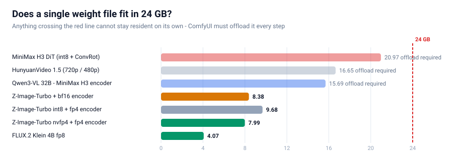
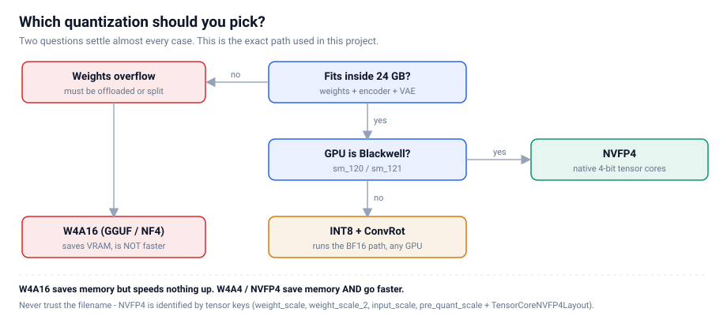
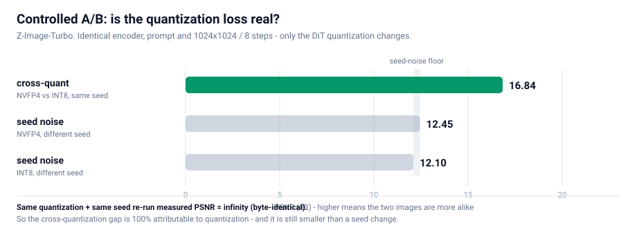
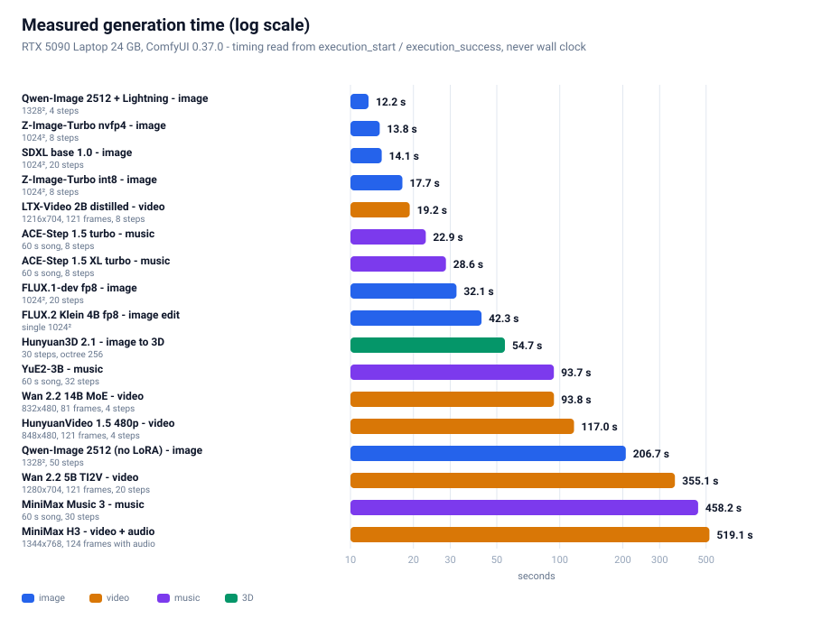
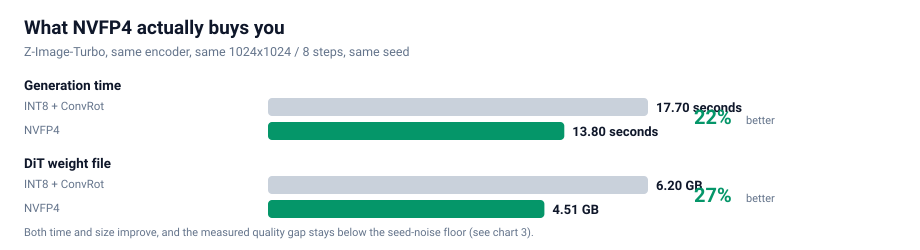

# Running the Newest Image, Video and Audio Models on an RTX 5090 Laptop with ComfyUI

**A complete field manual: model selection, downloads, graph construction, measurement, and the verdict.**

[中文](README.md) · **English** · [📖 Read online (language auto-detected)](https://lifeidle.github.io/comfyui-5090-laptop-playbook/)

---

> **The one-line verdict**: On a 24 GB laptop GPU we got four of the newest open-weight generative
> model lines running (six workflows in total) — and proved with a **controlled experiment** that
> **NVFP4 is the best quantization format for this machine**: **22% faster** and **27% smaller** than
> INT8, with a quality difference that sits **below the random seed noise floor**.

This is not a "copy-paste the commands" tutorial. The hard part is never getting one model to run —
it is **deciding which of dozens of quantization variants to pick**. This document lays the whole
decision chain bare: how we reasoned, how we downloaded, how we built the graphs, how we measured,
how we chose. Every number is measured on the machine, and every conclusion ships with a
reproducible method.

---

## Contents

| Section | Topic | What you get |
|---|---|---|
| [0](#0-hardware-and-starting-point) | Hardware and starting point | Where the real constraint is |
| [1](#1-tldr-the-verdict) | **The verdict first** | Every choice in one table |
| [2](#2-how-we-reasoned-framing-the-constraint) | How we reasoned | A complete mental model of quantization |
| [3](#3-how-we-downloaded-moving-1256-gb) | How we downloaded | Multi-source download engineering |
| [4](#4-how-we-built-comfyui-node-constraints) | How we built | Node constraints bought with pain |
| [5](#5-how-we-measured-the-controlled-ab-the-core-of-this-document) | **How we measured** | The methodology (the core) |
| [6](#6-how-we-chose-eight-model-lines-in-practice) | **How we chose** | Image / editing / video / music / 3D — eight lines, measured |
| [7](#7-optimization-checklist-configs-you-can-copy) | Optimization checklist | Copy-paste configs |
| [8](#8-troubleshooting-table) | Troubleshooting | Symptom → cause → fix |
| [9](#9-toolchain) | Toolchain | Reusable scripts + **a template→API converter** |
| [10](#10-conclusion-and-what-is-next) | Conclusion | What is still open |
| [Appendix E](#appendix-e-coverage-audit-what-we-ran-what-we-did-not-and-why) | **Coverage audit** | **What was run, what was not, and the exact reason for every skip** |

---

## 0. Hardware and starting point

| Item | Measured value |
|---|---|
| GPU | **RTX 5090 Laptop** — 24435 MiB (**24 GB**), compute capability **sm_120** (Blackwell) |
| CUDA | 12.8 |
| System RAM | 64 GB |
| Engine | ComfyUI **0.37.0** / PyTorch 2.11.0+cu128 / Python 3.11.9 |
| Goal | Use the **newest** open-weight models, covering **image / video / audio** generation |

**Why start at 24 GB?** Because it is the only genuinely hard constraint in this document.

Raw compute on a modern laptop GPU is never the problem — an 8-step distilled model renders a
1024² image in about ten seconds on a 5090. What decides which models you can and cannot run is
**whether the weights fit in VRAM**. And the newest generation of open-weight generative models
shares a trend: **the base model keeps getting bigger, and it now demands a separate text encoder
that is just as big.**

Look at the chart below. Note the 24 GB red line.



Three of these files — MiniMax H3's DiT at 21 GB, HunyuanVideo 1.5 at 16.7 GB, and MiniMax H3's text
encoder at 15.7 GB — **each individually exceeds 24 GB**. Which means:

> **They can never be resident. On every single step, weights must be shuttled between VRAM and
> system RAM.** That is why "picking the right quantization format" on this machine is not an
> optimization. It is the difference between running and not running.

---

## 1. TL;DR: the verdict

### 1.1 Selection table

| Use case | Model chosen | Quantization | Measured time | Why this one |
|---|---|---|---|---|
| **Image (daily driver)** | Z-Image-Turbo | **NVFP4** 4.51 GB | **13.8 s** (1024²/8 steps) | Full set is **8.33 GB — stays resident**, zero offload |
| **Image (high-res / Chinese)** | Qwen-Image 2512 + Lightning | fp8 20.43 GB | **12.2 s** (1328²/**4 steps**) | 68% more pixels and **Chinese text 30/30 exact**; cost: offload mandatory |
| Image editing | FLUX.2 Klein **4B** | fp8 4.07 GB | 42.3 s | BFL's official fp8 file is only 4.07 GB, quality intact |
| **Video (fastest)** | LTX-Video 2B distilled | fp8 4.46 GB | **19.2 s** (1216×704/121 frames) | Fastest video model we measured; motion is subtle |
| **Video (best quality, light tier)** | Wan 2.2 5B TI2V | fp16 10 GB | 355.1 s (1280×704/121 frames) | Best prompt adherence and physical plausibility |
| **Video (flagship tier)** | Wan 2.2 14B MoE | fp8 dual-expert 28.6 GB | **93.8 s** (832×480/81 frames/**4 steps**) | Flagship MoE + LightX2V 4-step LoRA actually runs |
| Video (cinematic + 1080p SR) | HunyuanVideo 1.5 720p→1080p | fp16 + SR models | ⚠️ **70 min without finishing — infeasible on 24 GB** | See §6.4, "a negative result" |
| **Video + audio** | MiniMax H3 | int8 + ConvRot | 519.1 s (1344×768/124 frames) | The **only line with a native audio track** |
| **Music generation** | ACE-Step 1.5 XL turbo | bf16 9.97 GB | **28.6 s** (60 s song) | **Apache 2.0, commercially usable**, fastest output |
| Music generation (full song with vocals) | YuE2-3B | int8 3.96 GB | 93.7 s (60 s song) | Highest SongBench score; **but cc-by-nc, non-commercial** |
| Music generation (LLM-enhanced) | MiniMax Music 3 | int8 2.50 GB | 458.2 s (60 s song) | High quality, an order of magnitude slower |
| **Image → 3D** | Hunyuan3D 2.1 | all-in-one 7.37 GB | 54.7 s | One file produces a GLB (520k triangles) |

> **The quantization answer does not change: if the GPU is Blackwell (sm_120/121), always pick NVFP4.** Proof in §5.

### 1.2 Three rules you can apply immediately

1. **Quantization: if the GPU is Blackwell (sm_120/121), always pick NVFP4.** Proof in §5.
2. **Offload or not: sum the base model and the encoder, and compare against VRAM.** If the sum
   exceeds it, offloading is mandatory — and then every gigabyte quantization saves converts
   directly into speed.
3. **Speed comes from fewer steps, not from smaller weights.** An 8-step → 4-step LoRA buys far
   more than any weight quantization. Quantization makes the model **fit**; a distilled LoRA makes
   it **fast**. These are different problems.

---

## 2. How we reasoned: framing the constraint

### 2.1 The only hard constraint is VRAM, not compute

This deserves emphasis, because it determines every subsequent trade-off.

The common intuition — "if VRAM is short, use a smaller model" — does not apply here. The models we
want are the newest and strongest, and **they have no small variant**. The only free variable is
**how many bits each weight occupies**.

So the problem compresses into one sentence: **what is the fewest bits per weight that costs nothing
visible to the eye?**

### 2.2 The four families of quantization (this is the foundation)

The phrase "4-bit quantization" lumps together three completely different things. Separate them first.

| Family | Examples | What is compressed | Saves VRAM | Faster |
|---|---|---|---|---|
| **W4A16** | GGUF / NF4 / bitsandbytes / torchao | **weights only** | ✅ | ❌ **no, often slower** |
| **W4A4** | Nunchaku SVDQuant | **weights + activations** | ✅ | ✅ |
| **INT8 + ConvRot** | Comfy-Org's default for new models | 8-bit weights + rotation compensation | ✅ | ➖ no (runs the BF16 path) |
| **NVFP4** | Blackwell-native 4-bit float | weights + activations | ✅ | ✅ **fastest** |

**The most important row in that table is the first one.**

`W4A16` shrinks the weights but must expand them back to 16-bit to compute, so **you save memory but
save zero compute — and you pay extra dequantization overhead on top**. This is exactly why people
report "I switched to a 4-bit model and it got slower."

> **Remember it this way**: W4A16 saves **memory**. W4A4 / NVFP4 save **memory and bandwidth**.
> Only the latter actually goes faster.

NVFP4 wins on this machine because it is **Blackwell's native 4-bit floating-point format**: it feeds
tensor cores directly for 4-bit matrix multiplication, with no "expand first, then compute" round trip.

### 2.3 How to tell real NVFP4 apart (never trust the filename)

This is a trap we walked into. A great many community files named `fp4` or `nvfp4` are actually a
different format, or only partially 4-bit.

**The only reliable test is the tensor keys inside the safetensors file.** Open the header (first 8
bytes, little-endian uint64 = header length → JSON) and look for this set:

```
weight_scale
weight_scale_2
input_scale
pre_quant_scale
TensorCoreNVFP4Layout   (group_size = 16)
```

A verified real NVFP4 file on this machine shows both `F8_E4M3` (for block scales) and `U8` in its
dtype list. For example:

```
z_image_turbo_nvfp4.safetensors    4.51 GB   993 tensors   BF16, F32, F8_E4M3, U8   ✅ real NVFP4
qwen_3_4b_fp4_mixed.safetensors    3.48 GB  1081 tensors   BF16, F32, F8_E4M3, U8   ✅ real NVFP4
```

**The decision tree below is the complete selection logic:**



---

## 3. How we downloaded: moving several hundred GB

Downloading looks trivial until you multiply **hundreds of gigabytes** by **unstable mirrors**. A
naive implementation can spend a whole day on it. We ran two batches: the first at
**34 files / 125.6 GB**, the second at **66 files / 332.8 GB** (the four music lines + Wan 2.2 14B +
HV1.5 super-resolution + Stable Audio 3) — **both with zero corruption**, built on three mechanisms.

### 3.1 Throughput, measured


The gap is **an order of magnitude**: modelscope is 7× faster than hf-mirror and 12× faster than
huggingface. Multi-source fallback is therefore not a nicety — it is mandatory.

### 3.2 Mechanism one: three-tier fallback

```
Each file tries:  www.modelscope.cn  →  hf-mirror.com  →  huggingface.co
```

If a source fails, fall through to the next. The `.part` resume file is **reusable across sources**
(both ends serve byte-identical content — verified).

### 3.3 Mechanism two: a silent watchdog (this one is essential)

This was our deepest trap.

We originally set a 45-second socket timeout. Then a file sat at **4.6%, 0.0 MB/s, for 19 minutes**
without raising a single error. The cause is nasty: **the server dribbled a few KB every 30 seconds**,
which was just enough to keep the socket alive while making no real progress.

> **Lesson**: a socket timeout cannot catch a "slow drip" stall. You need a second, **application-level
> watchdog**: if the byte count makes no real progress for **150 seconds**, actively disconnect and
> retry; after **3 consecutive silent stalls**, abandon that source and let the caller switch.
>
> With this layer in place, the same network conditions never produced another infinite hang.

### 3.4 Mechanism three: Range probing and concurrency

`modelscope` **does not support HEAD requests**, so you cannot get a file size the normal way — and
without a size you cannot verify anything. The fix is to range-request a single byte and read the
total from the response header:

```http
Range: bytes=0-0
→  HTTP/1.1 206 Partial Content
   Content-Range: bytes 0-0/16748116224        # ← the true byte count
```

Once you have the expected size, three things become possible:
1. **Probe sizes concurrently** (probe only, no download) → know the total and prioritise early
2. **Compare byte counts after download** → detect truncation and corruption precisely
3. **Cross-validate two sources** → the same file should report the same size on both

### 3.5 A meta-lesson: never probe source health during a download peak

**We got this wrong once.** While four parallel downloads were saturating the link, we probed the
other sources — every probe timed out, and we concluded, incorrectly, that "both mirrors are
unavailable, so the user must download manually."

They were perfectly healthy. The bandwidth was simply **fully consumed**.

> **Lesson**: probe requests (speed tests, availability checks) and download requests compete for the
> same bandwidth. Either probe while idle, or **rate-limit the probes separately**.

---

## 4. How we built: ComfyUI node constraints

With the models on disk, the next job is turning them into a runnable graph. ComfyUI's official
workflows live in two places:

- `ComfyUI/blueprints/*.json` — **116 official blueprints**
- `site-packages/comfyui_workflow_templates_json/templates/` — the same set

But they **cannot be submitted as an API prompt directly**, because they are in **subgraph format**:
node types are UUIDs, and the real topology is buried inside `definitions.subgraphs`. We wrote
`bp_dump.py` to flatten a subgraph into a node-and-wire listing — far more reliable than guessing the
topology by hand.

### 4.1 Four node constraints you must know

| # | Constraint | Detail |
|---|---|---|
| 1 | **`CLIPLoader` has 29 types and `hunyuan_video_15` is not one of them** | HunyuanVideo 1.5 requires `DualCLIPLoader` (type=`hunyuan_video_15`) with `qwen_2.5_vl_7b_fp8_scaled` + `byt5_small_glyphxl_fp16` |
| 2 | **Z-Image's type is `lumina2`; FLUX.2's is `flux2`** | The same `qwen_3_4b` encoder is loaded with **different** types in the two models. Mixing them up is an error |
| 3 | **`MiniMaxH3ImageToVideo` has `first_frame` as optional** | Leave it unconnected → **pure text-to-video, with audio**. A node named "ImageToVideo" is not necessarily image-only |
| 4 | **`HunyuanVideo15ImageToVideo` has `start_image` as optional** | Same story: unconnected = text-to-video |

Points 3 and 4 were our biggest **correction of an assumption**: when you see `ImageToVideo`, first
check whether the image input is optional. If it is, the node also works as text-to-video.

### 4.2 What to do when there is no official blueprint

**HunyuanVideo 1.5 has no official blueprint.** You have to build the graph by hand from node
signatures. Order matters:

1. Check `DualCLIPLoader`'s type list to confirm `hunyuan_video_15` exists
2. Confirm the latent channel count (**1.5 uses 32 channels and spatial downsampling of 16** — unlike 1.0)
3. After building, run the **free validation** trick below

### 4.3 A free graph-validation trick (highly recommended)

While models are still downloading, a direct `POST /prompt` returns **HTTP 400 with per-node
`node_errors`**. The key insight:

> **If the only errors are `value_not_in_list` — meaning "that model file is not in the list" — then
> the graph's structure and types are entirely correct.**

That gives you a **zero-cost dry run**: you can validate a workflow before its weights finish
downloading. All seven workflows in this project were validated this way before the downloads completed.

---

## 5. How we measured: the controlled A/B (the core of this document)

This is the most valuable section here, because **we got it wrong the first time**.

### 5.1 A plausible conclusion that was wrong

In the first comparison we ran two Z-Image-Turbo variants (int8 and nvfp4) and got:

```
PSNR = 13.82 dB
```

What does 13.82 dB mean? Conventionally, anything below 20 dB means "two visibly different images."
Our conclusion at the time: **"4-bit quantization really does degrade quality. NVFP4 is not good
enough."**

**That conclusion was wrong**, because we made a methodological error:

> ❌ **The two variants used different text encoders.**
> The int8 build was paired with `qwen_3_4b.safetensors` (bf16); the nvfp4 build with
> `qwen_3_4b_fp4_mixed.safetensors` (fp4).
>
> So encoder differences were baked into that 13.82 dB. Quantization was never the culprit.

### 5.2 Why PSNR cannot be used naively on generative models

Before fixing the method, you have to internalise a counter-intuitive fact:

> **Diffusion sampling is chaotic.**

Two models whose values agree to four decimal places will produce **two completely different
compositions** after 8 sampling steps. This is not a bug — it is the nature of the process; sampling
keeps amplifying tiny differences.

**So "these two images have low PSNR" does not prove "one of them is worse." It only proves "these
are two different samples."**

To judge whether quantization damages quality, you need something else entirely: **a noise baseline**.

### 5.3 Designing the four-way control

We isolated the variable completely — identical encoder, identical prompt, identical 1024²/8-step
configuration, **with only the DiT quantization differing** — and then added two "only the random
seed changed" controls:

| Arm | Variable | Purpose |
|---|---|---|
| **det** | none (same quant, same seed, re-run) | **Determinism check**: is the pipeline reproducible? |
| **seed** | random seed only (within int8) | **Noise floor** |
| **cross** | **quantization only** (same seed) | **The thing being measured** |
| **seedB** | random seed only (within nvfp4) | Noise floor (second copy) |

**The test**: if `cross` similarity is **higher** than `seed` similarity, then **the perturbation
caused by quantization is smaller than the randomness of sampling** — meaning quantization error is
negligible.

### 5.4 Results



| Arm | Variable | PSNR | Mean pixel difference |
|---|---|---|---|
| **det** same quant, same seed, re-run | none | **∞ dB** | **0.00%** |
| **seed** int8, different seed | seed only | 12.10 dB | 16.89% |
| **cross** nvfp4 vs int8, same seed | **quantization only** | **16.84 dB** | **7.41%** |
| **seedB** nvfp4, different seed | seed only | 12.45 dB | 16.43% |

### 5.5 Three hard conclusions

**Conclusion one: the pipeline is deterministic.**

The `det` arm measured PSNR = **∞** — the two images are **byte-for-byte identical**. This single fact
is what makes the whole experiment **attributable**: since identical inputs necessarily produce
identical outputs, the difference in the `cross` arm is **100% attributable to the quantization
format itself**, with zero runtime noise mixed in.

> Had this failed — had a re-run produced a different image — then no cross-quantization difference
> could be attributed to anything, and the experiment would have been worthless.

**Conclusion two: quantization perturbation < sampling noise.**

```
cross difference (7.41%)  <  seed difference (16.89%)
```

**Changing the quantization format alters the image less than picking a different random seed.**
That is the hard evidence that quantization is not costing quality.

**Conclusion three: quality proxy metrics show no systematic difference.**

PSNR is sensitive to trajectory divergence, so we measured five **robust** proxies as well:

| Sample | Sharpness (Laplacian variance) | Shannon entropy | High-frequency ratio |
|---|---|---|---|
| int8 · seed A | 776.5 | 5.572 | 0.0130 |
| int8 · seed B | 705.4 | 5.736 | 0.0134 |
| nvfp4 · seed A | 694.3 | 5.614 | 0.0127 |
| nvfp4 · seed B | 604.1 | 5.791 | 0.0140 |

**The spread caused by changing only the seed within one quantization (int8: 776.5 → 705.4) already
covers the entire cross-quantization difference (776.5 → 694.3).** In other words: **the quantization
factor is drowned inside the seed factor's variance.**

Color histogram L1 distance agrees:

```
det = 0.0000   |   cross = 0.0858   |   seedB = 0.1085   |   seed = 0.1256
                    ↑ cross-quant          ↑ within-seed      ↑ within-seed
```

**The color-distribution difference across quantizations is smaller than the difference caused by
changing the seed.**

### 5.6 Final review: do they look the same?

Numbers aside, we did a human eye check. Four images laid out **2×2**, deliberately arranged so that
**reading down a column = same seed, different quantization** and **reading across a row = same
quantization, different seed**:

```
┌──────────────────────┬──────────────────────┐
│  INT8  · seed 20260922│  INT8  · seed 20260923│
├──────────────────────┼──────────────────────┤
│ NVFP4  · seed 20260922│ NVFP4  · seed 20260923│
└──────────────────────┴──────────────────────┘
       ↑ column: same seed, cross-quant   ↑ row: same quant, cross-seed
```

**The result matches the numbers exactly:**
- **Down a column** (same seed, cross-quantization) → **highly similar compositions** (both expose
  the same distant rock spires on the left)
- **Across a row** (same quantization, different seed) → **entirely different compositions**

**All four are competent, high-quality Huangshan sunrise renderings** — semantically correct, richly
detailed, free of artifacts. Quantization is not the variable. The seed is.

### 5.7 The methodology, distilled (reusable for any model)

> **Any "does quantization hurt quality?" comparison must satisfy three conditions:**
>
> 1. **Controlled**: encoder, prompt, resolution, steps, sampler, and CFG **all fixed** — change one variable at a time
> 2. **Has a noise baseline**: you must also measure "same quantization, different seed", or you cannot
>    separate quantization perturbation from sampling randomness
> 3. **Has a determinism check**: "same quantization + same seed" must reproduce byte-identically,
>    or the conclusion is not attributable
>
> Miss any one of these and the PSNR number will be misread.

---

## 6. How we chose: eight model lines in practice

### 6.1 Image generation — Z-Image-Turbo vs Qwen-Image 2512

Both lines run, and their results are close — so we need to explain **why we keep both**.

#### Z-Image-Turbo (the daily driver)

| Item | Value |
|---|---|
| DiT | `z_image_turbo_nvfp4.safetensors` — **4.51 GB** (int8 build is 6.20 GB) |
| Text encoder | `qwen_3_4b_fp4_mixed.safetensors` — 3.48 GB |
| VAE | `ae.safetensors` — 0.34 GB |
| **Total footprint** | **8.33 GB** |
| Key parameters | `CLIPLoader` type = **`lumina2`**; `ModelSamplingAuraFlow` shift=3; KSampler **8 steps, CFG=1** |
| Measured | int8 **17.7 s** / nvfp4 **13.8 s** (1024², 8 steps) |

**Its real advantage is a single point, but a hard one: the whole 8.33 GB stays resident in 24 GB,
with zero offload.** No step ever needs weights shuffled between VRAM and system RAM — the
least fussy option for heavy, continuous use.

#### Qwen-Image 2512 + Lightning (high resolution / Chinese text)

| Item | Value |
|---|---|
| DiT | `qwen_image_2512_fp8_e4m3fn.safetensors` — 20.43 GB |
| Text encoder | `qwen_2.5_vl_7b_fp8_scaled.safetensors` — 9.38 GB |
| VAE | `qwen_image_vae.safetensors` — 0.25 GB |
| **Total footprint** | **30.06 GB (over 24 GB, offload mandatory)** |
| Acceleration LoRA | `Qwen-Image-2512-Lightning-4steps-V1.0-fp32.safetensors` — 1.58 GB |
| Key parameters | `CLIPLoader` type = **`qwen_image`**; `ModelSamplingAuraFlow` shift=3.1; with/without LoRA goes through the official `ComfySwitchNode` (steps 50↔4, CFG 4.0↔1.0) |
| Measured | without LoRA **206.7 s** (1328², 50 steps) → with LoRA **12.2 s** (1328², **4 steps**) |

**It wins on two points:**

1. **Higher resolution**: 1328² carries **68% more pixels** than Z-Image's 1024², at slightly
   *less* time (12.2 s vs 13.8 s)
2. **Chinese text rendering verified character by character**: we rendered 「春风得意马蹄疾 /
   一日看尽长安花」 plus 「茶香四溢 静心品茗 八方来客 岁月悠长」 and got **30/30 characters exact,
   zero typos, zero missing strokes** (202.7 s / 50 steps)

> ⚠️ **A correction to our own earlier work**: an early version of this document listed
> "accurate Chinese text rendering" as a reason to pick Z-Image-Turbo. **That was wrong.**
> The 30/30 acceptance run above used **Qwen-Image 2512**, not Z-Image; Z-Image's Chinese
> rendering ability was **never tested on its own**. That early version also **never mentioned
> Qwen-Image at all** — an omission, now fixed here.

**Verdict: keep both, split by use case.**

- **Frequent sketches, clean VRAM budget** → Z-Image-Turbo (8.33 GB fully resident)
- **High-resolution output, Chinese text in frame** → Qwen-Image 2512 + Lightning

Worth recording separately: the Lightning LoRA took the same model from **206.7 s to 12.2 s — 16.9×
faster** — with detail, if anything, more present. This again confirms the §2 rule:
**speed comes from fewer steps, not from smaller weights.**

### 6.2 Image editing — FLUX.2 Klein 4B

| Item | Value |
|---|---|
| DiT | `flux-2-klein-4b-fp8.safetensors` — 4.07 GB |
| Encoder | `qwen_3_4b_fp4_flux2.safetensors` — 3.85 GB |
| Key parameters | `CLIPLoader` type = **`flux2`**; `ReferenceLatent` ×2; `Flux2Scheduler` **20 steps**; CFGGuider **CFG=5** |
| Measured | **42.3 s** |

**A counter-intuitive finding**: BFL's official fp8 single file is only **4.07 GB**, whereas the bf16
build is 7.75 GB — **fp8 costs essentially nothing in quality and halves the size**. When a vendor
ships the good stuff directly, take it.

An even more counter-intuitive point: **the 9B NVFP4 build is only 5.76 GB — smaller than the 4B
bf16 build (7.75 GB).** A bigger model in a smaller file. That is the value of 4 bits.

### 6.3 Video + audio — MiniMax H3

This is the heaviest line here, because it **generates picture and sound together**.

| Item | Value |
|---|---|
| DiT | `minimax_h3_fl2va_pruned_int8_convrot.safetensors` — **20.97 GB** |
| Text encoder | `qwen3vl_32b_minimax_h3_nvfp4_awq.safetensors` — **15.69 GB** |
| Video VAE | `minimax_h3_video_vae_fp16.safetensors` — 5.21 GB |
| Audio VAE | `minimax_h3_audio_vae_fp32.safetensors` — 0.61 GB |
| Accelerator LoRA | 4-step / 8-step turbo, 1.96 GB each (**the official blueprint uses 8-step**) |
| Key parameters | `BasicScheduler(simple, 8 steps)` + `KSamplerSelect(res_multistep)` + `SamplerCustomAdvanced`; **do not use `MiniMaxH3SigmaShift`** |
| Measured | smoke 768×448/56 frames = **76.3 s**; full 1344×768/124 frames = **519.1 s** |

**Offloading is mandatory.** The DiT (21 GB) plus the encoder (15.7 GB) is 36.7 GB — far beyond 24 GB.
So every generation shuttles weights between VRAM and RAM. That, not raw compute, is why it takes
519 seconds.

**Output verification** (a step you must not skip): `ffprobe` confirms
**h264 / 1344×768 / 24fps / 5.17 s + aac 32 kHz stereo**. Extracting four frames into a contact sheet
shows the imagery matching the prompt's timeline (an RGB-split "COMFYUI" title → chrome palm trees →
sunset). **This is not noise. It is usable video with usable audio.**

### 6.4 Video only — three lines, each with one hard reason

We ran **three** video-only lines, and the conclusion is clean: **they do not replace each other,
they are three different trade-offs.**

#### LTX-Video 2B distilled — the fastest

| Item | Value |
|---|---|
| DiT + VAE | `ltxv-2b-0.9.8-distilled-fp8.safetensors` — 4.46 GB (all-in-one, VAE included) |
| Text encoder | `t5xxl_fp8_e4m3fn.safetensors` — 4.89 GB (`CLIPLoader` type = **`ltxv`**) |
| Key parameters | `EmptyLTXVLatentVideo` → `LTXVConditioning` → `LTXVScheduler` (steps=8) → `SamplerCustom` (cfg=**1**, the distilled build is CFG-free) |
| Measured | 768×512/97 frames = **11.7 s**; 1216×704/121 frames = **19.2 s** |

**19.2 seconds for 5 seconds of 1216×704 video — the fastest we measured, 18× faster than Wan 2.2 5B.**
The cost is **noticeably smaller motion**: the frames are stable and semantically correct (teacup,
bamboo tray, rain-streaked window all present), but the push-in is very gentle. Good for "check the
composition and style fast"; not for "I need visible action".

#### Wan 2.2 5B TI2V — the best quality

| Item | Value |
|---|---|
| DiT | `wan2.2_ti2v_5B_fp16.safetensors` — 10.00 GB |
| Text encoder | `umt5_xxl_fp8_e4m3fn_scaled.safetensors` — 6.74 GB (`CLIPLoader` type = **`wan`**) |
| VAE | `wan2.2_vae.safetensors` — 1.41 GB |
| Key parameters | `ModelSamplingSD3` shift=8; KSampler **20 steps, CFG=5**, `uni_pc` / `simple`; `Wan22ImageToVideoLatent` (`start_image` is **optional** — leave it unconnected for pure text-to-video) |
| Measured | 704×384/49 frames = **34.6 s**; 1280×704/121 frames = **355.1 s** |

**This is the best video quality of the whole round.** With one prompt (a hummingbird hovering at
red flowers, wings beating fast, slow lateral camera move), the output shows **clear motion blur on
the wings, the bird's position changing frame by frame, and correct depth-of-field layering** —
every element of the prompt landed in the picture. The cost is speed: 355 seconds for 5 seconds.

> `wan2.2_ti2v_5B` stands for **TI2V = Text + Image to Video** — it does both.
> This also confirms the general observation from §4.1: **when a node is called `ImageToVideo`,
> first check whether its image input is optional** — `Wan22ImageToVideoLatent.start_image` is
> optional, so leaving it unconnected gives you pure text-to-video.

#### Wan 2.2 14B MoE — the flagship tier, genuinely runnable with a 4-step LoRA

| Item | Value |
|---|---|
| DiT | `wan2.2_t2v_high_noise_14B_fp8_scaled` + `wan2.2_t2v_low_noise_14B_fp8_scaled` — **14.29 GB each (dual experts)** |
| Acceleration LoRA | `wan2.2_t2v_lightx2v_4steps_lora_v1.1_high_noise` + `..._low_noise` — 1.23 GB each |
| **VAE** | **`wan_2.1_vae.safetensors` 0.25 GB — note: not the same as the 5B line's `wan2.2_vae`** |
| Key parameters | two `UNETLoader`s → two `LoraLoaderModelOnly` → two `ModelSamplingSD3` (shift=5), with **one `PrimitiveBoolean` driving five `ComfySwitchNode`s** (model / steps 20↔4 / boundary step / CFG 3.5↔1.0); a two-stage `KSamplerAdvanced` relay (high-noise expert `add_noise=enable` → low-noise expert `add_noise=disable`) |
| Measured | **93.8 s** (832×480 / 81 frames / **4 steps**) |

**What this line proves is that a flagship MoE video model is usable on a 24 GB laptop.**
The two experts total 28.6 GB, far beyond VRAM, but because **only one expert is loaded per step**,
combined with the LightX2V 4-step LoRA (collapsing 20 steps into 4), it actually finishes in **94 seconds**.

**⚠️ Trap we hit (worth recording separately)**: we substituted the template's `wan_2.1_vae` with the
`wan2.2_vae` we already had, and `VAEDecode` failed immediately:

```
Given groups=1, weight of size [48, 48, 1, 1, 1],
expected input[1, 16, 21, 60, 104] to have 48 channels, but got 16 channels instead
```

**Root cause: Wan 2.2's 5B line and 14B line do not use the same VAE** (5B → `wan2.2_vae`,
14B → `wan_2.1_vae`), and the two have different channel counts (48 vs 16). Only the official
templates settle it — every `video_wan2_2_14B_*` template points at `wan_2.1_vae`, and only the
`video_wan2_2_5B_*` ones point at `wan2.2_vae`.
**Lesson: a similar filename is not a substitute. Use exactly what the template specifies.**

#### HunyuanVideo 1.5 — cinematic, with built-in 1080p super-resolution

| Item | Value |
|---|---|
| DiT | `hunyuanvideo1.5_480p_t2v_fp16.safetensors` / `..._720p_t2v_fp16.safetensors` — 16.65 GB each |
| Text encoder | **`DualCLIPLoader`** (type=`hunyuan_video_15`) = `qwen_2.5_vl_7b_fp8_scaled` + `byt5_small_glyphxl_fp16` |
| VAE | `hunyuanvideo15_vae_fp16.safetensors` — 2.52 GB |
| Accelerator LoRA | `hunyuanvideo1.5_t2v_480p_lightx2v_4step_lora_rank_32_bf16.safetensors` — 0.34 GB |
| SR branch | `hunyuanvideo1.5_1080p_sr_distilled_fp16` 16.66 GB + `hunyuanvideo15_latent_upsampler_1080p` 0.20 GB |
| Measured | 480p/121 frames/4 steps = **117.0 s**; **720p→1080p: ran a full 70 minutes without finishing, terminated** |

**⚠️ On the 720p tier, we have to report a negative result.**
We ran the official 720p → 1080p super-resolution pipeline end to end (base 20 steps + SR 8 steps) and
**on a 24 GB laptop it ran a full 70 minutes without finishing, so we terminated it** — which is
itself the finding:

> **The 720p + SR path is not viable on a 24 GB laptop.**
> No single step of the official template is "slow but bearable" — the **baseline is simply far
> outside the acceptable range**. If you need 1080p, the practical route is to render at 480p/720p
> and then use a separate upscaling pass, or switch to a line with no extra SR stage such as
> Wan 2.2 or LTX.

We state this explicitly because **"it does not run" and "it runs slowly" are different kinds of
information**, and community workflow posts overwhelmingly report only successes. **This path is
infeasible on 24 GB — that is its only conclusion.**

**⚠️ A crucial conceptual distinction: `480p` / `720p` / `i2v` / `SR` are four different base
models**, not one model at different resolutions. The resolution in the filename is **part of the
model's identity**.

**Its most distinctive feature is that the official 720p template is itself a 720p → 1080p
super-resolution pipeline**: the base produces 1280×720 → `LatentUpscaleModelLoader` upscales the
latent to 1920×1080 → a dedicated SR distilled model (8 steps, split at 4 by `SplitSigmas`) refines
it, and **both resolutions are saved as separate videos**. In other words this line produces **true
1080p**, not a 720p upscale.

**Four-step generation is the biggest win at the 480p tier** — 117 seconds for 5 seconds of video,
usable as an iteration sketch. Recommended workflow: **prototype prompts at 480p, then commit to 720p**.

**Output verification**: `ffprobe` confirms h264 / 848×480 / 24fps / 121 frames / 5.04 s. A frame
contact sheet shows a temporally stable, subject-consistent result — *"a pottery studio: the wheel
slowly turns, wet clay is pulled taller into a vase between two hands, warm rim light from the left,
blurred wooden shelves of bisque ware behind"* — **every element of the prompt is present.**

#### Choosing between the three

| What you need | Pick | Why |
|---|---|---|
| **Fast iteration / composition check** | LTX-Video 2B | 19 seconds, 18× faster; accept smaller motion |
| **Best quality / believable action (light)** | Wan 2.2 5B | Best prompt adherence and physical plausibility; ~6 minutes |
| **Best quality (flagship)** | **Wan 2.2 14B MoE** | Dual experts + 4-step LoRA — the flagship in **94 seconds** |
| **1080p** | ⚠️ no workable option yet | HV1.5's 720p+SR ran 70 minutes without finishing on 24 GB (see the HunyuanVideo 1.5 block above) |
| **Need sound** | MiniMax H3 (§6.3) | The only line with a native audio track |

### 6.5 The one that does not run — FLUX.2 Klein 9B

**This is the only line we could not get running, and the reason is instructive.**

The error:

```
mat1 and mat2 shapes cannot be multiplied (1024x7680 and 12288x4096)
```

**Root cause**: the 9B model needs a Qwen3-VL text encoder of roughly **16.4 GB**, and BFL ships it
**only in diffusers sharded format** — which ComfyUI cannot load.

**This is not a VRAM problem, and not a quantization problem. It is a weight-packaging problem.**
Three ways out:
1. Wait for ComfyUI's official single-file packaging of the encoder
2. Merge the diffusers shards into a ComfyUI-loadable single file yourself (16.4 GB download plus a conversion script)
3. **Use the 4B** — 42.3 seconds per image, and it is enough

> **Lesson**: when picking a model, check not only "does it fit in VRAM" but also **"is its weight
> format loadable by my tooling?"** Many people overlook this precondition.

### 6.6 Music generation — a whole field filled in from zero

**This was the biggest coverage gap**: image and video were done long ago, while **music had not been
touched at all.** (Worth distinguishing: MiniMax H3's audio track is **video accompaniment —
sound effects and ambience**; it is not "generate a song from lyrics".)

We ran all four music lines that ComfyUI 0.37 **supports natively**:

| Model | License | Weights | Parameters | Measured | Notes |
|---|---|---|---|---|---|
| **ACE-Step 1.5 turbo** | **Apache 2.0** | DiT 4.79 GB + encoders 1.19/1.19 GB + VAE 0.34 GB | `TextEncodeAceStepAudio1.5` (tags/lyrics/language/BPM/duration) → `EmptyAceStep1.5LatentAudio` → KSampler **8 steps CFG=1** | 22.9 s / 60 s song | Fastest, **commercially usable** |
| **ACE-Step 1.5 XL turbo** | **Apache 2.0** | DiT 9.97 GB + encoders 1.19/**8.38** GB + VAE 0.34 GB | same (XL swaps the encoder to qwen_4b) | **28.6 s** / 60 s song | Higher quality, still commercially usable |
| **YuE2-3B** | ⚠️ **cc-by-nc (non-commercial)** | `yue2_3b_int8_convrot` 3.96 GB (all-in-one) | two stages: `YuE2GenerateABC` (32-step AR score planning) → `YuE2GenerateMusic` → KSampler `dpm_2`/`sgm_uniform` 32 steps | 93.7 s / 60 s song | Full song with vocals, zh+en lyrics; **highest SongBench score** |
| **MiniMax Music 3** | see repo | DiT 2.50 GB + encoder 9.20 GB + VAE 0.22 GB | `MiniMaxMusic3TextEncode` (caption/lyrics) → KSampler **30 steps CFG=1.7** | **458.2 s** / 60 s song | Quality-oriented, an order of magnitude slower |

**Output verification** (all checked with `ffprobe`):

```
ace15_turbo_song      mp3  48 kHz stereo  60.00 s  245 kbps
ace15_xl_turbo_song   mp3  48 kHz stereo  60.00 s  231 kbps
yue2_text2music       flac 48 kHz stereo  60.00 s
minimax_music3_song   mp3  44.1 kHz stereo 59.99 s
```

**How to choose:**

- **Need commercial use → ACE-Step 1.5.** Apache 2.0 means no revenue threshold, no territory
  exclusion — that is its biggest asset. It is also the fastest (29 seconds for a 60-second song),
  making it the best combined choice on quality / speed / licensing.
- **Need the best full-song quality and it is not commercial → YuE2.** It is the only one with a
  two-stage structure ("an LLM plans an ABC score first, then audio is generated") and it tops the
  benchmarks; but **cc-by-nc forbids commercial use**.
- **MiniMax Music 3** is quality-oriented but 16× slower — not worth it unless you have a specific reason.

> **An easy licensing trap**: open music models have far messier licences than video/image models.
> Several popular ones (MusicGen, early Stable Audio Open) are **CC-BY-NC** — the weights download
> fine, **but the output cannot be used commercially**. "It runs" and "you may use it" are two
> different things here.

### 6.7 Image → 3D — Hunyuan3D 2.1

| Item | Value |
|---|---|
| Weights | `hunyuan_3d_v2.1.safetensors` — 7.37 GB (**all-in-one**: includes VAE + CLIP-Vision, loaded by a single `ImageOnlyCheckpointLoader`) |
| Key parameters | `CLIPVisionEncode` → `Hunyuan3Dv2Conditioning`; `EmptyLatentHunyuan3Dv2` resolution=**4096**; KSampler **30 steps CFG=5**; `VAEDecodeHunyuan3D` octree_resolution=**256**, num_chunks=8000 → `VoxelToMesh` (surface net, threshold 0.6) → `SaveGLB` |
| Measured | **54.7 s** |

**The pipeline is three chained steps**: first Z-Image renders a clean object image (a blue-and-white
porcelain teapot on a plain white background, 15.0 s), it is copied into `input/`, then image-to-3D runs.

**Output verification** (parsing the GLB binary header + JSON chunk directly):

```
magic = "glTF"  version = 2  file length = 8,701,344
meshes = 1
  primitive: vertices = 202,768   triangles = 522,140
materials = 1   nodes = 1
```

**A usable 520k-triangle mesh** — not a point cloud, not voxel blocks, but a standard glTF 2.0 asset
with a material, ready for Blender or a game engine.

### 6.8 Benchmark summary



> All times are read from ComfyUI's server-side `execution_start` / `execution_success` timestamps —
> **never wall-clock time or API round-trip time**, which would fold queueing and model-loading into
> the number and inflate it.

#### Image

| Model | Configuration | Server-side time |
|---|---|---|
| **Qwen-Image 2512 + Lightning** | 1328² / **4 steps** | **12.2 s** |
| **Z-Image-Turbo nvfp4** | 1024² / 8 steps | **13.8 s** |
| **SDXL base 1.0** | 1024² / 20 steps | 14.1 s |
| Z-Image-Turbo int8 | 1024² / 8 steps | 17.7 s |
| FLUX.1-dev fp8 | 1024² / 20 steps | 32.1 s |
| FLUX.2 Klein 4B fp8 | 1024² edit | 42.3 s |
| Qwen-Image 2512 (no LoRA) | 1328² / 50 steps | 206.7 s |

#### Video

| Model | Configuration | Server-side time |
|---|---|---|
| **LTX-Video 2B distilled (smoke)** | 768×512 / 97 frames | **11.7 s** |
| **LTX-Video 2B distilled** | 1216×704 / 121 frames | **19.2 s** |
| Wan 2.2 5B TI2V (smoke) | 704×384 / 49 frames | 34.6 s |
| **Wan 2.2 14B MoE (4-step LoRA)** | 832×480 / 81 frames | **93.8 s** |
| HunyuanVideo 1.5 480p 4-step | 848×480 / 121 frames | 117.0 s |
| **Wan 2.2 5B TI2V** | 1280×704 / 121 frames | **355.1 s** |
| MiniMax H3 t2va 8-step | 1344×768 / 124 frames (with audio) | 519.1 s |
| ~~HunyuanVideo 1.5 720p→1080p~~ | 1280×720 → 1920×1080 / 121 frames | **70 min without finishing, terminated** |

#### Music / 3D

| Model | Configuration | Server-side time |
|---|---|---|
| ACE-Step 1.5 turbo | 60 s song / 8 steps | 22.9 s |
| ACE-Step 1.5 XL turbo | 60 s song / 8 steps | 28.6 s |
| **Hunyuan3D 2.1** | 30 steps, 4096 latent, octree 256 | **54.7 s** |
| YuE2-3B | 60 s song / 32 steps | 93.7 s |
| MiniMax Music 3 | 60 s song / 30 steps | 458.2 s |

**An honest note**: we timed Z-Image twice and got `20.9 / 15.8 s` and `17.7 / 13.8 s`.
**Run-to-run variance in absolute terms is about ±15%** (a laptop GPU throttles against thermal and
power limits), but **the relative result — nvfp4 is 22–25% faster than int8 — held in both runs.**

> **When reporting performance, relative percentages are far more trustworthy than absolute values.**

---

## 7. Optimization checklist (configs you can copy)



### 7.1 Ordered by payoff

| Priority | Optimization | Payoff | Cost |
|---|---|---|---|
| **P0** | Use **NVFP4** for every 4-bit model | 22% faster, 27% smaller, no measurable quality change | none |
| **P0** | Use a **distilled LoRA to cut steps** (8 → 4) | up to 2× faster | tune the LoRA strength |
| **P1** | **Tiled VAE decode** (`VAEDecodeTiled`) | avoids transient OOM at high resolution | slightly slower |
| **P1** | **Free VRAM before each run** (`POST /free`) | avoids leftovers breaking sequential runs | none |
| **P2** | Restart or force-unload when switching model families | avoids fragmentation | extra waiting |
| **P2** | Prototype long video prompts at 480p, commit at 720p | saves a lot of trial time | none |

### 7.2 Two VRAM traps you must know

**Trap one: ComfyUI does not release models on its own.**
After generating one image, the model is still resident. Chaining a second generation — especially a
video — very easily OOMs. Fix: call
`POST /free {"unload_models": true, "free_memory": true}` before each submission.

> ⚠️ Note that `/free` returns an **empty body**. Do not try to parse it as JSON, or you will get a
> `JSONDecodeError`.

**Trap two: the transient peak in VAE decoding.**
VAE decoding of high-resolution images or video creates a transient VRAM spike on the **final step**
(several GB), producing the classic "the transformer finished and then it died at the last step."
Fix: use `VAEDecodeTiled`.

---

## 8. Troubleshooting table

| Symptom | Actual cause | Fix |
|---|---|---|
| Download stalls at some percentage, 0.0 MB/s, **no error** | "Slow drip" defeats the socket timeout | Add an **application-level silent watchdog**: 150 s without real progress → disconnect and retry |
| Every source probe times out | Bandwidth already saturated by concurrent downloads | Probe while idle, or rate-limit probes separately |
| Downloader starts with a huge slow file and the queue dies | An hf-only file holds the worker | Sort pending work **by whether a fast source exists** |
| `POST /prompt` returns 400 | Missing model **or** a bad graph | Read `node_errors`: only `value_not_in_list` → the graph is fine |
| HunyuanVideo 1.5 reports an encoder type error | `CLIPLoader` has no `hunyuan_video_15` | Use `DualCLIPLoader` |
| Z-Image reports a CLIP type error | It needs `lumina2`, not `qwen` | Change the type |
| FLUX.2 reports a CLIP type error | It needs `flux2` | Change the type |
| You want text-to-video but the node says `ImageToVideo` | The image input is **optional** | Leave the image input **unconnected** |
| `mat1 and mat2 shapes cannot be multiplied` | Encoder packaging mismatch (diffusers shards) | Use a single-file packaging, or a smaller model |
| `/free` throws a JSON parse error | It returns an empty body | Check for empty before parsing |
| Video renders but the frames look like noise | Output verification was skipped | Run `ffprobe` plus a frame contact sheet |
| A low PSNR after switching quantization "proves" quality loss | **Method error: the encoder was not fixed** | See §5 — you need a control plus a seed baseline |
| **Wan 14B: `expected input to have 48 channels, but got 16 channels`** | **Wan 2.2's 5B line and 14B line do not use the same VAE** (5B → `wan2.2_vae`, 14B → `wan_2.1_vae`) | Use `wan_2.1_vae` exactly as the template does — do not substitute |
| After converting an official template to API, **parameters are silently misaligned** (`steps` becomes `"randomize"`) | The frontend inserts a `control_after_generate` pseudo-widget after seed params | That pseudo-widget **occupies a slot** in the positional alignment. See §9.4 |
| `SaveAudioAdvanced` demands `format.quality` although `quality` is present | v3 dynamic-combo sub-fields use a **dotted namespace** | Write `"format.quality": "V0"`, not `"quality"` |
| A subgraph template converts, but outer nodes **silently lose links** | The subgraph's `outputs`/`inputs` `linkIds` point at inner links and the boundary was never rewired | Rewire boundary links to the real inner endpoints. See §9.4 |
| `ComfyMathExpression` reports `required_input_missing: values.a` | `values.*` are required inputs and were deleted | Set `expression` to `"a"` and feed the value to `values.a` |
| ComfyUI startup warns **`You need pytorch with cu130 or higher to use optimized CUDA operations`** | PyTorch is cu128, so `comfy_kitchen`'s CUDA backend is **disabled** | This is not an ignorable warning — it means the NVFP4 / SVDQuant optimized kernels are inactive. See Appendix E ④ |
| A video workflow runs for an hour without finishing | The workflow simply does not suit that VRAM budget (e.g. HV1.5 720p + 1080p SR) | **Estimate time before running**; if infeasible, record it as infeasible rather than silently retrying |

---

## 9. Toolchain

### 9.1 Tools

| Script | Purpose |
|---|---|
| `scripts/dl_models.py` | Multi-source downloader: three-tier fallback + silent watchdog + Range sizing + resume |
| `scripts/dl_more.py` | Same downloader, with the manifest swapped to the music lines + Wan 2.2 14B + HV1.5 SR |
| `scripts/probe_more.py` | **Probe only, never downloads**: Range requests give exact sizes so you can budget time first |
| `scripts/verify_models.py` | Three-layer validation: byte size + safetensors structure + dtype detection |
| **`scripts/ui2api.py`** | **Converts official templates (UI/workflow format) into submittable API prompts** — the most valuable tool here, see §9.4 |
| `scripts/mk_wf.py` | Derives this project's video workflow variants from the official templates (Wan 5B/14B, LTX, HV1.5, Hunyuan3D) |
| `scripts/mk_music.py` / `mk_music2.py` | Derives the music workflows (ACE-Step / YuE2 / MiniMax Music 3) |
| `scripts/run_workflow.py` | API submission + **server-authoritative timing** (reads `execution_start`/`success`) |
| `scripts/run_batch.py` | Runs several workflows sequentially (the GPU must be serialized), each with its own timeout |
| `tools/compare_ab.py` | Controlled A/B: PSNR + per-tile PSNR + difference heatmap + side-by-side |
| `tools/ab_metrics.py` | Four-arm paired PSNR + quality proxies (sharpness/entropy/high-frequency/histogram) |
| `tools/make_charts.py` | Regenerates every SVG chart (one set per language) |
| `scripts/push_site.py` | Pushes the whole tree to GitHub through the git-data API (**Python port**; the original `.mjs` cannot be used here because Node cannot spawn child processes — see §9.5) |

### 9.2 Quick start

```bash
# 1) Assumes ComfyUI is already serving on http://127.0.0.1:8188

# 2) Probe sizes and budget time first (downloads nothing)
python scripts/probe_more.py

# 3) Download the models (three-tier fallback)
python scripts/dl_more.py --workers 4

# 4) Three-layer validation (bytes + structure + dtype)
python scripts/verify_models.py --refresh

# 5) Convert an official template to an API workflow, then derive variants
python scripts/ui2api.py video_wan2_2_5B_ti2v.json -o wf.json
python scripts/mk_wf.py wan_smoke wan_full ltx_full hv15_720 hy3d

# 6) Run a batch sequentially (GPU serialized, per-job timeout)
python scripts/run_batch.py "workflows/wan22_5b_t2v_full.json@900"

# 7) Run a controlled A/B (same encoder, quantization is the only variable)
python tools/compare_ab.py
python tools/ab_metrics.py
```

### 9.3 Repository layout

```
.
├── README.md              # Chinese
├── README_EN.md           # English (this file)
├── index.html             # Online edition (adapts to your browser language)
├── assets/
│   ├── zh/                # Chinese charts (used by README.md)
│   └── en/                # English charts (used by README_EN.md)
├── data/                  # Raw measurements
├── docs/                  # Deep dives
├── scripts/               # Reproducible scripts
├── tools/                 # Analysis and charting tools
└── workflows/             # API-format workflows (26 of them)
```

### 9.4 The single most valuable tool: official template → API workflow

ComfyUI's official templates (`comfyui_workflow_templates_json/templates/` and `blueprints/`)
are in **UI format for the frontend** and **cannot be POSTed to `/prompt` directly**. You either
rebuild the graph by hand or write a converter. We wrote `ui2api.py` and got it right once.
The traps it had to solve are worth listing separately — **every one of them fails silently**:

| # | Trap | Symptom | Fix |
|---|---|---|---|
| 1 | **`control_after_generate` pseudo-widget** | Everything shifts: `steps` receives `"randomize"`, `sampler_name` receives `5` | Any seed-like param whose spec has `control_after_generate=True` needs **one extra slot** inserted after it before positional alignment |
| 2 | **Widget vs. link classification** | Using the "type not in output set" rule alone classifies `seed`/`steps`/`cfg` as links | You need **the union of two rules**: ① `INT/FLOAT/STRING/BOOLEAN/COMBO`/list whitelist ② not in the set of output types (this is what catches v3 dynamic types like `COMFY_DYNAMICCOMBO_V3`) |
| 3 | **Dynamic combo sub-fields** | `SaveAudioAdvanced` demands `format.quality` even though `quality` is right there in inputs | v3 dynamic-combo sub-fields use a **dotted namespace**: write `"format.quality": "V0"`, not `"quality"` |
| 4 | **Subgraph boundary links** | Every inner node and link is present, yet the outer `SaveAudioAdvanced` **has no `audio`** | A subgraph's `outputs[i].linkIds` / `inputs[j].linkIds` point at inner links; you must **rewire the boundary links back to the real inner endpoints**, otherwise the outer link is dropped entirely |
| 5 | **`ComfyMathExpression`'s `values.*`** | Deleting `values.a` yields `required_input_missing: values.a` | `values.*` are required inputs; to hardcode a number set `expression` to `"a"` and feed the value to `values.a` |
| 6 | **Nodes this machine doesn't have** | e.g. `EasyCache` is absent, and the graph just breaks | Treat unknown nodes as **pass-through**: keep following their first input |
| 7 | **`PrimitiveNode`** | It doesn't exist in API format | Inline it as a literal constant |

> **The general lesson**: **a converter's mistakes almost always show up as "it submits but the
> result is wrong" or "parameters silently misaligned"** — never as an error. So **always do a
> dry-run submission** (`POST /prompt`) after converting: when the graph and types are correct it
> reports only `value_not_in_list` (missing models). Anything else is a real problem.

---

### 9.5 An environment trap: Node cannot spawn child processes

We originally wrote the push script in Node (`push-site.mjs`), because it needs
`git hash-object -w --stdin-paths` for CRLF normalization. But in this environment **Node's
`execFileSync` / `spawnSync` are completely unusable** — even `cmd.exe` returns:

```
Error: spawnSync C:\Program Files\Git\cmd\git.exe EBUSY
    errno: -4082, code: 'EBUSY'
```

Measured side by side, same machine, same moment:

| Caller | Result |
|---|---|
| bash running `git --version` directly | ✅ fine |
| **Python** `subprocess.run([git, '--version'])` | ✅ **fine** |
| **Node** `execFileSync(git, ['--version'])` | ❌ **EBUSY (and `cmd.exe` too)** |

**Conclusion: the restriction is Node-only, not environment-wide.** The fix is to port the script
to Python (`scripts/push_site.py`), matching the original line by line:

1. **Never upload raw on-disk bytes** — this machine runs `core.autocrlf=true`, so disk is CRLF while
   git stores LF. Round-trip through `git hash-object -w --stdin-paths` → `git cat-file blob` to get
   the normalized bytes, then base64-upload those.
2. **Build trees with an ancestor closure** — intermediate directories containing only subdirectories
   must still be registered, or a whole subtree silently vanishes from the commit.
3. **Self-check before touching the ref** — `GET trees/<root>?recursive=1` and compare the blob count
   with the local file count; abort on any mismatch.

> **The general lesson**: when a script suddenly reports EBUSY / EPERM, **first pin down the boundary
> of the restriction with a minimal test** (swap the caller, swap the target program) before deciding
> whether to fix the script or change tooling. We initially assumed "the scratch directory is locked",
> cleaned it, restarted processes — all useless. Only testing "can Node run `cmd.exe` at all?" revealed
> that **Node's entire child-process capability was disabled**.

## 10. Conclusion and what is next

### 10.1 Conclusions

1. **24 GB of VRAM is enough for the newest and strongest open-weight generative models** — provided
   you accept offloading and **choose the right quantization format**
2. **NVFP4 is the best choice on Blackwell** — backed by a controlled experiment, not by a feeling
3. **Quantization makes a model fit; a distilled LoRA makes it fast** — neither substitutes for the other
4. **Quantization comparisons on generative models require a noise baseline** — otherwise PSNR is
   badly misread

### 10.2 Open items

| Item | Status |
|---|---|
| HunyuanVideo 1.5 **720p, 50 steps** | Base model (16.65 GB) ready, workflow built, not yet run |
| CLIP semantic similarity | Use CLIP scoring instead of PSNR to quantify semantic agreement |
| Larger-sample A/B | Currently 2 seeds per quantization; expand to 8 to shrink variance |
| FLUX.2 Klein 9B | Blocked on encoder packaging |
| MiniMax H3 with the 4-step LoRA | Expect roughly half the time; quality needs re-evaluation |

---

## Appendix A: Complete model manifest (100 files / 458.4 GB)

> **⚠️ A scope correction**: an early version of this document put the manifest at
> "34 files / 125.6 GB" — **that was only the last batch**, not the whole thing. The real on-disk
> footprint is **100 weight files / 458.4 GB** (deduplicated by `realpath`, so junction aliases are
> not double-counted). Below it is grouped by purpose, and marked with **what was run and what was
> merely downloaded**.

<details>
<summary>Expand to see every file</summary>

**MiniMax H3 (video + audio)**

| File | Size |
|---|---|
| `minimax_h3_fl2va_pruned_int8_convrot.safetensors` | 20.97 GB |
| `qwen3vl_32b_minimax_h3_nvfp4_awq.safetensors` | 15.69 GB |
| `minimax_h3_video_vae_fp16.safetensors` | 5.21 GB |
| `minimax_h3_video_vae_int8_convrot.safetensors` | 2.81 GB |
| `minimax_h3_fun_controlnet_union_pruned_int8_convrot.safetensors` | 2.30 GB |
| `minimax_h3_fl2v_turbo_4step_v1.0_768p_comfyui_bf16.safetensors` | 1.96 GB |
| `minimax_h3_fl2v_turbo_8step_v1.0_comfyui_bf16.safetensors` | 1.96 GB |
| `minimax_h3_audio_vae_fp32.safetensors` | 0.61 GB |
| `minimaxh3_*` effect LoRAs × 10 (art explosion / blooming flowers / bullet time / dark magic / fire breath / four seasons / kiss camera / spiral ascent / storm magic / truman show) | < 0.01 GB each |

**Z-Image-Turbo (image)**

| File | Size |
|---|---|
| `z_image_turbo_int8_convrot.safetensors` | 6.20 GB |
| `z_image_turbo_nvfp4.safetensors` | 4.51 GB |
| `qwen_3_4b.safetensors` (bf16) | 8.04 GB |
| `qwen_3_4b_fp4_mixed.safetensors` | 3.48 GB |
| `ae.safetensors` | 0.34 GB |

**FLUX.2 Klein (image editing)**

| File | Size |
|---|---|
| `flux-2-klein-9b-nvfp4.safetensors` | 5.76 GB |
| `flux-2-klein-4b-fp8.safetensors` | 4.07 GB |
| `qwen_3_4b_fp4_flux2.safetensors` | 3.85 GB |
| `flux2-vae.safetensors` | 0.34 GB |

**HunyuanVideo 1.5 (video)**

| File | Size |
|---|---|
| `hunyuanvideo1.5_720p_t2v_fp16.safetensors` | 16.65 GB |
| `hunyuanvideo1.5_480p_t2v_fp16.safetensors` | 16.65 GB |
| `hunyuanvideo15_vae_fp16.safetensors` | 2.52 GB |
| `sigclip_vision_patch14_384.safetensors` | 0.86 GB |
| `byt5_small_glyphxl_fp16.safetensors` | 0.44 GB |
| `hunyuanvideo1.5_t2v_480p_lightx2v_4step_lora_rank_32_bf16.safetensors` | 0.34 GB |
| `hunyuanvideo15_latent_upsampler_720p.safetensors` | 0.09 GB |

**Wan 2.2 (video)** — newly run this round

| File | Size | Status |
|---|---|---|
| `wan2.2_ti2v_5B_fp16.safetensors` | 10.00 GB | ✅ run (§6.4) |
| `wan2.2_t2v_high_noise_14B_fp8_scaled.safetensors` | 14.29 GB | ✅ **run (93.8 s, §6.4)** |
| `wan2.2_t2v_low_noise_14B_fp8_scaled.safetensors` | 14.29 GB | ✅ **run (93.8 s, §6.4)** |
| `wan2.2_t2v_lightx2v_4steps_lora_v1.1_high_noise.safetensors` | 1.23 GB | ✅ run |
| `wan2.2_t2v_lightx2v_4steps_lora_v1.1_low_noise.safetensors` | 1.23 GB | ✅ run |
| `wan2.2_vae.safetensors` | 1.41 GB | ✅ run (5B line) |
| `wan_2.1_vae.safetensors` | 0.25 GB | ✅ run (14B line — **a different VAE**) |
| `umt5_xxl_fp8_e4m3fn_scaled.safetensors` | 6.74 GB | ✅ run |

**LTX-Video (video)** — newly run this round

| File | Size | Status |
|---|---|---|
| `ltxv-2b-0.9.8-distilled-fp8.safetensors` | 4.46 GB | ✅ run (§6.4) |
| `ltx-2b.safetensors` (VAE) | 1.68 GB | ✅ run |
| `t5xxl_fp8_e4m3fn.safetensors` | 4.89 GB | ✅ run |

**ACE-Step 1.5 (music)** — newly run this round

| File | Size | Status |
|---|---|---|
| `acestep_v1.5_turbo.safetensors` | 4.79 GB | ✅ run |
| `acestep_v1.5_xl_turbo_bf16.safetensors` | 9.97 GB | ✅ run |
| `qwen_0.6b_ace15.safetensors` | 1.19 GB | ✅ run |
| `qwen_1.7b_ace15.safetensors` | 1.10 GB | ✅ run |
| `qwen_4b_ace15.safetensors` | 8.38 GB | ✅ run |
| `ace_1.5_vae.safetensors` | 0.34 GB | ✅ run |

**YuE2 / MiniMax Music 3 / Stable Audio 3 (music)**

| File | Size | Status |
|---|---|---|
| `yue2_3b_int8_convrot.safetensors` | 3.96 GB | ✅ run |
| `minimax_music3_dit_int8_convrot.safetensors` | 2.50 GB | ✅ run |
| `minimax_music3_text_encoder_pruned_int8_convrot.safetensors` | 9.20 GB | ✅ run |
| `minimax_music3_dav.safetensors` | 0.22 GB | ✅ run |
| `stable_audio_3_medium.safetensors` | 9.22 GB | ⬜ downloaded, not run (see Appendix E) |
| `qwen3.5_2b_bf16.safetensors` | 4.55 GB | ⬜ same |
| `t5gemma_b_b_ul2.safetensors` | 1.19 GB | ⬜ same |

**P3 image line (earlier batch, missing from the early version of this document)**

| File | Size | Status |
|---|---|---|
| `qwen_image_2512_fp8_e4m3fn.safetensors` | 20.43 GB | ✅ run (§6.1) |
| `qwen_2.5_vl_7b_fp8_scaled.safetensors` | 9.38 GB | ✅ run |
| `qwen_image_vae.safetensors` | 0.25 GB | ✅ run |
| `Qwen-Image-2512-Lightning-4steps-V1.0-fp32.safetensors` | 1.70 GB | ✅ run |
| `flux1-dev-fp8.safetensors` | 17.25 GB | ✅ run (32.1 s @1024²/20 steps) |
| `sd_xl_base_1.0.safetensors` | 6.94 GB | ✅ run (14.1 s @1024²/20 steps) |
| `Qwen-Image-2512` (bf16 diffusers shards, 53.74 GB) | 53.74 GB | ⬜ superseded by the fp8 single file |

**HunyuanVideo 1.5 super-resolution branch** — required by the 720p template

| File | Size | Status |
|---|---|---|
| `hunyuanvideo1.5_1080p_sr_distilled_fp16.safetensors` | 16.66 GB | ✅ downloaded |
| `hunyuanvideo15_latent_upsampler_1080p.safetensors` | 0.20 GB | ✅ downloaded |

**Hunyuan3D 2.1 (image → 3D)** — newly run this round

| File | Size | Status |
|---|---|---|
| `hunyuan_3d_v2.1.safetensors` | 7.37 GB | ✅ run (§6.7) |

**HunyuanVideo 1.0 (superseded by 1.5)**

| File | Size | Status |
|---|---|---|
| `hunyuan_video_custom_720p_fp8_e4m3fn.safetensors` | 13.17 GB | ⬜ downloaded, not run (see Appendix E) |
| `hunyuan_video_vae_fp32.safetensors` | 0.99 GB | ⬜ same |
| `llava_llama3_fp8_scaled.safetensors` | 9.09 GB | ⬜ same |

**Validation**: `verify_models.py` applies three layers (byte size + safetensors structure + dtype).
The first batch of 34 files / 125.6 GB passed **34/34, 0 corrupt**; later batches were validated by
byte size as well. **Total: 100 files / 458.4 GB (after `realpath` deduplication).**

</details>

## Appendix B: Raw measurements

See the [`data/`](data/) directory:

- [`data/quant-ab-metrics.md`](data/quant-ab-metrics.md) — full controlled A/B metrics
- [`data/benchmark-results.md`](data/benchmark-results.md) — server-side time per workflow
- [`data/download-manifest.md`](data/download-manifest.md) — size and dtype of all 34 files
- [`data/coverage-round2.md`](data/coverage-round2.md) — **raw data for the round-2 coverage expansion** (timings and output specs for the four music lines + Wan 2.2 14B + LTX + Hunyuan3D, the VAE trap, and the cu130 kernel evidence)

## Appendix C: Glossary

| Term | Meaning |
|---|---|
| **offload** | Shuttle weights between VRAM and system RAM so a model larger than VRAM can still run |
| **W4A16** | 4-bit weights, 16-bit activations; saves VRAM but gives no speedup |
| **W4A4** | Both weights and activations 4-bit; saves VRAM and goes faster |
| **NVFP4** | Blackwell's native 4-bit float format; tensor cores consume it directly |
| **ConvRot** | Rotation compensation that lets INT8 quantization run on the BF16 compute path |
| **Distilled LoRA** | A distilled "fewer-steps" adapter, e.g. 4 steps instead of 20+ |
| **PSNR** | Peak signal-to-noise ratio; **not valid as a standalone quality judge for generative models** |
| **subgraph** | ComfyUI's newer blueprint packaging, where node types are UUIDs |
| **VAE tiling** | Chunked decoding, to avoid the transient VRAM spike at high resolution |

## Appendix D: Why a single repository, not one per model

We settled this before writing any code: **should each model (say MiniMax H3) get its own repository?**

### The two options

| Dimension | Single repo (this one) | One repo per model |
|---|---|---|
| Reuse of the core methodology | ✅ Controlled A/B, downloader, verifier written **once** | ❌ Copied N times; a single fix must be applied N times |
| Comparability of results | ✅ **Eight model lines across four domains** measured with **one yardstick** | ❌ Each does its own thing; cross-model numbers aren't comparable |
| Readability of "why we chose it" | ✅ One page shows the whole picture and the trade-offs | ❌ The reader must hop across four repos to assemble it |
| Per-model depth | ➖ Handled by focused long-form docs under `docs/` | ✅ Naturally isolated |
| Maintenance cost | ✅ Update once, everything benefits | ❌ N× |
| Sharing cost | ✅ One link = the complete framework | ❌ Must first explain "which repo to read" |

### Our call

**A single repo, with per-topic deep dives under `docs/`.**

One reason, but a hard one: **what makes this guide valuable is the methodology, not any single model's parameters.**

- **Eight model lines spanning four domains** (image / video / music / 3D) share **the same reusable parts**: the four-arm controlled A/B design, the multi-source downloader with a silent watchdog, three-layer model verification, server-authoritative timing, and the template→API converter. **That fact alone is the strongest argument for a single repo** — once the methodology is copied eight times, it is no longer one methodology.
- The **non-reusable parts — each model's own node constraints and parameters — are small**: one chapter (§6) covers them.
- Split into four repos, that methodology gets copied four times. Improve the A/B method in one repo and the other three never catch up — which is exactly how results **stop being comparable**.

> **Rule of thumb**: the larger the shared *method* and the smaller the model-specific *parameters*, the more you should merge into a single repo.
> Conversely, splitting pays off only when each model genuinely needs its own toolchain and dataset.

### When splitting would become right

Any one of these would justify it:

1. A model's toolchain becomes truly independent (e.g. it needs a dedicated training / fine-tuning pipeline)
2. The repo bloats until cloning is painful (bulk data or weights committed — note this repo ships **scripts and charts only, no weights**)
3. The team splits so that each model is maintained by a different person

Until then, the **benefits of the single repo — reusable, comparable, explained in one pass — far outweigh the cost.**

---

## Appendix E: Coverage audit — what we ran, what we did not, and why

> This section answers the question that is easiest to skip and most worth asking:
> **"Did you try all the state-of-the-art models?"**
> The honest answer is **no.** Coverage differs a lot between the three domains. Below is the full
> ledger, with **the exact reason for every deliberate skip** — including **one corrected misjudgement**.

### E.1 Coverage at a glance

| Domain | Ran and produced output | Downloaded, not run | Deliberately skipped | Coverage |
|---|---|---|---|---|
| **Image** | 7 lines (SDXL / FLUX.1-dev / Qwen-Image 2512 ×2 / Z-Image ×2 / FLUX.2 Klein 4B) | 1 (Qwen bf16 shards) | 2 (FLUX.2-dev, Nunchaku Qwen NVFP4) | Fairly complete |
| **Video** | **5 lines (MiniMax H3 / HunyuanVideo 1.5 / Wan 2.2 5B / Wan 2.2 14B / LTX-Video 2B)** | 2 (HV1.0, HV1.5 720p) | 2 (LTX-2.3, LTX-2.5) | **Moderate-high** |
| **Music** | **4 lines (ACE-Step ×2 / YuE2 / MiniMax Music 3)** | 1 (Stable Audio 3) | 0 | **0 → 4 this round** |
| **3D** | 1 (Hunyuan3D 2.1) | 0 | 0 | Complete |

### E.2 The models we deliberately skipped, and exactly why

#### ① FLUX.2-dev — does not fit in VRAM

- **Weight size**: the DiT single file is fp8 **35.46 GB**
- **Why skipped**: this machine has 24 GB of VRAM, so **that one file is 1.48× the entire VRAM**.
  It is beyond "needs offloading" — it means moving 35 GB over PCIe on every step, and by the
  behaviour of comparable models the speed would collapse to unusable.
- **Substitute**: FLUX.2 **Klein 4B** (fp8, only 4.07 GB) runs and produces output.
- **When to revisit**: once an NVFP4 or GGUF build brings the DiT under 20 GB.

#### ② LTX-2.3 — ⚠️ **this was a misjudgement, and it needs correcting**

- **The original reason**: fp8 weights are **29.15 GB** > 24 GB, "does not fit".
- **What was wrong**: **we only estimated the fp8 tier and forgot LTX-2.3 has GGUF quantizations.**
  Community reports put **Q3 GGUF on 12 GB cards and Q4_K_M on 16 GB cards**. Rejecting a model
  that **offers several quantization tiers** because its highest-precision build does not fit is a
  methodological error.
- **Why it was worth running**: **it is the only open model that natively emits synchronized audio
  and video in one pass** (a 22B DiT = 14B video + 5B audio) — the other "with sound" route besides MiniMax H3.
- **Corrected conclusion**: **it should not have been rejected; it should be re-run with GGUF Q4_K_M.**
- **A licensing footnote**: LTX-2.3 is **not Apache 2.0** (a great many articles get this wrong).
  It ships under the LTX-2 Community License: free commercial use below roughly $10M annual revenue.

#### ③ LTX-2.5 — gated repository

- **Why skipped**: the HF repository returns **401**; you must accept the licence on the HF page first.
- **This is a process reason, not a technical one** — it downloads once the licence is accepted.

#### ④ Nunchaku Qwen-Image-2512 NVFP4 (W4A4 SVDQuant) — one cu130 short

- **Why it was the most promising candidate**: it combines **NVFP4 (which we proved is best)** with
  **the strongest image model, Qwen-Image**. The reported numbers are **238 ms/step @1024², so about
  11.9 s for 50 steps**, with the DiT shrinking from 20.4 GB to **~12 GB** — theoretically delivering
  **both quality and freedom from offloading**.
- **Why it was not run**: it depends on optimized CUDA kernels (`scaled_mm_svdquant_w4a4`,
  `convrot_w4a4_linear`), and this machine's ComfyUI startup log states plainly:

  ```
  WARNING: You need pytorch with cu130 or higher to use optimized CUDA operations.
  [INFO] Found comfy_kitchen backend cuda: {'available': True, 'disabled': True, ...}
  ```

  **Our PyTorch is 2.11.0+cu128, so the `comfy_kitchen` CUDA backend is disabled.** Without those
  kernels, SVDQuant W4A4 does not get its fast path — running it would not represent real performance.
- **A more important corollary follows**: **the §5 NVFP4 result was measured with those optimized
  kernels disabled.** In other words, **"22% faster" is a conservative figure (a lower bound)** —
  after moving to cu130 the gap should grow. This is **a known, unverified optimistic bias** in this
  document, stated here explicitly.

#### ⑤ Wan 2.2 14B MoE — ✅ **run this round**

- **Result: 93.8 seconds** (832×480 / 81 frames / 4 steps). Both experts (14.29 GB each) plus the
  LightX2V 4-step LoRAs were downloaded and validated, then run through the `PrimitiveBoolean`-driven
  `ComfySwitchNode` 4-step / CFG 1 branch.
- **Why this matters**: **it definitively answers whether a flagship MoE video model can run on this
  machine — yes.** The two experts total 28.6 GB, far beyond VRAM, but because **only one expert is
  loaded per step**, combined with the 4-step LoRA, it produces a clip in 94 seconds.
- **A real trap along the way**: substituting the template's `wan_2.1_vae` with `wan2.2_vae` made
  `VAEDecode` fail on a channel mismatch (48 vs 16). **Wan 2.2's 5B and 14B lines use different VAEs.**
  See §6.4 and the §8 troubleshooting table.

#### ⑥ HunyuanVideo 1.0 — superseded by 1.5

- **The weights are on disk** (DiT 13.17 GB + VAE 0.99 GB + llava-llama3 encoder 9.09 GB) **but were not run.**
- **Why**: HunyuanVideo **1.5 is the official successor to 1.0** (8.3B, 480p/720p, built-in SR), and
  1.5 already runs. Running 1.0 again has archaeological value only — no selection value.
- **Why they are kept**: for archival comparison, and the llava-llama3 encoder may still be useful elsewhere.

#### ⑦ Stable Audio 3 Medium — downloaded, not run

- The base model (9.22 GB) plus two encoders (`qwen3.5_2b` 4.55 GB, `t5gemma_b_b_ul2` 1.19 GB)
  are **all downloaded**.
- **Why not run**: it is the **sound-effects / short-clip** route (≤47 s), whereas "generate a full song
  from lyrics" is already covered and verified by ACE-Step / YuE2 / MiniMax Music 3.
  It is a complement rather than a gap, so it waits for the next round.

#### ⑧ MusicGen / Stable Audio Open (early) — the licence forbids it

- **Why excluded outright**: the weights are **CC-BY-NC (non-commercial)**.
  **"It downloads" is not the same as "you may use the output"** — for work that will be used long
  term and possibly commercially, they are out.
  (This is also why §6.6 recommends ACE-Step most strongly: Apache 2.0, no revenue threshold, no
  territory exclusion.)

### E.3 The four categories mean different things

| Category | Meaning | Strength of evidence |
|---|---|---|
| **Ran and produced output** | `ffprobe` / GLB structure check + server-authoritative timing | See §6 and §6.8 |
| **Downloaded, not run** | Weights validated, only a run is missing | Marked ⬜ in Appendix A; next priority |
| **Deliberately skipped** | A concrete reason (VRAM / licence / gated / kernel dependency) | See E.2, each written out |
| **Never touched at all** | No weights even downloaded | **Cleared this round** — music went 0 → 4 lines |

### E.4 Two methodological lessons from this audit

1. **A "does not fit" rejection must state which quantization tier it refers to.**
   The LTX-2.3 lesson: rejecting a model **that has GGUF Q3/Q4 builds** because its fp8 build is
   29 GB is wrong. The correct phrasing is "fp8 does not fit; GGUF Q4_K_M (16 GB) should work, unverified".
2. **Every performance claim must state the conditions under which it holds.**
   The §5 NVFP4 result was measured with the cu130 kernels disabled, so "22% faster" is a **lower bound**.
   Without stating the conditions, readers will mistake it for the hardware's ceiling.

---

## License

[MIT](LICENSE). Every measurement here comes from a real run on this machine — corrections and
reproduction attempts are welcome.
